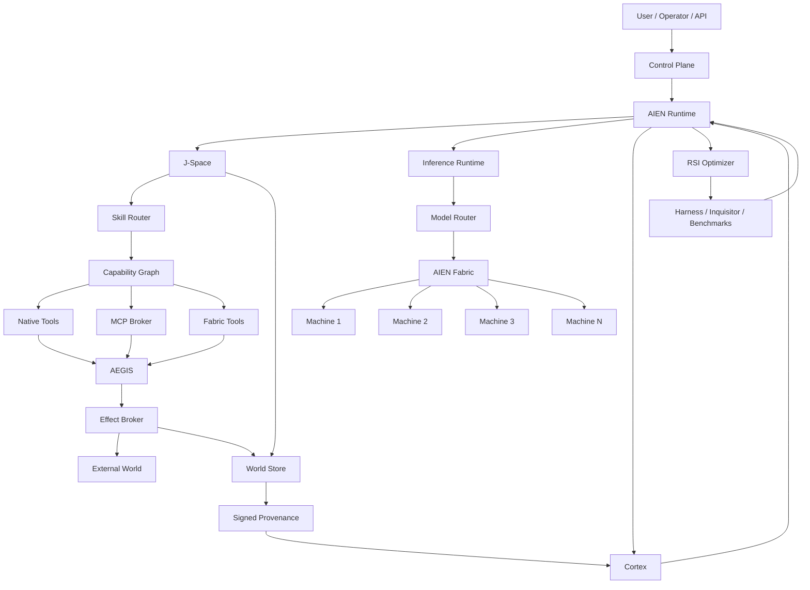

# AIEN Architecture

Canonical architecture, flows, boundaries, decisions, research notes, and implementation roadmap for the AIEN ecosystem.

This repository is intentionally **documentation-first**. It does not replace the implementation repositories. It defines how the pieces are intended to compose and gives implementation agents one place to answer:

- What owns this responsibility?
- What talks to what?
- What is already implemented?
- What is partial?
- What is missing?
- Which boundary is security-critical?
- Which repository contains the current implementation?
- Which planned subsystem should be built next?

> **Naming rule:** physical hosts are always called **Machine 1**, **Machine 2**, **Machine 3**, and so on. Hardware/vendor details are capabilities, never architectural identities.

## Start here

1. [Language](CONTEXT.md)
2. [Complete system architecture](AIEN_COMPLETE_SYSTEM_ARCHITECTURE.md)
3. [System map](docs/00-system-map.md)
4. [GitHub repository map](docs/01-github-repository-map.md)
5. [Implementation status](docs/02-implementation-status.md)
6. [Flows](docs/03-flows.md)
7. [Capabilities, skills, tools, and MCP](docs/04-capabilities-skills-tools-mcp.md)
8. [Fabric and portable compute](docs/05-fabric-and-compute.md)
9. [J-Space](docs/06-jspace.md)
10. [Security, AEGIS, vault, and effects](docs/07-security-effects-secrets.md)
11. [World, Cortex, and provenance](docs/08-world-cortex-provenance.md)
12. [RSI and evaluation](docs/09-rsi-evaluation.md)
13. [PEARL-inspired relational path engine](docs/10-relational-path-engine.md)
14. [Gap analysis](docs/11-gap-analysis.md)
15. [Roadmap](docs/12-roadmap.md)
16. [Golden path](docs/13-golden-path.md)
17. [Architecture decision records](docs/adr/README.md)

## One-line architecture

```text
User/API
  → Runtime
  → J-Space
  → Skill Router
  → Capability Graph
  → Fabric placement
  → Model/Tool execution
  → AEGIS
  → Effect Broker
  → World Commit
  → Signed Provenance
  → Cortex
  → RSI feedback
```

## Master diagram



## Source-of-truth policy

This repository describes **intended architecture** and records resolved architecture decisions.

Implementation truth remains the current code in the linked repositories. When this repository and running code disagree:

1. Do not silently pretend the target is implemented.
2. Mark the discrepancy in [implementation status](docs/02-implementation-status.md).
3. Open an architecture-gap issue.
4. Update the relevant ADR when the intended design changes.

## Repository role

This repo should become the architectural index linked from the top-level READMEs of major AIEN repositories. Code repositories should avoid re-explaining the entire system; they should link here for cross-system architecture and keep their own README focused on their component.

## License

The AIEN ecosystem currently uses more than one license across repositories. Before publishing this architecture repository, copy or explicitly select the intended canonical documentation license rather than assuming one. See [LICENSE-NOTICE.md](LICENSE-NOTICE.md).
