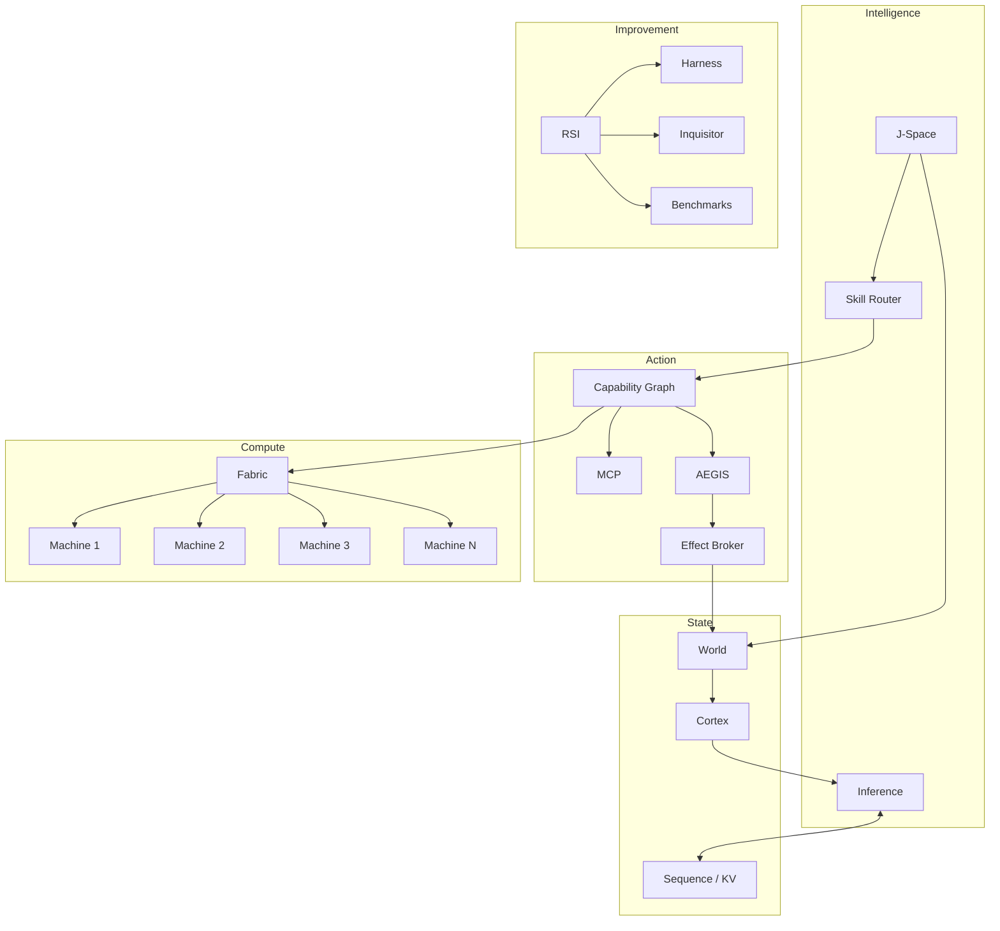

# System Map

AIEN is intended to operate as one logical system across multiple independent Machines.

## Responsibility table

| Concept | Owns | Must not own |
|---|---|---|
| Runtime | composition and execution loop | long-term knowledge |
| Sequence/KV | inference lineage and KV ownership | external effects |
| World | branchable transactional execution state | semantic memory |
| Cortex | durable knowledge/evidence/memory | live scheduler state |
| J-Space | alternatives, evaluation, selection | irreversible execution |
| Skill | reusable procedure/objective | authorization |
| Tool | atomic operation | global planning |
| Capability Graph | what exists and what it requires | execution authority |
| Fabric | where work runs | semantic tool choice |
| AEGIS | whether an action is permitted | transport |
| Effect Broker | irreversible execution | planning |
| MCP | protocol compatibility | core semantics |
| Provenance | evidence of what occurred | policy decisions |
| RSI | out-of-band optimization | direct hot-path mutation |

## Core invariant

The system can speculate freely inside reversible state. External reality changes only after selection, authorization, and effect execution.
