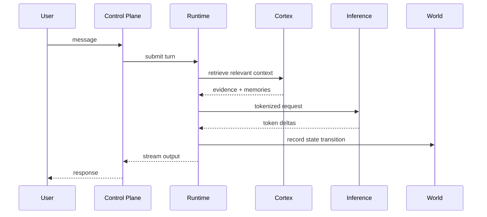
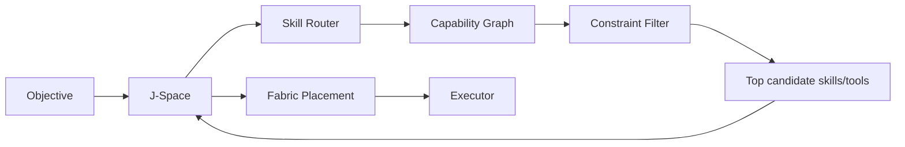
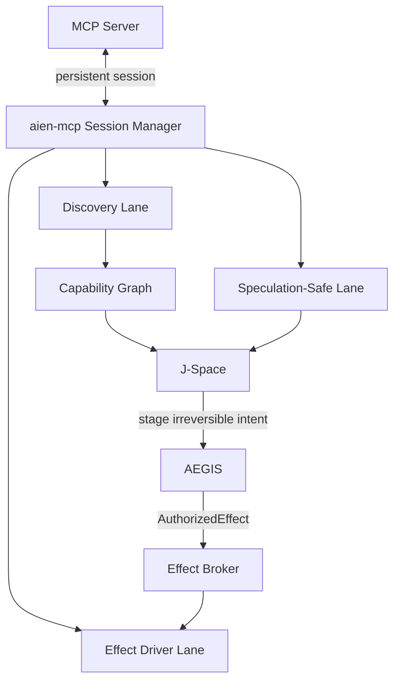
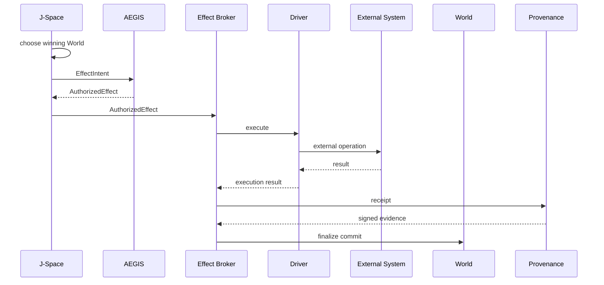
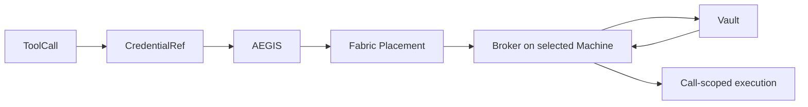
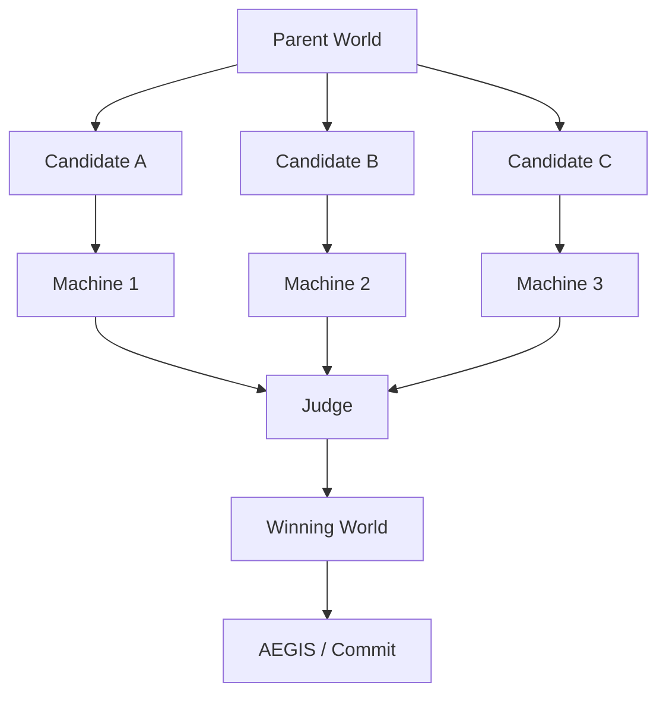
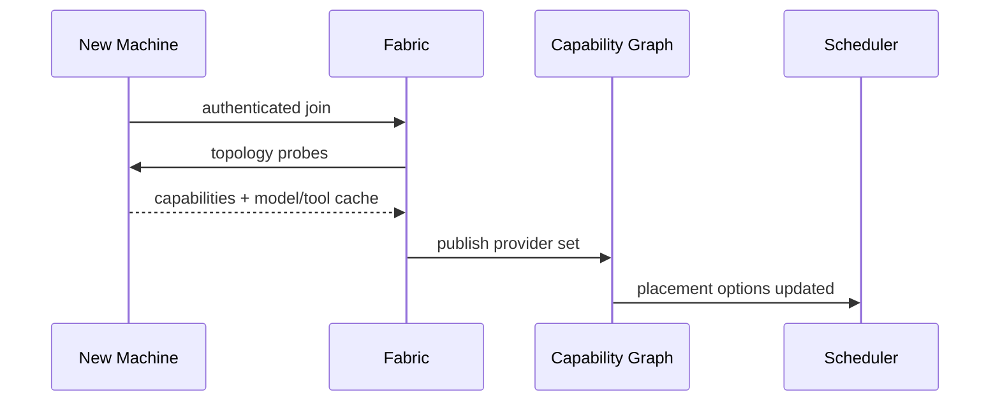
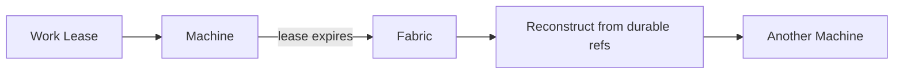
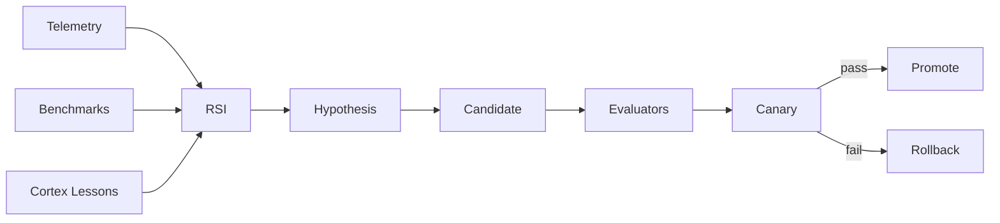

# Canonical Flows

## 1. Normal inference

## 2. Skill and tool resolution

## 3. MCP discovery vs effect authority

J-Space never owns the MCP session. `aien-mcp` owns protocol/session state.

## 4. Irreversible effect

## 5. Secret resolution

Raw values must not enter prompts, J-Space, World state, Cortex, logs, or receipts.

## 6. Distributed J-Space

## 7. Machine join

## 8. Machine failure

Never require remote RAM to be the only source of truth for recoverable work.

## 9. RSI optimization

