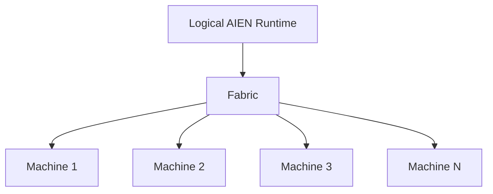

# AIEN Fabric and Portable Compute

## Goal

Every compatible computer can contribute without becoming an architectural special case.

```text
Machine 1
Machine 2
Machine 3
...
Machine N
```

Hardware details are advertised capabilities.

## Logical structure



## Machine advertisement

```rust
pub struct NodeAdvertisement {
    pub machine: MachineId,
    pub hardware: HardwareCapabilities,
    pub accelerators: Vec<AcceleratorCaps>,
    pub tools: Vec<ToolProvider>,
    pub skills: Vec<SkillProvider>,
    pub models: Vec<ModelDigest>,
    pub resources: ResourceState,
    pub network: NetworkState,
}
```

## Placement must consider

- memory,
- compute class,
- dtype/kernel support,
- model availability,
- tool availability,
- credential resolvability,
- policy,
- network latency/bandwidth,
- current load,
- thermal/power state.

## Preferred work granularity

Over ordinary LAN/Wi-Fi:

- whole J-Space branches,
- tool calls,
- evaluators,
- model replicas,
- embeddings,
- compilation/tests.

Only use fine-grained layer/tensor partitioning when topology measurements justify it.

## Portable accelerator rule

Core runtime APIs must not be CUDA-shaped.

Target:

1. optimized CPU baseline,
2. Mojo accelerator backend,
3. optional broader fallback later if needed.

The scheduler should ask about capabilities (`bf16`, `fp4`, memory, unified memory, etc.), not vendor model names.

## Reference deployment evidence

The GB10 reference host is one `Machine` in the model above; its accelerators and staged models are advertised capabilities, not architectural special cases.

Out-of-process serving is the current path for large models while the native runtime path matures:

- `Qwen/Qwen3-Coder-30B-A3B-Instruct` (MoE, 30B total / 3B active),
- SGLang, FP8 (`e4m3`) checkpoint, `Qwen3MoeForCausalLM`: weights loaded in 148.30 s, then KV-cache allocation and CUDA-graph capture,
- llama.cpp-compatible `Q8_0` GGUF staged at a stable local path.

Observed resource state at bring-up: ~72.96 GB accelerator memory available, ~23.36 GB weight usage, static memory fraction 0.75. These are measurements, not placement guarantees.

## Failure model

Work is leased.

If Machine 2 disappears:

1. lease expires,
2. durable identifiers remain,
3. work is reconstructed,
4. another Machine receives the task.

Global identity is distributed. Memory ownership is local.
