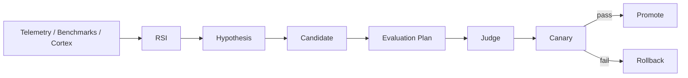

# RSI and Evaluation

RSI remains out-of-band.

## RSI may optimize

- routing heuristics,
- Fabric placement,
- J-Space widths/thresholds,
- kernel plans,
- model placement,
- cache policy,
- skill retrieval,
- quantization choice.

## RSI must not

- directly mutate production runtime without gate,
- bypass AEGIS,
- overwrite evidence,
- promote unsigned/unverified candidates.

## Evaluation stack

Existing Harness, Inquisitor, benchmarks, and signed evaluation receipts should become canonical evaluators exposed through typed interfaces rather than overlapping orchestration authorities.
