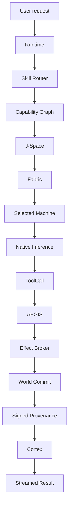

# Golden Path

The release gate should exercise real boundaries, not mocked claims.

## Required assertions

### Inference
- real model identity,
- real tokenizer/template,
- no synthetic reference-weight fallback in production mode,
- streamed output.

### Fabric
- Machine capability selected by constraints,
- unavailable Machine excluded,
- lease/failover behavior tested.

### Skill/tool
- relevant subset retrieved,
- missing requirements filtered,
- effect class known before execution.

### MCP
- discovery snapshot,
- safe call allowed,
- irreversible call impossible from speculative API,
- `AuthorizedEffect` required for effect driver.

### Secrets
- raw secret absent from prompt, arguments, logs, receipts, World, Cortex,
- production env fallback rejected,
- Machine placement accounts for vault resolvability.

### Effects
- denied effect makes zero external driver calls,
- allowed effect executes once,
- ambiguous retry cannot duplicate irreversible action silently.

### World/provenance
- parent lineage,
- effect root,
- policy/build/model digests,
- signed receipt/commit verification,
- tampering fails.

### Cortex
- result/evidence stored through explicit ingress,
- inferred relationships remain candidates until promoted.

### Resource cleanup
- sequences reclaimed,
- KV blocks reclaimed,
- losing Worlds released,
- expired work leases recovered.
