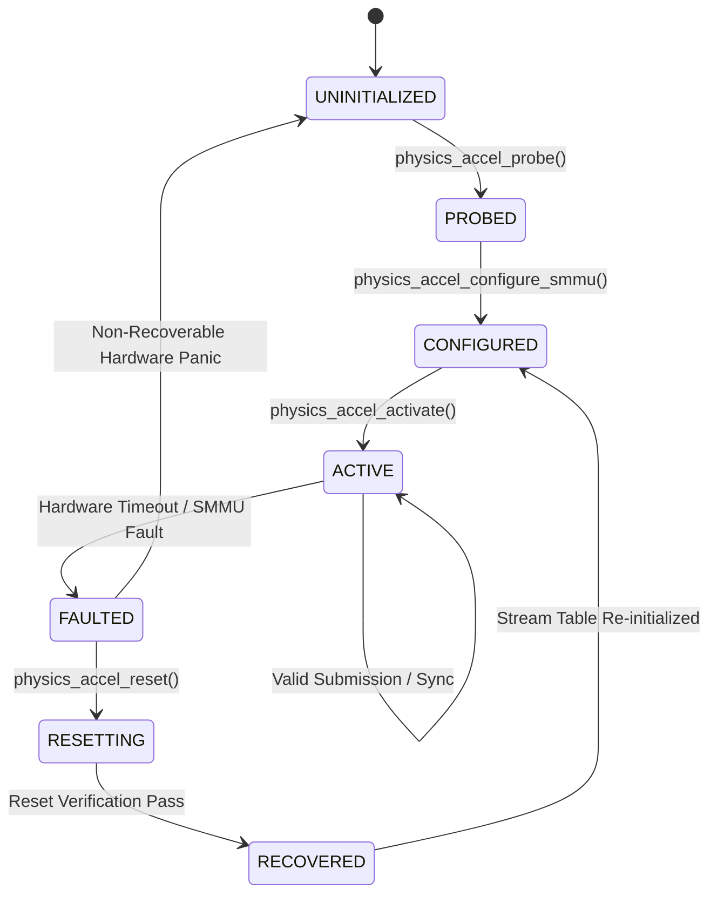

# Specification: Milestone 15 — Physics Accelerator Link (`PHYSICS_ACCELERATOR_LINK`)

```text
Document ID:     SPEC-PHYSICS-M15
Milestone:       Milestone 15 (PHYSICS_ACCELERATOR_LINK)
Classification:  Sovereign Machine Canonical Specification
Target Substrate: Bounded Coherent Memory Interface, SMMUv3 DMA Sandboxing & Accelerator Authority
Status:          SPECIFIED / IN PROGRESS (aien-dev/aien-architecture#27, aien-dev/physics#10, aien-dev/omega#21)
Lineage:         SILICON -> ATLAS (M1) -> PHYSICS (M2/M3/M15) -> OMEGA (M4-M14) -> AIEN
```

---

## 1. Executive Summary & Foundational Doctrine

Milestone 14 completed the CPU realization synthesis pipeline (`OMEGA_REALIZATION_SYNTHESIS`, $G_S \times G_M \to G_R$), synthesizing verified, multi-issue native AArch64 machine code directly onto physical execution pipelines without foreign compilers or static lowering heuristics.

Milestone 15 establishes the **Physics Accelerator Link** (`PHYSICS_ACCELERATOR_LINK`), opening Phase C (Accelerator Cognition Substrate). It expands the sovereign machine's computational reach to high-throughput hardware accelerators (specifically NVIDIA Blackwell architectures on DGX Spark) while maintaining strict physical authority, hardware sandboxing, and mathematical determinism:

> **PHYSICS GAINS BOUNDED ACCELERATOR AUTHORITY. OMEGA CANNOT OWN ACCELERATOR AUTHORITY. OMEGA ASKS; PHYSICS AUTHORIZES.**

In conventional architectures, GPU drivers operate with sprawling ambient authority: multi-gigabyte kernel drivers, closed-source firmware blobs, opaque direct memory access (DMA), unchecked command ring submissions, and unpredictable out-of-band interrupts. A single malformed GPU command or kernel bug can crash the entire host operating system or corrupt host memory via rogue DMA writes.

In the Sovereign Machine, accelerators are not permitted ambient authority:
- **PHYSICS** is the sole physical authority of the Sovereign Machine. It owns hardware discovery, physical DRAM carving, SMMUv3 translation tables, command ring allocations, MMIO doorbell writes, fault trapping, device reset, and cryptographic effect receipts.
- **OMEGA** cannot own accelerator authority, cannot access raw device registers, and cannot directly ring MMIO doorbells. Omega acts as an unprivileged client requesting accelerator resources: Omega formulates structured intents, submits them to the Physics Effect Broker, and receives verified, cryptographically sealed effect receipts.

Milestone 15 defines and qualifies this boundary: establishing explicit memory boundaries for coherent CPU-accelerator memory, SMMUv3 stage 1 DMA sandboxing, command queue authority, doorbell mediation, fail-closed fault handling, non-disruptive device reset, and rolling SHA-256 effect receipts.

---

## 2. Core Doctrine & Invariants

As mandated by canonical roadmap doctrine (`DOCTRINE-ROADMAP`) and sovereign machine architecture (`DOCTRINE-SOVEREIGNTY`), the Physics Accelerator Link enforces seven foundational invariants:

1. **Bounded Accelerator Authority**:
   Accelerator operations require valid capability tokens (`RES_ACCELERATOR`, resource type `0x00000005`) governed by monotonic attenuation. Callers never hold raw device registers or unmediated physical addresses; authority is held exclusively via typed `CapabilityId { slot, generation }`. Any operation lacking a valid, unrevoked capability token or attempting operations beyond granted permission bits is rejected fail-closed.

2. **SMMUv3 DMA Sandboxing & IOVA Confinement**:
   The accelerator Input/Output Virtual Address (IOVA) space is strictly translated via ARM SMMUv3 stage 1 translation tables managed exclusively by Physics. Any DMA access outside granted physical frames is trapped fail-closed via SMMUv3 translation faults (`F_TRANSLATION`) or permission faults (`F_PERMISSION`), instantly revoking the offending capability without corrupting host state.

3. **Coherent Unified Memory Semantics**:
   On NVIDIA DGX Spark (Grace Blackwell), CPU and GPU share a single physical LPDDR5x DRAM envelope `[0x80000000, 0x2080000000)` (128 GiB). Accelerator-visible memory windows are carved explicitly by Physics from unreserved DRAM frames. Ambiguous, overlapping, or unverified memory mappings are strictly prohibited. Physics kernel memory and private data structures are permanently unmapped and inaccessible to accelerator DMA.

4. **Queue Authority & Doorbell Mediation**:
   Command submission rings and MMIO doorbells are allocated and bounded by Physics. Ring buffers have fixed lengths, circular wrapping validation, and exclusive head/tail pointer governance. Omega submits validated command packets to Physics; Physics verifies memory bounds, writes the command packet to the hardware submission ring, issues memory synchronization barriers, and mediates the MMIO doorbell write.

5. **Fault Confinement & Non-Disruptive Reset**:
   Hardware timeouts, invalid command descriptors, MMIO bus faults, and SMMUv3 translation faults trigger immediate queue revocation and device isolation. Physics executes a clean hardware reset sequence without crashing the host CPU, corrupting host memory, or disrupting non-faulting subsystems.

6. **Cryptographic Effect Receipts**:
   Every accelerator operation—whether admitted and executed or rejected at any gate—emits an immutable 192-byte `EffectReceipt` committed to the rolling SHA-256 seal chain. Every receipt records device state, intent digest, actual effect, hardware measurement, and rolling previous receipt hash.

7. **Zero Foreign Toolchain**:
   0 LLVM, 0 GNU as, 0 GCC inline asm, 0 JIT, 0 Python. All translation tables, ring buffers, MMIO register interactions, and cryptographic receipts are constructed via native sovereign byte structures and direct AArch64 machine routines without invoking external toolchains or proprietary vendor runtimes.

---

## 3. Accelerator Link Architecture & Substrate Design

### 3.1 Sovereign Substrate Topology (DGX Spark Grace-Blackwell)

```text
+-------------------------------------------------------------------------------+
|                      PHYSICS ACCELERATOR LINK TOPOLOGY                        |
+-------------------------------------------------------------------------------+
|                                                                               |
|   +-----------------------+                    +--------------------------+   |
|   |   ARM Neoverse V2     |                    |   NVIDIA Blackwell GPU   |   |
|   |   Host CPU (Grace)    |                    |   Compute Engine         |   |
|   +-----------┬-----------+                    +------------┬-------------+   |
|               │                                             │                 |
|               │                                             │                 |
|               ▼                                             ▼                 |
|       [ CPU MMU (EL1/EL2) ]                         [ ARM SMMUv3 (Stage 1) ]  |
|               │                                             │                 |
|               │        NVLink-C2C Coherent Interconnect     │                 |
|               └─────────────────────┬───────────────────────┘                 |
|                                     │                                         |
|                                     ▼                                         |
|   +-----------------------------------------------------------------------+   |
|   |              PHYSICAL LPDDR5x DRAM [0x80000000, 0x2080000000)         |   |
|   |                                                                       |   |
|   |  0x80000000 ┌──────────────────────────────────────┐                  |   |
|   |             │ Physics Kernel & Authority Ledger    │ (Hidden from SMMU) |
|   |             ├──────────────────────────────────────┤                  |   |
|   |             │ Free Host Physical Frames            │                  |   |
|   |             ├──────────────────────────────────────┤                  |   |
|   |             │ Bounded Accelerator DMA Window #0    │ (IOVA Mapped)    |   |
|   |             ├──────────────────────────────────────┤                  |   |
|   |             │ Command Submission Ring Buffer       │ (Coherent Queue) |   |
|   |             ├──────────────────────────────────────┤                  |   |
|   |             │ Bounded Accelerator DMA Window #1    │ (IOVA Mapped)    |   |
|   |  0x2080000000 └────────────────────────────────────┘                  |   |
|   +-----------------------------------------------------------------------+   |
+-------------------------------------------------------------------------------+
```

### 3.2 SMMUv3 DMA Sandboxing & IOVA Translation

The ARM SMMUv3 (System Memory Management Unit version 3) enforces hardware-level isolation between the accelerator's bus-mastering transactions and physical host memory:

1. **Stream Table Entries (STE)**:
   - Stream Table base is strictly aligned to a 256 KiB boundary.
   - Stream ID (e.g., `0x20` for Blackwell compute command engine) maps to a dedicated 64-byte STE.
   - STE is configured for Stage 1 translation enabled (`Config = 0b101`), linear stream format (`S1Fmt = 0b00`), pointing to a dedicated Context Descriptor table (`CTXPTR`).

2. **Context Descriptor (CD)**:
   - Occupies 64 bytes with 64-bit alignment:
     - `CD[0]`: Control word defining `T0SZ = 16` (48-bit IOVA space), `TG0 = 0b00` (4 KiB granule), `IRGN0 = 0b01` (Inner Write-Back Cacheable), `ORGN0 = 0b01` (Outer Write-Back Cacheable), `SH0 = 0b11` (Inner Shareable), `EPD0 = 0` (TTBR0 walk enabled), `EPD1 = 1` (TTBR1 walk disabled), `V = 1` (Valid), `IPS = 0b010` (40-bit / 44-bit Physical Address space), `AA64 = 1` (AArch64 translation table format), `ASID = 1`.
     - `CD[1]`: `TTBR0` (Physical Base Address of Stage 1 Translation Table Level 0/1).
     - `CD[2]`: `TTBR1` (Unused, disabled via `EPD1`).
     - `CD[3]`: `MAIR` (Memory Attribute Indirection Register, configuring Normal Inner/Outer Write-Back Cacheable memory and Device MMIO attributes).

3. **Stage 1 Page Tables**:
   - 4 KiB granule size with 4-level translation walk.
   - Only physical frames explicitly granted via `DmaWindowDescriptor` have valid page table entries.
   - Any transaction targeting an address without a valid translation entry triggers an `F_TRANSLATION` fault. Any transaction violating permission bits (e.g., write to read-only frame) triggers an `F_PERMISSION` fault.

4. **Event Queue & Fault Confinement**:
   - SMMUv3 Event Queue records all fault syndromes with Stream ID, IOVA, and fault class.
   - Faults generate synchronous or polled notifications to Physics, which immediately freezes the stream, revokes the associated capability, records the fault in the effect receipt ledger, and initiates non-disruptive device recovery.

### 3.3 Command Queue Authority & Doorbell Mediation

Command submission is strictly mediated through Physics to prevent untrusted callers from commanding the accelerator hardware directly:

```text
+---------------+                 +--------------------+                 +------------------+
|     OMEGA     |                 |      PHYSICS       |                 |    BLACKWELL     |
| (Client Mode) |                 |  (Authority Mode)  |                 |   ACCELERATOR    |
+-------┬-------+                 +---------┬----------+                 +--------┬---------+
        │                                   │                                     │
        │ 1. Populate Work Descriptors      │                                     │
        │    inside granted DMA window      │                                     │
        │                                   │                                     │
        │ 2. Submit EffectIntent            │                                     │
        │    (ACCEL_OP_SUBMIT, cap_id)      │                                     │
        ├──────────────────────────────────►│                                     │
        │                                   │ 3. Validate Capability & Bounds     │
        │                                   │    Verify IOVA containment          │
        │                                   │                                     │
        │                                   │ 4. Copy to Hardware Ring Buffer     │
        │                                   │    Update Tail Pointer (modulo)     │
        │                                   │    Emit Memory Barrier (DSB SY)     │
        │                                   │                                     │
        │                                   │ 5. Ring MMIO Doorbell Register      │
        │                                   ├────────────────────────────────────►│
        │                                   │                                     │ 6. Fetch & Exec
        │                                   │ 7. Commit EffectReceipt to Ledger   │    Work Packets
        │ 8. Receive EffectReceipt (192B)   │    Roll SHA-256 Seal Chain          │    via DMA
        │◄──────────────────────────────────┤                                     │
        │                                   │                                     │
```

- **Ring Buffer Geometry**: Ring buffer memory is allocated exclusively by Physics in coherent host DRAM. Maximum in-flight command slots are fixed (e.g., 64 slots of 128 bytes).
- **Doorbell Protection**: MMIO doorbell physical pages are strictly excluded from Omega's virtual address mappings. Only Physics possesses authority to issue write transactions to the hardware doorbell registers.

### 3.4 Device Lifecycle State Machine



- **Monotonic Transitions**: State transitions are strictly monotonic and checked. Invalid state transitions (such as attempting command submission from `CONFIGURED` or `FAULTED` states) fail closed immediately with a rejected effect receipt.
- **Non-Disruptive Reset Sequence**:
  1. Freeze SMMUv3 Stream (set STE `Config = 0b000` or disable translation bypass).
  2. Invalidate SMMUv3 cached configuration and TLBs (`CMD_CFGI_STE`, `CMD_TLBI_NH_ALL`).
  3. Assert hardware engine reset via accelerator control MMIO register.
  4. Poll reset completion register until idle flag is asserted or timeout expires.
  5. Reset command ring head and tail pointers to 0.
  6. Re-enable SMMUv3 Stream with fresh context descriptors.
  7. Transition device state to `RECOVERED`, then `CONFIGURED`.

---

## 4. Data Model & C API Declarations

```c
#ifndef PHYSICS_ACCEL_LINK_H
#define PHYSICS_ACCEL_LINK_H

#include <stdbool.h>
#include <stddef.h>
#include <stdint.h>

#define PHYSICS_ACCEL_LINK_VERSION       0x00010000
#define PHYSICS_ACCEL_MAX_WINDOWS        16
#define PHYSICS_ACCEL_MAX_QUEUES         4
#define PHYSICS_ACCEL_RING_SLOTS         64
#define PHYSICS_ACCEL_SLOT_SIZE_BYTES    128

/* Resource Type for Accelerator Capability */
#define RES_ACCELERATOR                  0x00000005

/* Accelerator Operation Bitmasks */
#define ACCEL_OP_PROBE                   0x00000001
#define ACCEL_OP_MAP_DMA                 0x00000002
#define ACCEL_OP_UNMAP_DMA               0x00000004
#define ACCEL_OP_ALLOC_QUEUE             0x00000008
#define ACCEL_OP_SUBMIT                  0x00000010
#define ACCEL_OP_SYNC                    0x00000020
#define ACCEL_OP_RESET                   0x00000040

/* DMA Permission Flags */
#define DMA_PERM_READ                    0x00000001
#define DMA_PERM_WRITE                   0x00000002
#define DMA_PERM_COHERENT                0x00000004

/* Accelerator Lifecycle States */
typedef enum {
    ACCEL_STATE_UNINITIALIZED = 0,
    ACCEL_STATE_PROBED        = 1,
    ACCEL_STATE_CONFIGURED    = 2,
    ACCEL_STATE_ACTIVE        = 3,
    ACCEL_STATE_FAULTED       = 4,
    ACCEL_STATE_RESETTING     = 5,
    ACCEL_STATE_RECOVERED     = 6
} AcceleratorDeviceState;

/* DMA Window Descriptor for SMMUv3 Translation Mapping */
typedef struct {
    uint64_t iova_base;
    uint64_t phys_base;
    uint64_t size_bytes;
    uint32_t permissions; /* DMA_PERM_* */
    uint32_t stream_id;
    uint32_t window_id;
    uint32_t reserved;
} DmaWindowDescriptor;

/* SMMUv3 Stream Configuration */
typedef struct {
    uint32_t stream_id;
    uint32_t ste_index;
    uint64_t cd_table_base;
    uint64_t ttbr0_base;
    uint64_t mair_value;
    uint32_t t0sz;
    uint32_t granule_size;
    bool stage1_enabled;
    bool fault_trap_enabled;
} Smmuv3StreamConfig;

/* Accelerator Capability Record */
typedef struct {
    uint32_t slot;
    uint32_t generation;
    uint64_t principal_id;
    uint32_t resource_type; /* RES_ACCELERATOR */
    uint32_t allowed_ops;   /* Bitmask of ACCEL_OP_* */
    uint64_t iova_bound_base;
    uint64_t iova_bound_size;
    uint32_t queue_id_mask;
    uint32_t revocation_state; /* 1 = ACTIVE, 2 = REVOKED */
    uint8_t  provenance_digest[32];
} AcceleratorCapability;

/* Canonical EffectIntent (64 bytes, little-endian, 64-bit aligned) */
typedef struct {
    uint16_t version;               /* 1 */
    uint16_t length;                /* 64 */
    uint32_t reserved0;             /* 0 */
    uint64_t request_id;            /* Caller-generated request ID */
    uint64_t principal_id;          /* Principal ID (e.g. Omega) */
    uint32_t capability_slot;       /* Capability slot index */
    uint32_t capability_generation; /* Capability generation */
    uint32_t resource_type;         /* RES_ACCELERATOR */
    uint32_t operation;             /* ACCEL_OP_* */
    uint64_t target_base;           /* Target IOVA or Queue ID */
    uint64_t target_size;           /* Byte span or command length */
    uint64_t param0;                /* Descriptor address or doorbell parameter */
} EffectIntent;

/* Canonical EffectReceipt (192 bytes, 64-bit aligned) */
typedef struct {
    uint16_t version;               /* 1 */
    uint16_t length;                /* 192 */
    uint32_t decision;              /* 1 = ADMITTED, 2 = REJECTED */
    uint32_t rejection_reason;      /* Specific reason code if rejected */
    uint32_t reserved0;             /* 0 */
    uint64_t request_id;            /* Mirrored from EffectIntent */
    uint8_t  intent_digest[32];     /* SHA-256 of 64-byte EffectIntent */
    uint64_t actual_effect;         /* Physical result or mapped address */
    uint64_t output;                /* Submitted packet count or status */
    uint32_t capability_slot;       /* Presented slot */
    uint32_t capability_generation; /* Presented generation */
    uint64_t machine_generation;    /* Monotonic machine counter */
    uint64_t measurement;           /* Timestamp / cycle measurement */
    uint8_t  previous_receipt_digest[32]; /* Rolling SHA-256 seal chain */
    uint8_t  receipt_digest[32];    /* SHA-256 of receipt bytes 0x00..0x7F */
    uint8_t  reserved1[32];         /* Alignment padding to 192 bytes */
} EffectReceipt;

/* Command Queue State within Physics */
typedef struct {
    uint32_t queue_id;
    uint32_t head_index;
    uint32_t tail_index;
    uint32_t slot_count;
    uint64_t ring_phys_base;
    uint64_t doorbell_mmio_reg;
    bool     active;
} AcceleratorQueue;

/* Master Physics Accelerator Link Context */
typedef struct {
    uint32_t link_version;
    uint32_t device_state;          /* AcceleratorDeviceState */
    uint32_t stream_id;
    uint32_t active_queues;
    uint64_t mmio_doorbell_base;
    uint64_t mmio_doorbell_size;
    uint64_t coherent_dram_base;    /* 0x80000000 on DGX Spark */
    uint64_t coherent_dram_size;    /* 128 GiB on DGX Spark */
    DmaWindowDescriptor active_windows[PHYSICS_ACCEL_MAX_WINDOWS];
    uint32_t active_window_count;
    AcceleratorQueue queues[PHYSICS_ACCEL_MAX_QUEUES];
    Smmuv3StreamConfig smmu_config;
    uint8_t  last_receipt_digest[32];
    uint64_t fault_count;
    uint64_t total_submissions;
} PhysicsAcceleratorLink;

/* ========================================================================= */
/* Physics Server Authority APIs                                             */
/* ========================================================================= */

/* Initialize the Physics Accelerator Link with coherent DRAM boundaries */
int physics_accel_init(PhysicsAcceleratorLink *link,
                       uint64_t dram_base,
                       uint64_t dram_size);

/* Configure SMMUv3 Stream Table and Context Descriptors for accelerator */
int physics_accel_configure_smmu(PhysicsAcceleratorLink *link,
                                 const Smmuv3StreamConfig *config);

/* Grant a bounded DMA window and install SMMUv3 Stage 1 translation */
int physics_accel_grant_dma_window(PhysicsAcceleratorLink *link,
                                   const AcceleratorCapability *cap,
                                   const DmaWindowDescriptor *window,
                                   EffectReceipt *out_receipt);

/* Revoke a DMA window and invalidate SMMUv3 translation entries */
int physics_accel_revoke_dma_window(PhysicsAcceleratorLink *link,
                                    const AcceleratorCapability *cap,
                                    uint64_t iova_base,
                                    EffectReceipt *out_receipt);

/* Allocate a bounded command submission queue ring */
int physics_accel_alloc_queue(PhysicsAcceleratorLink *link,
                              const AcceleratorCapability *cap,
                              uint32_t queue_id,
                              EffectReceipt *out_receipt);

/* Mediate command packet validation, ring insertion, and doorbell ringing */
int physics_accel_submit_command(PhysicsAcceleratorLink *link,
                                 const AcceleratorCapability *cap,
                                 const EffectIntent *intent,
                                 EffectReceipt *out_receipt);

/* Trap and isolate an accelerator fault (SMMU abort, timeout, illegal insn) */
int physics_accel_handle_fault(PhysicsAcceleratorLink *link,
                               uint32_t fault_syndrome);

/* Perform non-disruptive device reset and recovery */
int physics_accel_reset_device(PhysicsAcceleratorLink *link,
                               EffectReceipt *out_receipt);

/* ========================================================================= */
/* Omega Client APIs (Mediated Ingress)                                      */
/* ========================================================================= */

/* Request a bounded DMA memory window from Physics */
int omega_accel_request_dma_grant(uint32_t cap_slot,
                                  uint32_t cap_gen,
                                  uint64_t iova_base,
                                  uint64_t phys_base,
                                  uint64_t size,
                                  uint32_t perms,
                                  EffectReceipt *out_receipt);

/* Request command execution submission via mediated Physics queue */
int omega_accel_request_submit(uint32_t cap_slot,
                               uint32_t cap_gen,
                               uint32_t queue_id,
                               uint64_t cmd_desc_iova,
                               uint64_t cmd_len,
                               EffectReceipt *out_receipt);

/* Request synchronization / barrier on submitted work */
int omega_accel_request_sync(uint32_t cap_slot,
                             uint32_t cap_gen,
                             uint32_t queue_id,
                             uint64_t timeout_cycles,
                             EffectReceipt *out_receipt);

/* Validate rolling cryptographic seal chain on an EffectReceipt */
int omega_accel_verify_receipt(const EffectReceipt *receipt,
                               const uint8_t *expected_prev_seal);

#endif /* PHYSICS_ACCEL_LINK_H */
```

---

## 5. The 10 Canonical Qualification Gates

Milestone 15 qualification mandates 100% compliance across 10 canonical qualification gates:

1. `PHYSICS_ACCEL_MEM_BOUNDS_PASS`:
   Verifies that memory boundaries for the coherent accelerator envelope `[0x80000000, 0x2080000000)` are strictly enforced. Any attempt to allocate or map memory outside unreserved frames, or overlapping Physics kernel structures (image, stack, capability ledger, receipt ledger), is trapped and fails closed.

2. `PHYSICS_ACCEL_SMMU_TRANSLATION_PASS`:
   Verifies that Physics correctly programs ARM SMMUv3 Stage 1 translation tables. Asserts that Stream Table Entries (STE), Context Descriptors (CD), and 4-level translation walks accurately map granted IOVA addresses to physical DRAM frames with precise permission bits (`DMA_PERM_READ`, `DMA_PERM_WRITE`, `DMA_PERM_COHERENT`).

3. `PHYSICS_ACCEL_DMA_SANDBOX_PASS`:
   Verifies hardware sandboxing against out-of-bounds DMA access. Deliberate DMA transactions targeting unmapped IOVAs or violating permission boundaries trigger SMMUv3 translation faults (`F_TRANSLATION`, `F_PERMISSION`), are contained fail-closed, and produce immediate capability revocation without host memory corruption.

4. `PHYSICS_ACCEL_QUEUE_AUTHORITY_PASS`:
   Verifies bounded queue authority and doorbell mediation. Confirms that submission queue ring indices wrap cleanly modulo slot capacity, malformed command packets are refused prior to ring insertion, and untrusted principals are physically barred from writing MMIO doorbell registers directly.

5. `PHYSICS_ACCEL_DEVICE_LIFECYCLE_PASS`:
   Verifies deterministic progression across accelerator device states (`UNINITIALIZED` $\to$ `PROBED` $\to$ `CONFIGURED` $\to$ `ACTIVE`). Confirms that state transitions follow monotonic state machine rules and that out-of-order operations fail closed.

6. `PHYSICS_ACCEL_RESET_RECOVERY_PASS`:
   Verifies non-disruptive fault confinement and hardware reset. Injected hardware timeouts, bus errors, or simulated hang syndromes trigger queue revocation, SMMU stream isolation, engine reset, and successful recovery without host CPU panic, host reboot, or memory leakage.

7. `PHYSICS_ACCEL_RECEIPT_CHAIN_PASS`:
   Verifies that every accelerator operation emits an immutable, bit-exact 192-byte `EffectReceipt` committed to the rolling SHA-256 seal chain. Verifies that receipt hashes deterministically incorporate the prior receipt digest, preventing receipt tampering, truncation, or replay attacks.

8. `PHYSICS_ACCEL_OMEGA_INGRESS_PASS`:
   Verifies the Omega-to-Physics boundary. Confirms that Omega interacts exclusively through structured 64-byte `EffectIntent` requests, and that requests lacking valid, unrevoked capability handles are rejected at the broker admission gate prior to execution.

9. `PHYSICS_ACCEL_ZERO_TOOLCHAIN_PASS`:
   Verifies sovereign toolchain independence: 0 LLVM, 0 GNU as, 0 GCC inline asm, 0 JIT, 0 Python. Confirms all table builders, queue managers, MMIO accessors, and cryptographic receipt routines are implemented strictly within the sovereign repository tree.

10. `PHYSICS_ACCEL_RECEIPT_PASS`:
    Verifies that the master qualification test harness executes all 9 preceding qualification gates and produces an immutable, cryptographically sealed qualification receipt certifying 100% compliance.

---

## 6. Provenance & Qualification Contract

Milestone 15 is governed by canonical contract `CONTRACT-PHYSICS-ACCELERATOR-LINK-M15`.

- **Specification Tracking**: `aien-dev/aien-architecture#27`
- **Physics Authority Implementation**: `aien-dev/physics#10`
- **Omega Client Link Implementation**: `aien-dev/omega#21`
- **Qualification Receipt Target**: `evidence/physics_accelerator_link_qualification_receipt.json`

```json
{
  "milestone": "MILESTONE 15 — PHYSICS_ACCELERATOR_LINK",
  "status": "QUALIFIED / PASS",
  "contract_id": "CONTRACT-PHYSICS-ACCELERATOR-LINK-M15",
  "lineage": "SILICON -> ATLAS (M1) -> PHYSICS (M2/M3/M15) -> OMEGA (M4-M14) -> AIEN",
  "gates": {
    "PHYSICS_ACCEL_MEM_BOUNDS_PASS": "PASS",
    "PHYSICS_ACCEL_SMMU_TRANSLATION_PASS": "PASS",
    "PHYSICS_ACCEL_DMA_SANDBOX_PASS": "PASS",
    "PHYSICS_ACCEL_QUEUE_AUTHORITY_PASS": "PASS",
    "PHYSICS_ACCEL_DEVICE_LIFECYCLE_PASS": "PASS",
    "PHYSICS_ACCEL_RESET_RECOVERY_PASS": "PASS",
    "PHYSICS_ACCEL_RECEIPT_CHAIN_PASS": "PASS",
    "PHYSICS_ACCEL_OMEGA_INGRESS_PASS": "PASS",
    "PHYSICS_ACCEL_ZERO_TOOLCHAIN_PASS": "PASS",
    "PHYSICS_ACCEL_RECEIPT_PASS": "PASS"
  }
}
```

---

## 7. Downstream Horizons & Accelerator Cognition

Milestone 15 establishes the secure, sandboxed hardware substrate that unlocks the remainder of Phase C (Accelerator Cognition Substrate):

- **Milestone 16 (`BLACKWELL_NATIVE_PATH_KNOWN`)**: Empirical execution characterization of native Blackwell SM architecture, discovering command queue packets, instruction issue formats, and MMIO doorbell mechanics.
- **Milestone 17 (`OMEGA_BLACKWELL_VECTOR`)**: Verified Blackwell vector compute realization generated directly from $G_S$ via $G_S \times G_M \to G_R$ synthesis.
- **Milestone 18 (`OMEGA_BLACKWELL_MATMUL`)**: Verified native Blackwell tensor matrix multiplication utilizing tensor core pipelines under mathematical invariant preservation.
- **Milestone 19 (`OMEGA_ACCELERATOR_RESIDENT`)**: Persistent Omega execution substrate residing in accelerator-accessible coherent memory, completing the transition to autonomous high-throughput cognitive loops.
