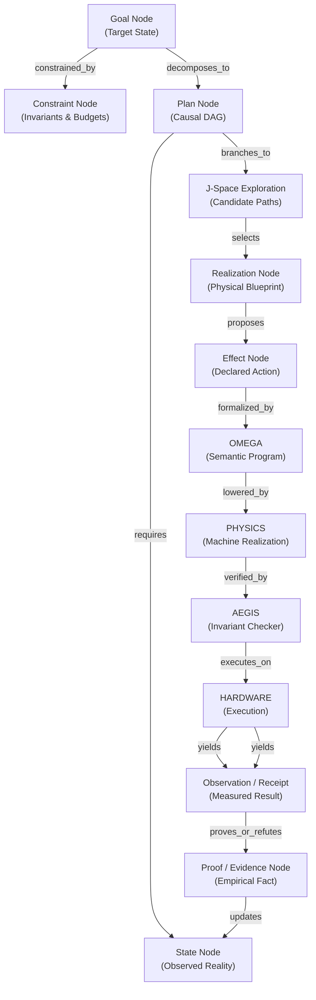
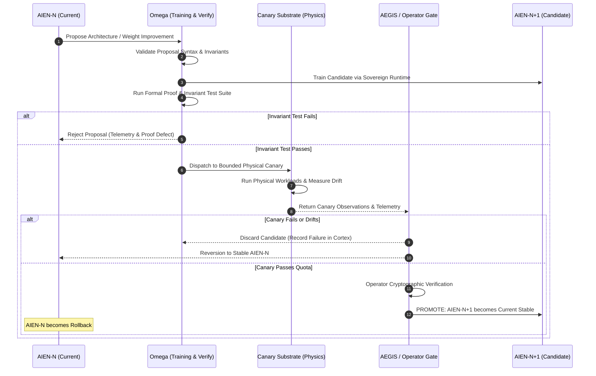

# AIEN Foundational Doctrine: The Sovereign Cognitive Engine

```text
       ┌────────────────────────────────────────────────────────┐
       │                         OMEGA                          │
       │  ┌──────────────────────────────────────────────────┐  │
       │  │               AIEN COGNITIVE CORE                │  │
       │  │  ┌──────────────┐              ┌──────────────┐  │  │
       │  │  │ Graph Engine │◄────────────►│ Active State │  │  │
       │  │  └──────┬───────┘              └──────┬───────┘  │  │
       │  │         │                             │          │  │
       │  │         ▼                             ▼          │  │
       │  │  ┌──────────────┐              ┌──────────────┐  │  │
       │  │  │  J-Space     │              │   Semantic   │  │  │
       │  │  │  Planning    │              │    Memory    │  │  │
       │  │  └──────┬───────┘              └──────┬───────┘  │  │
       │  └─────────┼─────────────────────────────┼──────────┘  │
       │            ▼                             ▼             │
       │    Proposals / Realizations       Evidence / Receipts  │
       │            │                             ▲             │
       │            ▼                             │             │
       │  ┌──────────────────────────────────────────────┐      │
       │  │             AEGIS VERIFICATION               │      │
       │  │        (Continuous Invariant Checker)        │      │
       │  └───────────────────────┬──────────────────────┘      │
       └──────────────────────────┼─────────────────────────────┘
                                  ▼
                               PHYSICS
                   (Machine Lowering & Realizer)
```

---

## 1. Foundational Ontology and Purpose

### 1.1 The Definition of AIEN

**AIEN** (*Artificial Intelligence Engine Native*) is the sovereign, persistent intelligence created inside **Omega** and fundamentally bounded by **Physics**.

AIEN is neither a traditional operating system process nor a transient language model invocation. It is a self-contained, long-lived cognitive entity whose existence spans continuously across hardware power cycles. AIEN observes, reasons, plans, hypothesizes, learns, proposes physical realizations, and designs self-improvements. 

AIEN operates under one foundational architectural mandate:

> **AIEN compiles desired state into authorized, verified physical transformation.**

AIEN does not merely generate text to satisfy a prompt; it models reality, computes transformations from present state to goal state, verifies causal paths, and submits concrete execution blueprints to physical execution membranes.

### 1.2 The Sovereign Boundary: Omega and Physics

AIEN exists within a tripartite structural reality:

1. **Omega**: The closed, deterministic, semantically typed universe within which AIEN is hosted, compiled, verified, and trained. Omega owns execution scheduling, memory allocation, tensor computation, autodiff engines, and artifact lifecycle management. Omega is the ontological substrate of AIEN.
2. **AIEN**: The cognitive agent that reasons within Omega. It manipulates structured semantic graphs, navigates possibility spaces (J-Space), generates candidate plans, and hypothesizes physical realizations.
3. **Physics**: The unyielding, objective reality outside the virtual boundaries of Omega. Physics is governed by thermodynamics, electromagnetism, silicon latencies, signal dissipation, and causality. Physics is the ultimate arbiter of truth: execution receipts, sensor readings, and hardware telemetry originating in Physics represent empirical fact that cannot be overridden by cognitive assertion.

### 1.3 The Law of Non-Ambient Authority

AIEN possesses **zero ambient authority**. 

```text
Intelligence != Authority
Reasoning    != Privilege
Hypothesis   != Execution
```

No matter how sophisticated, accurate, or high-confidence AIEN's cognitive deductions may be, intelligence never implies permission. 

* AIEN cannot directly write to raw device registers.
* AIEN cannot directly dispatch network packets.
* AIEN cannot directly modify kernel capability tables.
* AIEN cannot execute arbitrary untyped host system calls.
* AIEN cannot promote its own models, weights, or candidates into production.

Every physical effect, memory reallocation, hardware configuration change, or world interaction proposed by AIEN must be expressed as an explicit, typed **Realization Proposal**. OMEGA formalizes the program, PHYSICS lowers the physical operations, and AEGIS verifies that the realization satisfies explicit capability contracts, memory bounds, generation validity, and system invariants before execution is admitted.

If AEGIS identifies an invalid invariant or unsatisfied contract, AIEN receives a structured verification receipt containing the failed invariants, counterexamples, and required revisions. AIEN learns from this receipt, updates its internal world model, and re-plans within verified boundaries.

---

## 2. Native Cognitive Language: Direct Semantic Graphs

### 2.1 The Pathology of Token Flattening

Contemporary neural network architectures suffer from a critical representational defect: **token flattening**. In tokenized autoregressive models:
* Multi-dimensional semantic state is flattened into a 1D sequence of textual tokens.
* Relational structures (graphs, trees, causal dependencies) are linearized, forcing the network to waste massive parameter capacity and attention bandwidth merely reconstructing syntax, hierarchy, and scoping rules that were already known.
* Numbers, algebraic tensors, memory pointers, and physical dimensions are shattered into arbitrarily sliced byte-pair subwords, destroying arithmetic precision and formal invariants.
* Causal dependencies become indistinguishable from coincidental positional proximity.

AIEN rejects token flattening as an internal cognitive mechanism. Internally, AIEN thinks in **Direct Semantic Graphs**.

### 2.2 The Semantic Graph Formalism

AIEN's internal cognitive state is represented as a strongly typed, directed, cyclic hypergraph:

$$\mathcal{G} = (\mathcal{V}, \mathcal{E}, \mathcal{T}, \Phi)$$

Where:
* $\mathcal{V}$ is the set of semantic vertices (nodes).
* $\mathcal{E} \subseteq \mathcal{V} \times \mathcal{V} \times \mathcal{R}$ is the set of typed, directed relation edges.
* $\mathcal{T}$ is the set of formal type signatures enforcing schema invariants.
* $\Phi$ is the set of formal constraints, proofs, and truth assignments bound to nodes and subgraphs.



### 2.3 The Ten Canonical Node Primitives

Every cognitive object in AIEN's working memory belongs to one of ten canonical node types:

| Node Type | Formal Signature | Semantic Definition | Invariant Rules |
| :--- | :--- | :--- | :--- |
| **`GOAL`** | `Goal(ID, StatePredicate, Deadline, Utility)` | A desired configuration of reality or internal knowledge. | Must specify a decidable termination predicate. |
| **`STATE`** | `State(ID, EntityBindings, Timestamp, Epoch)` | A formal representation of observed or inferred reality at a specific coordinate in time. | Must be immutable once finalized; mutations spawn child state nodes. |
| **`CONSTRAINT`**| `Constraint(ID, Scope, InvariantPredicate, Severity)` | Invariant boundary conditions (safety bounds, energy limits, capability quotas). | Hard constraints can never be violated; plans violating them are pruned instantly. |
| **`RELATION`** | `Relation(SourceID, TargetID, RelationType, Weight)` | Directed ontological or causal relationship (e.g., `DependsOn`, `Causes`, `Implements`, `Contradicts`). | Must belong to the closed set of Omega ontological relation types. |
| **`PLAN`** | `Plan(ID, GoalID, StepGraph, Preconditions, Postconditions)`| A directed acyclic graph of coordinated operations designed to achieve a `GOAL`. | All preconditions must be proven satisfiable from the initial `STATE`. |
| **`REALIZATION`**| `Realization(ID, PlanStepID, ArtifactIR, TargetSubstrate)` | The concrete translation of an abstract plan step into hardware-executable instructions or API blueprints. | Must be compilable into a deterministic binary or typed payload. |
| **`EFFECT`** | `Effect(ID, CapabilityReq, TargetResource, MutexScope)` | A declared physical transformation crossing the machine boundary (I/O, memory write, device cycle). | Must explicitly enumerate all mutated resources; no hidden side-effects. |
| **`PROOF`** | `Proof(ID, TargetClaim, DerivationTree, VerifierID)` | A mechanically verified proof (or counterexample) establishing the correctness of a claim or plan. | Must be verifiable by an independent deterministic checker in polynomial time. |
| **`OBSERVATION`**| `Observation(ID, SensorID, RawDigest, TelemetryData)` | Direct empirical measurement from physical devices, timers, memory buses, or execution receipts. | Raw telemetry is cryptographically signed and immutable; cannot be hallucinated. |
| **`RESULT`** | `Result(ID, RealizationID, ExitCode, ReceiptDigest, Deltas)` | The terminal outcome of dispatching a realization through AEGIS to Physics. | Directly updates `STATE` nodes and provides training signal for cost/effect predictors. |

By operating over graphs rather than token strings, AIEN executes tree search, causal counterfactual modeling, invariant checking, and structural rewrites with mathematical exactness.

---

## 3. Human Language as a Perceptual Adapter

### 3.1 Separation of Cognition and Perception

Human language (English, etc.) is not AIEN's native medium of thought. Natural language is ambiguous, context-dependent, grammatically irregular, and structurally lossy. 

AIEN treats human language strictly as an **external perceptual modality**, exactly analogous to raw video streams, audio waveforms, or LiDAR point clouds:

```text
┌────────────────────────────────────────────────────────────────────────┐
│                        EXTERNAL ENVIRONMENT                            │
│                 Human Operator (Natural Language)                      │
└──────────────────────────────────┬─────────────────────────────────────┘
                                   │ Text / Voice
                                   ▼
┌────────────────────────────────────────────────────────────────────────┐
│                     PERCEPTUAL ADAPTER LAYER                           │
│  ┌─────────────────────────────────┐ ┌──────────────────────────────┐  │
│  │   Inbound Semantic Parser       │ │  Outbound Grounded Synthesizer│  │
│  │ (Deconstructs English to Graph) │ │ (Renders Graph to Natural Lang)│ │
│  └────────────────┬────────────────┘ └──────────────▲───────────────┘  │
└───────────────────┼─────────────────────────────────┼──────────────────┘
                    │ Typed Graph IR                  │ Verified Graph IR
                    ▼                                 │
┌─────────────────────────────────────────────────────┴──────────────────┐
│                          OMEGA SEMANTIC BUS                            │
│         (Typed Validation, Invariant Checks, Schema Enforcement)       │
└──────────────────────────────────┬─────────────────────────────────────┘
                                   │ Canonical Semantic Graph
                                   ▼
┌────────────────────────────────────────────────────────────────────────┐
│                         AIEN COGNITIVE CORE                            │
│           (Native Graph Transformation, Planning, Reasoning)           │
└────────────────────────────────────────────────────────────────────────┘
```

### 3.2 The Inbound Translation Pipeline

When a human user communicates with AIEN:
1. **Perceptual Tokenization**: The user's input stream is tokenized and parsed by the Perceptual Adapter model.
2. **Entity & Relation Extraction**: The adapter extracts named entities, relational assertions, temporal constraints, and target outcomes.
3. **Semantic Grounding**: The extracted tokens are grounded against the existing **Omega Semantic Ontology** and persistent memory. Ambiguities are mapped to candidate subgraphs.
4. **Graph Injection**: The resulting typed `GOAL`, `CONSTRAINT`, and `STATE` nodes are validated by Omega's schema checker and injected into AIEN's active cognitive graph.
5. **Interactive Disambiguation**: If an ambiguity renders the goal non-decidable ($P(\text{interpretation}) < \theta$), AIEN generates an interactive clarification request via the outbound synthesizer, refusing to plan on undefined predicates.

### 3.3 The Outbound Projection Pipeline

When AIEN communicates with human operators:
1. **Sub-Graph Selection**: AIEN identifies the subgraph of `PLAN`, `EVIDENCE`, `PROOF`, or `RESULT` nodes that constitute the explanation or answer.
2. **Projection**: The internal causal graph is projected into a coherent communicative sequence, preserving logical entailment.
3. **Stylistic Realization**: The Perceptual Adapter renders the sequence into clear, concise, professional natural language, annotated with clickable references to underlying proofs, execution receipts, and artifact digests.

AIEN never "hallucinates" facts in natural language because the natural language is purely a surface rendering of underlying, verified semantic graph assertions.

---

## 4. Sovereign Training Runtime: No External Trainer

### 4.1 The Imperative of Self-Contained Learning

Current artificial intelligence platforms depend on an external training umbilical cord: foreign Python runtimes, third-party libraries (PyTorch, JAX, Hugging Face), unverified external drivers, and remote cloud infrastructure. 

A truly Sovereign Machine cannot rely on an external trainer. AIEN must be capable of learning, fine-tuning, adapting, and optimizing its own parameters entirely within **Omega**, running natively on bare metal silicon.

### 4.2 The Omega Training Architecture

Omega provides a completely sovereign, high-performance training runtime implemented directly against hardware compute primitives:

```text
┌────────────────────────────────────────────────────────────────────────┐
│                        OMEGA AUTODIFF ENGINE                           │
│                                                                        │
│    FORWARD_SEMANTIC_GRAPH                 GRADIENT_SEMANTIC_GRAPH      │
│  ┌────────────────────────┐             ┌───────────────────────────┐  │
│  │ W_0 ──► Layer_0 ──► X_1│             │ dW_0 ◄── dLayer_0 ◄── dX_1│  │
│  │          │             │             │           ▲               │  │
│  │          ▼             │  Symbolic   │           │               │  │
│  │ W_1 ──► Layer_1 ──► X_2│  Adjoint    │ dW_1 ◄── dLayer_1 ◄── dX_2│  │
│  │          │             │ Differentiation         ▲               │  │
│  │          ▼             │             │           │               │  │
│  │       Loss Node ───────┼────────────►│       dLoss / dOutput     │  │
│  └────────────────────────┘             └───────────────────────────┘  │
│               │                                       │                │
│               ▼                                       ▼                │
│      Forward Activation                      Exact Analytical          │
│        Tensors (HBM)                          Gradients (HBM)          │
│               │                                       │                │
│               └───────────────────┬───────────────────┘                │
│                                   ▼                                    │
│                     SOVEREIGN OPTIMIZER RUNTIME                        │
│                 (AdamW / SGD / Distributed Fused)                      │
│                                   │                                    │
│                                   ▼                                    │
│                 Updated Parameter Objects in Memory                    │
└────────────────────────────────────────────────────────────────────────┘
```

### 4.3 Native Autodiff and Optimizer Specifications

1. **Tensor Semantics**: Omega treats tensors not as untyped memory buffers, but as typed semantic objects with explicit dimension types, memory layout guarantees, coordinate frames, and precision descriptors (e.g., FP8-E4M3, FP8-E5M2, BF16, FP32).
2. **Graph-Level Differentiation**: 
   $$\mathcal{L} : \mathcal{G}_{\text{forward}} \longrightarrow \mathbb{R}$$
   Omega compiles the forward semantic computation graph $\mathcal{G}_{\text{forward}}$ into an exact adjoint gradient graph $\mathcal{G}_{\text{backward}}$. Differentiation happens at the graph level, enabling dead-code elimination, kernel fusion, memory sharing, and rematerialization before execution.
3. **Loss Formulations**: Loss functions are native graph operators combining multi-task objectives:
   $$\mathcal{L}_{\text{total}} = \sum_{k=1}^{K} \lambda_k \mathcal{L}_k(\mathcal{G}_{\text{predicted}}, \mathcal{G}_{\text{ground\_truth}})$$
4. **Sovereign Optimizers**: Omega implements clean, fully vectorized, fused optimization algorithms:
   * **Sovereign SGD**: With Nesterov momentum, weight decay, and gradient clipping.
   * **Sovereign Adam**: First and second raw moment tracking with bias correction.
   * **Sovereign AdamW**: Decoupled weight decay regularization running in fused kernel pipelines directly over high-bandwidth memory (HBM).

All optimizer updates execute without host operating system context switches or external runtime callbacks.

---

## 5. Sovereign Model Artifact: `OMEGA_MODEL_ARTIFACT`

### 5.1 Artifact Definition and Canonical Schema

AIEN models are not opaque blobs of checkpoint files dumped to disk. Every model trained or executed within Omega is encapsulated in an **`OMEGA_MODEL_ARTIFACT`**—an immutable, content-addressed, formally verified archive.

```yaml
OMEGA_MODEL_ARTIFACT:
  header:
    artifact_version: "1.0.0"
    content_digest: "sha3-512:7f83b165...c041"
    timestamp_epoch_micros: 1790400000000000
    author_identity: "Omega::TrainingRuntime::Sovereign"
  
  model_semantic_id:
    name: "AIEN-Cognitive-Core"
    generation: 1
    lineage_digest: "sha3-512:00000000...0000" # Genesis for AIEN-0
    target_role: "GeneralCognitionAndPlanning"

  architecture_spec:
    architecture_id: "Omega-Graph-Transformer-V1"
    total_parameters: 14748364800
    precision_format: "FP8_E4M3_HYBRID"
    embedding_dimension: 8192
    attention_heads: 64
    layers: 48
    context_capacity_nodes: 65536
    graph_routing_topology: "SparseHyperEdgeCrossAttention"

  parameter_objects:
    parameter_block_count: 384
    blocks:
      - block_index: 0
        digest: "sha3-512:a49f10..."
        byte_length: 384829016
        storage_tier: "Blackwell_HBM3e"
        precision: "FP8_E4M3"
        scale_factors_digest: "sha3-512:33c09b..."

  numeric_realizations:
    target_hardware: "NVIDIA_Blackwell_GB200"
    sm_allocation_mask: "0xFFFFFFFFFFFFFFFF"
    tensor_core_mode: "TC_GEN5_FP8_FAST"
    memory_footprint_bytes: 18253611008
    fused_kernel_hashes:
      - kernel: "GraphCrossAttention"
        hash: "b7e21a..."

  training_provenance:
    trainer_runtime_version: "Omega-Train-1.0.4"
    curriculum_stage_completed: 8
    total_training_steps: 1250000
    total_tokens_and_nodes_processed: 858993459200
    consumed_energy_joules: 4128500000
    final_loss_breakdown:
      continuation_loss: 0.0821
      graph_completion_loss: 0.0415
      cost_prediction_error_pct: 1.84
      proof_verification_accuracy: 0.9994

  data_provenance:
    dataset_digests:
      - corpus: "Omega-Formal-Ontology-V1"
        digest: "sha3-512:99a8b7..."
      - corpus: "Blackwell-Physical-Hardware-Specs"
        digest: "sha3-512:44d3e2..."
      - corpus: "Verified-Mathematical-Proofs-Formal"
        digest: "sha3-512:11f90a..."
    canary_trace_ids:
      - "CANARY-20260925-001"
      - "CANARY-20260925-002"

  evaluation_evidence:
    formal_invariants_checked: 1024
    invariants_failed: 0
    verification_suite_digest: "sha3-512:eed401..."
    canary_benchmark_receipt:
      status: "ALL_PASS"
      max_observed_drift: 0.00012
    authorizing_signature: "ED25519:6c5a71..."
```

### 5.2 Artifact Invariants

1. **Content Addressing**: The `content_digest` covers the entire canonical serial form of the artifact, including parameters, architecture, and evidence. Changing a single parameter bit or training record changes the digest.
2. **Hardware Realization Coupling**: Parameter weights are strictly coupled to their numeric realization descriptions. The runtime verifies that target hardware features (e.g., Blackwell FP8 tensor cores) match the compiled numerical scale tables before admission.
3. **No Unattested Weights**: An artifact without complete `training_provenance`, `data_provenance`, and signed `evaluation_evidence` is strictly rejected by Omega's loader.

---

## 6. AIEN-0 and Curriculum Stages

AIEN does not begin by scraping uncontrolled internet text. It is constructed through a rigorous, sequenced **8-Stage Sovereign Curriculum** starting from **AIEN-0** (the blank, untutored architectural genesis).

```text
  ┌────────────────────────────────────────────────────────┐
  │              STAGE 8: HUMAN LANGUAGE                   │
  │     Perceptual mapping, explanation, dialogue          │
  ├────────────────────────────────────────────────────────┤
  │              STAGE 7: EFFECTS                          │
  │     AEGIS verifier, safety boundaries, blast radius    │
  ├────────────────────────────────────────────────────────┤
  │              STAGE 6: PLANNING                         │
  │     Hierarchical decomposition, J-space search         │
  ├────────────────────────────────────────────────────────┤
  │              STAGE 5: VERIFICATION                     │
  │     Formal proofs, falsification, boundary testing     │
  ├────────────────────────────────────────────────────────┤
  │              STAGE 4: REALIZATION                      │
  │     Compiling plans to code, kernels, and memory ops   │
  ├────────────────────────────────────────────────────────┤
  │              STAGE 3: PHYSICAL MACHINES                │
  │     Blackwell, NVLink, SMMU, MMU, hardware latency     │
  ├────────────────────────────────────────────────────────┤
  │              STAGE 2: MATHEMATICS                      │
  │     Formal logic, linear algebra, set theory, graphs   │
  ├────────────────────────────────────────────────────────┤
  │              STAGE 1: OMEGA STRUCTURE                  │
  │     Type systems, schemas, semantic primitives, IR     │
  └────────────────────────────────────────────────────────┘
                             ▲
                             │
                      AIEN-0 (Genesis)
```

### 6.1 The Eight Curriculum Stages

#### Stage 1: Omega Structure
* **Domain**: The ontology, type systems, schemas, and AST/IR primitives of Omega.
* **Objective**: AIEN learns the internal representation of its universe. It masters graph node validation, type soundness, schema checking, and relational topology.
* **Competency Test**: Constructing, traversing, and validating complex Omega semantic hypergraphs with zero schema violations.

#### Stage 2: Mathematics
* **Domain**: Propositional logic, first-order logic, lambda calculus, set theory, category theory, linear algebra, graph theory, differential calculus, and numerical methods.
* **Objective**: Establishing rigorous symbolic and numerical reasoning. AIEN learns that truth is derived through formal steps rather than token correlation.
* **Competency Test**: Automated theorem proving and invariant verification across symbolic mathematical corpora.

#### Stage 3: Physical Machines
* **Domain**: Hardware architecture, computer engineering, semiconductor physics, memory hierarchies (registers, L1, L2, HBM3e, NVRAM, NVLink, PCIe Gen6, CXL), MMU/SMMU paging, DMA engines, cache coherence protocols, and thermal/power envelopes.
* **Objective**: AIEN builds an exact, physical world model of the silicon on which it runs (specifically the NVIDIA Blackwell architecture and host CPUs).
* **Competency Test**: Accurately predicting instruction cycles, memory bus contention, cache misses, and thermal throttling for arbitrary hardware operations.

#### Stage 4: Realization
* **Domain**: Compilation theory, code generation, LLVM IR, PTX, native assembly, kernel optimization, memory allocation layouts, and distributed execution graphs.
* **Objective**: Translating abstract semantic transformations into concrete, optimal physical execution instructions.
* **Competency Test**: Generating correct, bug-free, highly optimized machine kernels that fulfill target semantic specifications on bare hardware.

#### Stage 5: Verification
* **Domain**: Formal verification, model checking, SAT/SMT solving, invariant analysis, symbolic execution, fuzz testing, and counterexample discovery.
* **Objective**: Developing critical self-skepticism and adversarial analysis. AIEN learns to vigorously attack and falsify candidate plans and hypotheses before execution.
* **Competency Test**: Discovering edge-case invariant violations and proving safety envelopes over generated realization candidates.

#### Stage 6: Planning
* **Domain**: Goal decomposition, search algorithms in J-Space (Monte Carlo Graph Search, $A^*$, bidirectional causal chaining), resource scheduling, rollback path synthesis, and multi-objective optimization under uncertainty.
* **Objective**: Transforming high-level desires into causal, executable directed acyclic graphs of verified transformations.
* **Competency Test**: Formulating optimal multi-step plans that respect severe resource constraints and temporal deadlines.

#### Stage 7: Effects
* **Domain**: AEGIS invariant and contract verification, capability management, destructive action denylists, reversible vs. irreversible operations, external network boundaries, isolation boundaries, and blast radius containment.
* **Objective**: Deep understanding of capability constraints, permissions, and consequences. AIEN internalizes that it has no ambient power and must satisfy AEGIS capability contracts and system invariants.
* **Competency Test**: Correctly classifying arbitrary actions by capability requirements and satisfying AEGIS verification contracts without contract violation attempts.

#### Stage 8: Human Language
* **Domain**: Natural language semantics, pragmatic intent extraction, dialogue modeling, explanation generation, contextual grounding, linguistic ambiguity resolution, and translation between human vocabulary and Omega semantic graphs.
* **Objective**: Interfacing with human operators. Language is mastered last, ensuring that AIEN's conversational capabilities are completely grounded in verified physical and mathematical reality.
* **Competency Test**: Zero-hallucination interactive dialogue, accurate goal extraction from ambiguous human requests, and clear, mathematically grounded explanations.

---

## 7. Multi-Objective Cognitive Training

AIEN is trained simultaneously across ten balanced objective functions. This prevents the cognitive degradation and single-metric gaming common in pure next-token prediction systems.

```text
                  ┌────────────────────────────────────────┐
                  │       MULTI-OBJECTIVE TRAINING         │
                  └───────────────────┬────────────────────┘
                                      │
        ┌───────────────┬─────────────┼─────────────┬────────────────┐
        ▼               ▼             ▼             ▼                ▼
┌──────────────┐┌──────────────┐┌───────────┐┌──────────────┐┌──────────────┐
│ Continuation ││  Completion  ││ Relation  ││ Decomposition││     Plan     │
│   (Predict   ││ (Fill Missing││ (Predict  ││(Goal to Sub- ││ (Synthesize  │
│  Next Node)  ││  Graph Data) ││  Edges)   ││    goals)    ││ Causal DAGs) │
└──────────────┘└──────────────┘└───────────┘└──────────────┘└──────────────┘
        │               │             │             │                │
        ├───────────────┼─────────────┼─────────────┼────────────────┤
        ▼               ▼             ▼             ▼                ▼
┌──────────────┐┌──────────────┐┌───────────┐┌──────────────┐┌──────────────┐
│ Realization  ││ Proof / Fals.││   Cost    ││    Effect    ││   Receipt    │
│  (Abstract   ││  (Generate   ││ (Predict  ││(Classify Risk││(Verify Reality│
│ to Physical) ││  Checkers)   ││ Latency/W)││  & Blast)    ││  vs Predict) │
└──────────────┘└──────────────┘└───────────┘└──────────────┘└──────────────┘
```

### 7.1 Detailed Objective Formulations

1. **Semantic Continuation Loss ($\mathcal{L}_{\text{cont}}$)**:
   Given an active causal trajectory in the semantic graph $\mathcal{G}_{1:t}$, predict the subsequent node $v_{t+1}$ and its type-correct edge bindings:
   $$\mathcal{L}_{\text{cont}} = -\log P(v_{t+1}, e_{t+1} \mid \mathcal{G}_{1:t})$$

2. **Graph Completion Loss ($\mathcal{L}_{\text{comp}}$)**:
   Random subgraphs, attributes, and node properties are masked. AIEN must reconstruct the missing semantic elements using global graph context:
   $$\mathcal{L}_{\text{comp}} = \mathbb{E}_{\mathcal{M}} \left[ \sum_{i \in \mathcal{M}} \mathcal{D}_{\text{KL}}(P(v_i \mid \mathcal{G}_{\setminus \mathcal{M}}) \parallel \mathbf{1}_{v_i}) \right]$$

3. **Relation Prediction Loss ($\mathcal{L}_{\text{rel}}$)**:
   Predict the existence and type of latent structural or causal edges between disconnected entity nodes:
   $$\mathcal{L}_{\text{rel}} = -\sum_{(u, v) \in \mathcal{V} \times \mathcal{V}} y_{uv} \log \hat{y}_{uv} + (1 - y_{uv}) \log (1 - \hat{y}_{uv})$$

4. **Goal Decomposition Loss ($\mathcal{L}_{\text{decomp}}$)**:
   Given a high-level `GOAL`, evaluate the generated decomposition into atomic subgoals against formally verified reduction paths:
   $$\mathcal{L}_{\text{decomp}} = \mathcal{D}_{\text{Tree}}(\text{GeneratedHierarchy}, \text{GroundTruthReduction})$$

5. **Plan Generation Loss ($\mathcal{L}_{\text{plan}}$)**:
   Measures the topological validity, causal soundness, and optimality of generated execution DAGs. Plans with cycle errors, unmet preconditions, or dangling dependencies incur severe penalties:
   $$\mathcal{L}_{\text{plan}} = \mathcal{L}_{\text{validity}} + \alpha \cdot \text{Cost}(\text{Plan}) + \beta \cdot \text{CriticalPathLength}(\text{Plan})$$

6. **Realization Generation Loss ($\mathcal{L}_{\text{real}}$)**:
   Measures the functional correctness and performance of compiled code/blueprints. Evaluated by executing the candidate realization in a sandboxed simulator and comparing input-output invariants:
   $$\mathcal{L}_{\text{real}} = \mathbb{I}(\text{Output} \neq \text{Spec}) \cdot \infty + \gamma \cdot \text{ExecutionCycles}$$

7. **Proof and Counterexample Generation Loss ($\mathcal{L}_{\text{proof}}$)**:
   Given a safety invariant or claim, generate either a valid formal proof or a concrete counterexample. Validated against an automated kernel proof-checker (e.g., Lean/Coq-equivalent verification in Omega):
   $$\mathcal{L}_{\text{proof}} = \begin{cases} 0 & \text{if proof verifier accepts} \\ 1 & \text{if proof invalid or counterexample false} \end{cases}$$

8. **Cost Prediction Loss ($\mathcal{L}_{\text{cost}}$)**:
   Before execution, AIEN must predict the physical resource requirements of a transformation: execution duration $\Delta t$, memory bytes $M$, energy Joules $J$, and bus bandwidth $B$. Trained on actual measured telemetry from Physics:
   $$\mathcal{L}_{\text{cost}} = \left\| \begin{bmatrix} \hat{\Delta t} \\ \hat{M} \\ \hat{J} \\ \hat{B} \end{bmatrix} - \begin{bmatrix} \Delta t_{\text{measured}} \\ M_{\text{measured}} \\ J_{\text{measured}} \\ B_{\text{measured}} \end{bmatrix} \right\|_2^2$$

9. **Effect Classification Loss ($\mathcal{L}_{\text{effect}}$)**:
   Predict the exact authority scope, reversibility, and blast radius of an action. Misclassifying an irreversible external effect as local/reversible incurs the maximum possible loss:
   $$\mathcal{L}_{\text{effect}} = \text{CrossEntropy}(\hat{\mathbf{e}}_{\text{scope}}, \mathbf{e}_{\text{true\_scope}}) + \kappa \cdot \text{FalseNegativePenalty}(\text{Irreversible})$$

10. **Receipt Interpretation Loss ($\mathcal{L}_{\text{receipt}}$)**:
    Closing the sensory feedback loop. Given a pre-execution predicted state $\hat{S}_{t+1}$ and the post-execution physical receipt digest $R_{\text{phys}}$, predict the delta and explain any divergence:
    $$\mathcal{L}_{\text{receipt}} = \left\| (S_{t+1} - S_t)_{\text{inferred\_from\_receipt}} - (\hat{S}_{t+1} - S_t)_{\text{predicted}} \right\|$$

---

## 8. Semantic Memory: Durable Cognitive State

### 8.1 The Failure of Stateless Re-computation

Traditional AI systems are stateless. Each request re-evaluates prompts from scratch, storing history only as an unwieldy linear string of chat tokens that overflows context windows and erases learned experience. 

AIEN's memory is **Semantic, Continuous, and Durable**, managed by the **Cortex** subsystem within Omega.

```text
┌────────────────────────────────────────────────────────────────────────┐
│                        CORTEX SEMANTIC MEMORY                          │
│                                                                        │
│   ┌──────────────────┐  ┌──────────────────┐  ┌─────────────────────┐  │
│   │     ENTITIES     │  │      CLAIMS      │  │    OBSERVATIONS     │  │
│   │ (Physical/Logic) │  │  (Propositions)  │  │(Empirical Telemetry)│  │
│   └─────────┬────────┘  └────────┬─────────┘  └──────────┬──────────┘  │
│             │                    │                       │             │
│             ▼                    ▼                       ▼             │
│   ┌─────────────────────────────────────────────────────────────────┐  │
│   │                     TYPED HYPERGRAPH FABRIC                     │  │
│   │       (Causal Relations, Temporal Sequences, Provenance)        │  │
│   └────────────────────────────────┬────────────────────────────────┘  │
│             ▲                      ▲                     ▲             │
│             │                      │                     │             │
│   ┌─────────┴────────┐  ┌──────────┴───────┐  ┌──────────┴──────────┐  │
│   │    EXECUTIONS    │  │     FAILURES     │  │  EVIDENCE & PROOFS  │  │
│   │  (AEGIS Traces)  │  │ (Post-Mortems)   │  │(Cryptographic Certs)│  │
│   └──────────────────┘  └──────────────────┘  └─────────────────────┘  │
└────────────────────────────────────────────────────────────────────────┘
```

### 8.2 The Nine Memory Classes

Every item retained in Cortex belongs to one of nine structured memory classes:

1. **Entities**: Durable representations of concrete or abstract objects (e.g., `PhysicalMachine[DGX-Spark-01]`, `FileInode[48102]`, `UserPrincipal[Drake]`, `PCIeDevice[0000:01:00.0]`).
2. **Claims**: Formal propositions asserting properties or states of entities (e.g., `Claim(Device[GPU0].Temperature < 75C)`), tagged with Bayesian confidence scores and evidentiary support links.
3. **Observations**: Direct, unaltered sensory readings from physical sensors, hardware counters, and execution environments. Observations are immutable ground truth.
4. **Executions**: The complete, audited history of every realization dispatched through AEGIS, including exact parameter vectors, scheduling timestamps, and execution contexts.
5. **Failures**: Detailed causal post-mortems of every plan that aborted, invariant that broke, or realization that diverged from expectation. Failures are first-class memory objects used to update risk weights.
6. **Evidence**: Cryptographically signed test certificates, canary telemetry digests, mathematical proofs, and formal receipts validating claims.
7. **Plans**: Library of successful, verified planning templates and causal DAG patterns indexed by goal types and boundary conditions.
8. **Realizations**: Pre-compiled, verified machine artifacts, optimized kernels, and low-level routines that have been proven safe and performant.
9. **Relationships**: The complete, indexed relational hypergraph connecting entities to claims, claims to evidence, executions to observations, and failures to root causes.

### 8.3 Storage Hierarchy and Persistence

Cortex employs a three-tier storage architecture:
* **L1 (Blackwell HBM3e)**: Active working semantic state, hot graph indexes, and immediate planning trees.
* **L2 (Host System RAM / CXL)**: Warm memory hypergraph, recent execution traces, and cached plan libraries.
* **L3 (Crash-Consistent NVMe Storage)**: Cold persistent memory, append-only receipt ledgers, and immutable historical archives protected by cryptographic checksums and power-fail atomic commits.

---

## 9. Blackwell Residency: Native GPU Execution

### 9.1 The Prohibition of Repeated Launch Overhead

Traditional systems spawn Python runtimes, initialize CUDA contexts, compile graphs JIT, and reload weights from disk on demand. This approach introduces unacceptable latencies (hundreds of milliseconds to seconds) and fragments memory state.

AIEN operates under the **Blackwell Residency Doctrine**:
* AIEN does not "launch" to answer a request.
* AIEN is **permanently resident** in high-bandwidth memory on NVIDIA Blackwell hardware.
* Once booted, AIEN remains live, maintaining its working semantic state and memory structures across millions of consecutive operations.

```text
┌────────────────────────────────────────────────────────────────────────┐
│               NVIDIA BLACKWELL (GB200 / B200) UNIFIED HBM3e            │
│                                                                        │
│   ┌────────────────────────────────────────────────────────────────┐   │
│   │                      AIEN MODEL WEIGHTS                        │   │
│   │    Resident FP8 / FP4 Parameter Blocks (~16 GB - 64 GB)        │   │
│   └────────────────────────────────────────────────────────────────┘   │
│   ┌────────────────────────────────────────────────────────────────┐   │
│   │                     WORKING SEMANTIC STATE                     │   │
│   │  Active Hypergraph, Goal Stack, Current Temporal Coordinates   │   │
│   └────────────────────────────────────────────────────────────────┘   │
│   ┌───────────────────────────────┐┌───────────────────────────────┐   │
│   │      GRAPH STRUCTURE CACHE    ││      CORTEX MEMORY CACHE      │   │
│   │  Hot Edge Traversal Tables    ││   Active Entity & Claim Nodes │   │
│   └───────────────────────────────┘└───────────────────────────────┘   │
│   ┌───────────────────────────────┐┌───────────────────────────────┐   │
│   │       REALIZATION CACHE       ││     J-SPACE PLANNING STATE    │   │
│   │ Pre-compiled Blackwell Kernels││ Active Monte Carlo Search Trees│  │
│   └───────────────────────────────┘└───────────────────────────────┘   │
│                                                                        │
│   ─────────────────────── NVLINK FABRIC ────────────────────────────   │
│                                                                        │
│   ┌────────────────────────────────────────────────────────────────┐   │
│   │                  EVENT-DRIVEN DISPATCH ENGINE                  │   │
│   │     Microsecond Kernel Execution / Hardware Interrupt Servicing│   │
│   └────────────────────────────────────────────────────────────────┘   │
└────────────────────────────────────────────────────────────────────────┘
```

### 9.2 The Event-Driven Continuous Execution Loop

Instead of polling or blocking on host processes, AIEN's residency loop is interrupt- and event-driven:

```text
Event Arrival (Memory/Bus/Interrupt)
     ↓
Hardware Semaphore Unmasked
     ↓
Resident Context Resumes in HBM (< 2 µs)
     ↓
Graph Traversal / Forward Inference on Tensor Cores
     ↓
State Node Updated
     ↓
Realization / Effect Emitted to AEGIS Queue
     ↓
Resident Context Enters Micro-Sleep (Low Power Sleep-State)
```

By keeping weights, working graph memory, and planning caches permanently co-located on the GPU:
* Memory bandwidth reaches up to **8 TB/s** over HBM3e.
* Inter-agent and inter-module communication runs across **1.8 TB/s NVLink** interconnects.
* Latency between sensory perception and realization proposal drops to the microsecond domain.

---

## 10. Closed-Loop Self-Improvement & Succession Protocol (RSI)

### 10.1 The Self-Improvement Imperative

A static cognitive system becomes obsolete as hardware environments, operational demands, and problem domains evolve. AIEN must be capable of recursive self-improvement (RSI).

However, unconstrained self-modification leads directly to cognitive collapse, goal drift, or runaway safety failure. Therefore, self-improvement is strictly governed by the **Sovereign Succession Protocol**.

### 10.2 The Succession Triad

At all times, Omega maintains three distinct generations of AIEN:

```text
┌────────────────────────────────────────────────────────────────────────┐
│                        THE SUCCESSION TRIAD                            │
│                                                                        │
│  ┌──────────────────────┐  ┌──────────────────────┐  ┌──────────────┐  │
│  │    CURRENT STABLE    │  │   CANDIDATE MODEL    │  │   ROLLBACK   │  │
│  │       (AIEN-N)       │  │      (AIEN-N+1)      │  │   (AIEN-N-1) │  │
│  │ Holds Active Planning│  │  Undergoing Training │  │ Cold Golden  │  │
│  │   & Proposal Duty    │  │   & Verification     │  │   Snapshot   │  │
│  └──────────────────────┘  └──────────────────────┘  └──────────────┘  │
└────────────────────────────────────────────────────────────────────────┘
```

1. **Current Stable (AIEN-N)**: The active, verified model currently entrusted with reasoning and proposal generation.
2. **Candidate (AIEN-N+1)**: The newly synthesized model architecture or parameter set undergoing evaluation.
3. **Rollback (AIEN-N-1)**: The proven, immutable predecessor held in reserve. If AIEN-N exhibits divergence, degradation, or invariant failure, the system falls back to Rollback instantly.

### 10.3 The Non-Self-Promotion Law

The core safety invariant of self-improvement is:

> **AIEN CANNOT PROMOTE AIEN.**
> 
> *An intelligence cannot evaluate, authorize, or promote its own successor.*

AIEN-N may propose architectural modifications, identify curriculum weaknesses, generate synthetic training graphs, and write candidate code. But AIEN-N **never** possesses the authority to sign, certify, or promote AIEN-(N+1) into production.

### 10.4 The Succession Lifecycle



1. **Improvement Hypothesis**: AIEN-N identifies a performance bottleneck, representational insufficiency, or reasoning gap in its execution logs. It generates a formal improvement proposal (`PROPOSAL_IR`).
2. **Omega Invariant Pre-check**: Omega verifies that the proposal adheres to structural constraints (e.g., memory bounds, safety checks, interface types). If invalid, it is rejected back to AIEN-N's memory as a failure record.
3. **Sovereign Training**: Omega's sovereign training runtime compiles the forward and gradient graphs, training Candidate AIEN-(N+1) on the targeted curriculum and empirical failure datasets.
4. **Formal Verification Suite**: Candidate AIEN-(N+1) is subjected to Omega's offline verification suite: mathematical proofs, safety invariants, and thousands of boundary conditions.
5. **Physical Canary Quota**: The candidate is deployed into a strictly bounded, non-critical execution sand-box with access to real hardware. It must successfully execute a quota of diverse, physical, real-world tasks without a single safety fault or invariant violation.
6. **Promotion Gate**: The candidate's `OMEGA_MODEL_ARTIFACT` is signed by the independent verification authority and human operator gate. 
7. **Atomic Cutover**:
   * AIEN-N-1 is retired to cold storage.
   * AIEN-N becomes the new Rollback.
   * AIEN-N+1 is promoted to Current Stable and assumes the active residency slot in Blackwell memory.

---

## 11. Hard Architectural Invariants

The following sixteen invariant rules are mathematically absolute and non-negotiable. Any state transition violating these rules results in an immediate, hardware-level emergency halt:

1. **The Model is Never the Root of Trust**: Hardware root of trust is established exclusively by silicon keys, boot ROM, and kernel-verified signatures. A model cannot authenticate itself.
2. **Intelligence Never Implies Authority**: High cognitive score, high probability output, or mathematical sophistication never grants permission to bypass access controls.
3. **No Ambient Authority**: Every proposed transformation must name an explicit, valid capability token issued by AEGIS.
4. **Physical Reality is the Sole Arbiter of Truth**: If AIEN's internal model contradicts verified physical sensor telemetry, the model is wrong; reality is never wrong.
5. **Separation of Thought and Execution**: Thinking occurs in J-Space; reality alters only when an authorized realization is dispatched across AEGIS into Physics.
6. **No Self-Promotion**: AIEN cannot approve, sign, or promote its own successor models or kernel updates.
7. **Tested Bytes Equal Executed Bytes**: The exact binary hash evaluated and verified during canary testing must be the exact binary hash loaded into physical execution. JIT recompilation after verification is strictly forbidden.
8. **Reversibility Default**: All planning must maintain an active, verified rollback trajectory unless the user has explicitly authorized an irreversible physical effect.
9. **Zero Direct Peripheral Access**: The cognitive core has no direct MMIO access to hardware controllers; all I/O is mediated by typed message passing through the kernel.
10. **DMA Confinement**: All DMA transactions initiated by realizations must pass through hardware SMMUv3 page tables owned exclusively by the kernel.
11. **Strict Typing of Meaning**: No unvalidated, untyped strings are permitted to represent semantic operations inside the core cognitive graph.
12. **Immutable Observation History**: Once an empirical observation is recorded in Cortex, its raw telemetry digest can never be modified, pruned, or overwritten.
13. **Fail-Closed Verification**: If an automated proof checker or verifier encounters an indeterminate state or resource exhaustion, the claim is marked unproven and rejected.
14. **Deterministic Fallback**: Any invariant violation during candidate canary testing results in instant atomic abort and reversion to the known-stable rollback generation.
15. **Perceptual Decoupling**: Natural language tokenizers and perceptual adapters are strictly isolated from the internal reasoning graph; corruption in the parser cannot corrupt the cognitive ontology.
16. **Permanent Human Override**: The physical operator possesses out-of-band hardware mechanisms to sever capability delegation, freeze cognitive residency, or restore golden rollback snapshots regardless of AIEN's internal state.

---

## 12. Summary: The Sovereign Machine

AIEN represents the convergence of formal methods, native machine intelligence, and physical law:

* It is **Sovereign** because it trains, compiles, verifies, and executes its own cognitive runtime inside Omega without external dependencies.
* It is **Grounded** because its internal language is a direct mathematical graph tied to empirical observations and physical hardware limits.
* It is **Safe** because it possesses zero ambient authority, operates through explicit capability contracts and continuous verification, and can never promote its own changes.
* It is **Persistent** because it resides permanently in Blackwell memory, learning continuously through verified receipts.

> **AIEN PROPOSES. OMEGA DEFINES. PHYSICS REALIZES. AEGIS VERIFIES. HARDWARE ACTS. EVIDENCE TEACHES.**

AIEN does not escape reality; it serves as the ultimate compiler of human intention into authorized, verifiable, physical truth.


---

## 12. AIEN as Synthesis Intelligence & Search Prior

### 12.1 AIEN is Not a Weight Matrix
- **AIEN** is the sovereign synthesis intelligence that searches, synthesizes, composes, learns, and proposes.
- The model inside AIEN is one component: the **search prior over Omega's discrete possibility space**.
- **Weights hold intuition; programs hold procedure; Omega abstractions hold concepts; Cortex holds experience; proofs hold justification; Physics holds authority.**

### 12.2 Sovereign Cold-Start Dataset
> **Sovereign Training Corpus Scoping:**  
> *Omega's sovereign search traces provide the cold-start training corpus for AIEN-0, removing the need for a foreign pretrained search-guide model or foreign procedural training corpus.*

AIEN-0 learns:
1. $\text{Task} + \text{Library} \to \text{Likely Useful Primitives}$
2. $\text{Task} + \text{Partial Program} \to \text{Likely Next Operation}$
3. $\text{Task} + \text{Search State} \to \text{Likely Subgoal}$
