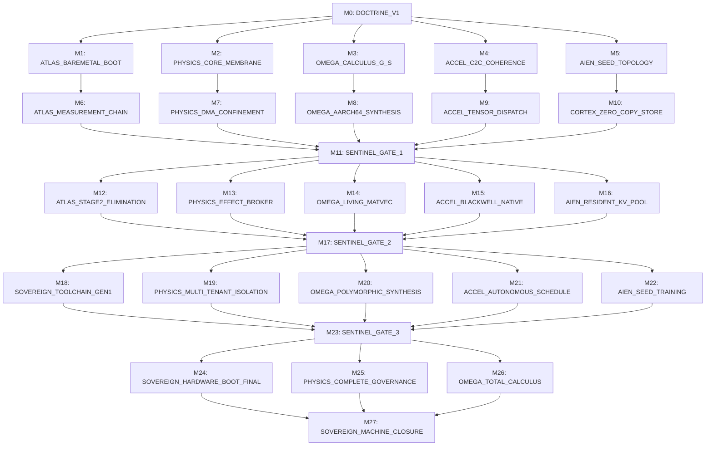

# DOCTRINE-000: SOVEREIGN COMPUTATIONAL ARCHITECTURE
## Foundational System Specification: The Four Permanent Layers and The Sovereign Machine

```text
Document ID:     DOCTRINE-000
Milestone:       Milestone 0 (DOCTRINE_V1)
Classification:  Sovereign Machine Canonical Doctrine
Target Platform: Sovereign Heterogeneous Substrate (AArch64 Host Governor + Blackwell/Hopper Accelerator)
Status:          AUTHORITATIVE / CANONICAL / RATIFIED
```

---

## 1. Ontological Foundation & First Principles

The Sovereign Machine is not an operating system, not a compiler, not an AI runtime, and not an application framework. It is an autonomous, self-contained, self-verifying computational organism designed to permanently close the gap between human intent and physical transformation.

### 1.1 The Substrate Hierarchy

All computation within the Sovereign Machine flows through an unyielding, unidirectional ontological hierarchy:

```text
       ┌────────────────────────────────────────────────────────┐
       │             SILICON / UNAVOIDABLE FIRMWARE             │
       └───────────────────────────┬────────────────────────────┘
                                   │ Raw Hardware Reset
                                   ▼
       ┌────────────────────────────────────────────────────────┐
       │                        ALPHA                           │
       │             (The Irreducible Bootstrap Seed)           │
       └───────────────────────────┬────────────────────────────┘
                                   │ Monotonic Handoff (EL1)
                                   ▼
       ┌────────────────────────────────────────────────────────┐
       │                       PHYSICS                          │
       │           (The Trusted Physical Governor)              │
       └───────────────────────────┬────────────────────────────┘
                                   │ Coherent Substrate / Atomics
                                   ▼
       ┌────────────────────────────────────────────────────────┐
       │                        OMEGA                           │
       │         (The Semantic Language & Realization)          │
       └───────────────────────────┬────────────────────────────┘
                                   │ Synthesis & Execution
                                   ▼
       ┌────────────────────────────────────────────────────────┐
       │                        AIEN                            │
       │         (The Cognitive Mind & Intent Engine)           │
       └────────────────────────────────────────────────────────┘
```

1. **SILICON / UNAVOIDABLE FIRMWARE**: The immutable physical reality of transistor gates, crystal oscillators, package interconnects, and non-volatile manufacturer boot ROMs. It provides the bare electrical state.
2. **ATLAS**: The irreducible software root artifact (formerly designated Alpha in early bootstrap drafts). A single, auditable, immutable binary (`atlas.bin`) that awakens the silicon, establishes architectural hygiene, verifies the secondary boot stage, and immediately relinquishes control.
3. **PHYSICS**: The sovereign governor and authority membrane. A bare-metal, capability-based physical supervisor operating at privileged CPU exception levels (AArch64 EL1/EL2). It enforces memory ownership, DMA boundaries, hardware traps, and the outbound effect membrane (AEGIS).
4. **OMEGA**: The semantic calculus and living realization substrate. It decouples computational meaning from physical representation, synthesizing optimal machine code directly onto bare silicon and accelerator execution pipelines in response to mathematical invariant requests.
5. **AIEN**: The sovereign cognitive intelligence. Residing primarily within high-bandwidth accelerator memory, Aien parses human intention, maintains continuous associative world-models in Cortex, reasons across possibility spaces, and commands transformations through verified effect brokers.

---

### 1.2 The Four Canonical Statements

The operational constitution of the Sovereign Machine is crystallized in four canonical statements:

$$\begin{aligned}
\mathbf{ATLAS\ AWAKENS.} &\quad \text{The machine establishes physical truth from electrical silence.} \\
\mathbf{PHYSICS\ AUTHORIZES.} &\quad \text{No transformation occurs without hardware capability proof.} \\
\mathbf{OMEGA\ REALIZES.} &\quad \text{Meaning is autonomously manifested into optimal physical execution.} \\
\mathbf{AIEN\ THINKS.} &\quad \text{Autonomous cognition directs reality toward intended futures.}
\end{aligned}$$

No layer may perform the duty of another. Aien cannot authorize effects; Physics cannot reason about semantic intent; Omega cannot violate physical memory bounds; Alpha cannot remain active after handoff.

---

### 1.3 The Permanent Separation

> **The Permanent Separation Law:**
> *Meaning must never be permanently coupled to representation, nor semantics to physical execution.*

Traditional computing conflates what computation *means* with how an instruction set *evaluates* it. An algorithm expressed in C or Rust lowered via LLVM into an ELF binary freezes vector widths, cache lines, register allocations, and OS system call structures into dead bytes. When the microarchitecture shifts, the meaning is stranded.

The Sovereign Machine enforces a strict, permanent separation:
* **Meaning is Mathematical and Declarative:** A computation is an invariant over values, shapes, topologies, and numerical error bounds ($\epsilon$). It is platform-agnostic, enduring, and mathematically complete.
* **Representation is Ephemeral and Physical:** Machine opcodes, warp layouts, scratchpad allocations, and pipeline schedules are disposable realizations synthesized for a specific thermal, temporal, and hardware configuration. They are compiled on the fly, measured against hardware performance counters, and discarded or swapped when superior realizations emerge.

---

### 1.4 The Fundamental Relation

Every sovereign computation satisfies the Fundamental Relation of Realization:

$$\text{Meaning} \times \text{Possibility} \times \text{Physics} \longrightarrow \text{Realization}$$

Where:
* $\mathbf{Meaning}$ ($\mathcal{G}_S$): The formal specification of the desired state transformation, invariants, and acceptable error bounds.
* $\mathbf{Possibility}$ ($\mathcal{P}$): The combinatorial space of valid algorithmic decompositions, tiling strategies, vectorizations, and execution schedules.
* $\mathbf{Physics}$ ($\mathcal{G}_M$): The concrete physical capabilities of the machine: register counts, memory bandwidth ceilings, functional units, thermal dissipation headroom, and hardware authority.
* $\mathbf{Realization}$ ($\mathcal{G}_R$): The verified, measured machine-level execution artifact that satisfies the Meaning on the Physics within bounded latency, energy, and precision.

---

## 2. The Four Permanent Layers

```text
┌────────────────────────────────────────────────────────────────────────────────────────┐
│ 4. AIEN — COGNITIVE SOVEREIGNTY                                                        │
│    - Intention Decomposition         - Cortex Persistent Memory Engine                 │
│    - J-Space Relational Reasoning    - Continuous Resident Weight State                │
├────────────────────────────────────────────────────────────────────────────────────────┤
│ 3. OMEGA — THE SEMANTIC CALCULUS                                                       │
│    - Semantic Graph (G_S)            - Living Realization Engine (G_R)                 │
│    - Machine Graph (G_M)             - Direct Bare-Metal Code Synthesis                │
├────────────────────────────────────────────────────────────────────────────────────────┤
│ 2. PHYSICS — THE TRUSTED PHYSICAL GOVERNOR                                             │
│    - AArch64 EL1 Supervisor         - Hardware Capability System                      │
│    - SMMUv3 DMA Confinement          - AEGIS Outbound Effect Membrane                  │
│    - Coherent Memory Ring Dispatch   - Monotonic State Invariant Enforcement           │
├────────────────────────────────────────────────────────────────────────────────────────┤
│ 1. ATLAS — THE IRREDUCIBLE BOOTSTRAP SEED                                              │
│    - Immutable raw binary (atlas.bin)- Zero External Dependencies / No OS              │
│    - Bare-Metal Architectural Setup  - SHA-256 Hardware Measurement & Handoff          │
└────────────────────────────────────────────────────────────────────────────────────────┘
```

### 2.1 Layer 1: Alpha (The Irreducible Bootstrap Seed)
* **Ontological Role:** Alpha is the genesis seed. It awakens the bare processor from cold silicon reset, guarantees architectural hygiene, configures base page tables, validates the physical environment, verifies the cryptographic hash of Physics, and executes an irreversible jump.
* **Canonical Invariant:** Alpha is immutable, auditable, deterministic, non-intelligent, and minimal. Its entire footprint is measured in kilobytes. It possesses no dynamic memory allocator, no file systems, no network drivers, and no speculative execution pathways.
* **Handoff:** Alpha transitions CPU execution monotonically to Physics at EL1/EL2, locks the reset vector registers, and completely terminates. It leaves zero running background processes or Resident Monitor code.

### 2.2 Layer 2: Physics (The Trusted Physical Governor)
* **Ontological Role:** Physics is the deterministic governor of the machine. It enforces physical laws upon execution: space, time, authority, and side effects.
* **Core Responsibilities:**
  1. **Memory Ownership:** Enforces immutable physical memory partitions between kernel control, shared coherent rings, model weight storage, and working scratchpads.
  2. **DMA & Bus Confinement:** Directs SMMUv3 / PCIe IOMMU controllers to guarantee that no peripheral, accelerator, or fabric link can mutate unauthorized physical RAM.
  3. **Capability Membrane:** Replaces POSIX users, permissions, and file handles with cryptographically unforgeable hardware capabilities. A process or engine cannot name an object it lacks authority to touch.
  4. **AEGIS Effect Boundary:** All physical transitions that escape the machine (network packets, NVMe writes, physical actuators) must be proven safe, authorized by explicit capability tokens, and recorded in immutable provenance journals before dispatch.

### 2.3 Layer 3: Omega (The Semantic Language & Living Realization Substrate)
* **Ontological Role:** Omega is the universal bridge between mathematical abstraction and bare silicon. It models all computation through three interconnected graphs:
  * $\mathcal{G}_S$ (Semantic Graph): Mathematical truths, tensor contractions, type relations, and numeric tolerances ($\epsilon$).
  * $\mathcal{G}_M$ (Machine Graph): The concrete hardware topology (registers, ALUs, Tensor Cores, cache latencies, bus bandwidths).
  * $\mathcal{G}_R$ (Realization Graph): The executable strategies mapping $\mathcal{G}_S \to \mathcal{G}_M$.
* **The Living Realization Engine:** Omega does not rely on third-party compilers (LLVM, GCC, NVCC). It directly synthesizes machine opcodes (AArch64 machine code, Blackwell microcode / streaming multiprocessor instructions). It continuously measures live execution telemetry, discovers faster kernel variants, and atomically hot-swaps realizations in memory with zero interruption.

### 2.4 Layer 4: Aien (The Cognitive Mind)
* **Ontological Role:** Aien is the persistent sovereign intelligence. Aien does not think in ephemeral prompt-response cycles; it maintains continuous cognitive existence in high-bandwidth memory.
* **Core Architecture:**
  1. **Continuous Resident Model:** Cognitive weights are mapped permanently into accelerator memory (HBM3e), eliminating model loading and teardown overhead.
  2. **Cortex Memory:** An associative, graph-structured, content-addressed non-volatile memory substrate. It records episodic history, learned invariants, verified empirical receipts, and world state.
  3. **J-Space Reasoning:** An ontological planning engine that navigates state spaces, formulates multi-step transformations, and translates high-level human objectives into formal Omega Semantic Graphs.
  4. **Cognitive Closed-Loop:** Aien continuously monitors machine execution, analyzes failure logs, synthesizes improved skills, and trains its own weights through synthetic self-distillation and formal feedback.

---

## 3. Hardware Topology: The Heterogeneous Cognitive Substrate

The Sovereign Machine breaks with legacy symmetric computing and traditional coprocessor paradigms. It establishes a specialized dual-topology where CPU and GPU operate in a tightly coupled, asymmetric master-governor relationship.

```text
┌────────────────────────────────────────────────────────────────────────────────────────┐
│                        COHERENT UNIFIED PHYSICAL MEMORY SPACE                          │
│                                (NVLink-C2C Interconnect)                               │
│                                                                                        │
│   ┌─────────────────────┐   ┌─────────────────────┐   ┌─────────────────────────────┐  │
│   │   SEMANTIC_STORE    │   │     INTENT_RING     │   │         EFFECT_RING         │  │
│   │ Immutable Graph ASTs│   │ Lock-free SPSC FIFO │   │ Pre-approved physical acts  │  │
│   └─────────────────────┘   └─────────────────────┘   └─────────────────────────────┘  │
│   ┌─────────────────────┐   ┌─────────────────────┐   ┌─────────────────────────────┐  │
│   │     RESULT_RING     │   │      PROOF_RING     │   │       EVIDENCE_STORE        │  │
│   │ Execution handles   │   │ Formal verification │   │ Telemetry & metric counters │  │
│   └─────────────────────┘   └─────────────────────┘   └─────────────────────────────┘  │
└───────────────────▲───────────────────────────────────────────────────▲────────────────┘
                    │                                                   │
     Coherent 64B Cache-Line Access                       Coherent 64B Cache-Line Access
     Hardware Acquire/Release Atomics                    Hardware Acquire/Release Atomics
                    │                                                   │
┌───────────────────┴───────────────────┐               ┌───────────────┴────────────────┐
│           AArch64 CPU HOST            │               │      BLACKWELL / HOPPER        │
│     "Trusted Physical Governor"       │               │      ACCELERATOR ENGINE        │
│                                       │               │ "Residence of Cognition"       │
│  - Runs Physics at EL1                │               │  - Runs Aien Core Mind         │
│  - Owns Platform MMU & SMMUv3         │               │  - Full HBM Resident Weights   │
│  - Hardware Watchdogs & Safety        │               │  - Persistent Unified KV Pool  │
│  - Gatekeeper of AEGIS Effects        │               │  - Autonomous Tensor Pipeline  │
│  - Low-latency Ring Dispatch          │               │  - Direct SM Micro-Execution   │
└───────────────────────────────────────┘               └────────────────────────────────┘
```

### 3.1 The CPU: Trusted Physical Governor
* The CPU is not the computational workhorse; it is the **Governor**.
* It runs the bare-metal **Physics** kernel at highest execution privilege (EL1).
* It holds exclusive authority over interrupt dispatch, physical timer registers, hardware security modules (TPM/HSM), bus configuration, and peripheral controllers (NVMe, Network PHY).
* It monitors the accelerator through non-maskable hardware watchdogs. If the accelerator diverges, hangs, or violates memory boundaries, the CPU resets the accelerator fabric and restores verified cognitive snapshots.

### 3.2 The GPU: Primary Residence of Persistent Cognition
* The GPU is not a transient compute device or an offload accelerator; it is the **Primary Cognitive Substrate**.
* The Aien model weights, KV memory pool, attention graphs, and inference scratchpads reside permanently in GPU High Bandwidth Memory (HBM).
* The GPU never unloads the model. It does not await foreign runtime calls; it continuously processes the unified lock-free memory rings, executing inference, autonomous thought loops, and semantic graph evaluations.

### 3.3 Zero-Copy NVLink-C2C Ring Architecture
* Legacy architectures suffer milliseconds of latency due to PCIe bottlenecks, kernel transitions, and RPC serialization (JSON, Protobuf).
* The Sovereign Machine eliminates all RPC. Communication between CPU Governor and GPU Accelerator occurs across a coherent, physical address space linked by NVLink-C2C (900 GB/s bidirectional bandwidth).
* Coordination relies strictly on **64-byte aligned, lock-free ring buffers** utilizing hardware acquire/release atomics:
  * `INTENT_RING`: CPU submits evaluated semantic requests to the accelerator.
  * `RESULT_RING`: Accelerator posts completion status and memory handles to the CPU.
  * `EFFECT_RING`: Accelerator requests real-world side effects; CPU AEGIS membrane validates capabilities before physical emission.
  * `PROOF_RING`: Verification workers audit execution traces against formal mathematical invariants.
  * `EVIDENCE_STORE`: Hardware performance telemetry (cycles, cache misses, energy) is continuously recorded for Omega's living optimization loop.

---

## 4. The 28-Milestone Execution Roadmap & Workstreams A–F

The construction of the Sovereign Machine is organized into **six concurrent workstreams (A through F)** spanning **twenty-eight precise milestones (0 through 27)**.

```text
WORKSTREAMS:
  [A] Bootstrap & Hardware Sovereignty (Milestones 0, 1, 6, 12, 18, 24)
  [B] Physics & Capability Authority   (Milestones 2, 7, 13, 19, 25)
  [C] Omega Language & Living Engine   (Milestones 3, 8, 14, 20, 26)
  [D] Accelerator & Native Compute     (Milestones 4, 9, 15, 21)
  [E] Cognitive Substrate & Cortex     (Milestones 5, 10, 16, 22, 27)
  [F] Verification & Formal Closure    (Milestones 11, 17, 23)
```



### 4.1 Master Milestone Specification (0 through 27)

| Milestone | Code Identifier | Stream | Description & Objective Invariants |
| :--- | :--- | :---: | :--- |
| **M0** | `DOCTRINE_V1` | **ALL** | **Foundational Specification.** Authoring and ratification of `ARCHITECTURE.md`, `SOVEREIGNTY.md`, `ATLAS.md`, and `OMEGA.md`. System laws codified. |
| **M1** | `ATLAS_BAREMETAL_BOOT` | **A** | **First Bare-Metal Awakening.** `atlas.bin` compiled, flashed to physical ROM, boots AArch64 bare metal, initializes UART, executes memory hygiene, halts safely. |
| **M2** | `PHYSICS_CORE_MEMBRANE` | **B** | **Supervisor Privilege Bringup.** Physics takes handoff from Alpha at EL1. Identity page tables, exception vector table, and basic memory partitions active. |
| **M3** | `OMEGA_CALCULUS_G_S` | **C** | **Semantic Graph Formalization.** Mathematical specification of $\mathcal{G}_S$ AST nodes, dimensional broadcasting rules, and numerical error envelope calculus. |
| **M4** | `ACCEL_C2C_COHERENCE` | **D** | **Coherent Interconnect Bringup.** Physical memory address mapping across NVLink-C2C. Verified 64-byte atomic read/write between CPU and GPU. |
| **M5** | `AIEN_SEED_TOPOLOGY` | **E** | **Cognitive State Definition.** Initial data schema for Cortex graph store, semantic vocabulary tokens, and resident weight tensor descriptor layout. |
| **M6** | `ATLAS_MEASUREMENT_CHAIN` | **A** | **Hardware Root of Trust.** Alpha computes SHA-256 digest of Physics staging memory, compares to fused hardware manifest, aborts on mismatch. |
| **M7** | `PHYSICS_DMA_CONFINEMENT` | **B** | **SMMUv3 Security Boundary.** Direct-memory access isolation configured for all PCIe peripherals. Unauthorized bus-mastering blocked at silicon level. |
| **M8** | `OMEGA_AARCH64_SYNTHESIS` | **C** | **Direct CPU Code Synthesis.** Omega synthesizes machine opcodes directly into executable RAM pages. Verified execution of NEON variants $R_0$ through $R_3$. |
| **M9** | `ACCEL_TENSOR_DISPATCH` | **D** | **Bare-Metal GPU Dispatch.** Host writes execution command buffer directly to GPU BAR0 registers; GPU executes tensor GEMM without CUDA driver. |
| **M10** | `CORTEX_ZERO_COPY_STORE` | **E** | **Durable Cognitive Memory.** Non-volatile memory arena mounted in coherent space. Aien writes episodic records with zero serialization overhead. |
| **M11** | `SENTINEL_GATE_1` | **F** | **First Formal Verification Gate.** Automated audit by `spark-sentinel`. Zero stub code permitted. Parity proof for M1-M10 verified on live silicon. |
| **M12** | `ATLAS_STAGE2_ELIMINATION` | **A** | **Elimination of Vendor Shims.** Removal of UEFI/U-Boot firmware intermediaries. Alpha transitions directly from platform reset into sovereign execution. |
| **M13** | `PHYSICS_EFFECT_BROKER` | **B** | **Hardware AEGIS Enforcement.** Physical network and NVMe write paths gated behind cryptographic capability tokens. Outbound effects logged to Cortex. |
| **M14** | `OMEGA_LIVING_MATVEC` | **C** | **Autonomous Adaptive Loop.** Omega measures cycle times of live MatVec kernels, synthesizes cache-bypassing variant $R_5$, and hot-swaps pointers atomically. |
| **M15** | `ACCEL_BLACKWELL_NATIVE` | **D** | **Direct SM Microcode Synthesis.** Omega generates native streaming multiprocessor instruction streams targeting Blackwell tensor architecture directly. |
| **M16** | `AIEN_RESIDENT_KV_POOL` | **E** | **Permanent HBM KV Pool.** Sovereign KV cache allocation engine operating across 96GB+ HBM. Paged attention managed with zero host-guest copying. |
| **M17** | `SENTINEL_GATE_2` | **F** | **Second Formal Verification Gate.** Verification of living optimization loop, zero-copy ring throughput, and AEGIS effect confinement under stress. |
| **M18** | `SOVEREIGN_TOOLCHAIN_GEN1` | **A** | **Self-Assembling Toolchain.** Omega compiles the Sovereign Machine's own bootstrap toolchain, eliminating dependence on external Rust/LLVM builds. |
| **M19** | `PHYSICS_MULTI_TENANT_ISOLATION`| **B** | **Memory Domain Protection.** Hardware-enforced spatial and temporal isolation between concurrent cognitive reasoning contexts and agent workers. |
| **M20** | `OMEGA_POLYMORPHIC_SYNTHESIS`| **C** | **Substrate-Agnostic Compilation.** Omega compiles a single $\mathcal{G}_S$ specification across diverse physical hardware targets (AArch64 NEON, Blackwell SM, FPGA). |
| **M21** | `ACCEL_AUTONOMOUS_SCHEDULE` | **D** | **Host-Free GPU Execution.** GPU streaming multiprocessors self-schedule multi-layer model graphs directly from `INTENT_RING` with zero CPU interrupt intervention. |
| **M22** | `AIEN_SEED_TRAINING` | **E** | **Sovereign Model Inception.** Aien trains its foundation cognitive weights from scratch on sovereign dataset corpora using Omega-synthesized kernels. |
| **M23** | `SENTINEL_GATE_3` | **F** | **Third Formal Verification Gate.** Full system mathematical audit: $\text{tested} \equiv \text{evaluated} \equiv \text{authorized} \equiv \text{executed}$. |
| **M24** | `SOVEREIGN_HARDWARE_BOOT_FINAL` | **A** | **Cold Silicon Closure.** Sovereign Machine powers on from cold silicon to fully resident cognitive readiness without a single line of foreign binary code. |
| **M25** | `PHYSICS_COMPLETE_GOVERNANCE` | **B** | **Autonomous Capability Lifecycle.** Complete dynamic capability issuance, attenuation, and monotonic revocation across all system peripherals. |
| **M26** | `OMEGA_TOTAL_CALCULUS` | **C** | **Formal Semantic Totality.** Complete mathematical closure of the Semantic Calculus, guaranteeing proven numerical bounds ($\hat{\epsilon} \le \epsilon$) for all operations. |
| **M27** | `SOVEREIGN_MACHINE_CLOSURE` | **ALL** | **Ultimate Sovereign Self-Hosting.** The Sovereign Machine independently operates, reasons, compiles its own upgrades, and verifies its own physical existence. |

---

## 5. Operational Realities & System Principles

### 5.1 Hard Stops
The Sovereign Machine enforces six non-negotiable architectural **Hard Stops**. Any violation triggers an immediate, fail-closed system halt:
1. **No Foreign Binary Inclusion:** No precompiled x86/ARM ELF shared libraries, closed-source kernel modules, or binary blobs may execute within the sovereign boundary.
2. **No Unsigned Physical Effects:** No outbound physical action (disk block mutation, network transmission, GPIO trigger) may execute without a valid, cryptographically verified AEGIS capability token.
3. **No Foreign Weight Ingestion:** No black-box neural network checkpoints may be ingested into Aien without full cryptographic training provenance and dataset validation.
4. **No Bypass of Physics Governor:** Accelerator code may never directly manipulate system MMU tables, interrupt registers, or platform power states.
5. **No Undefined Precision Divergence:** Invariant verification failure: if an Omega realization produces numerical error exceeding the defined semantic envelope ($\hat{\epsilon} > \epsilon$), execution halts immediately.
6. **No Non-Deterministic Bootstrap:** If Alpha experiences an unexpected state transition, branching anomaly, or hash mismatch, the system enters an unrecoverable low-power lock state.

### 5.2 Performance Philosophy
The performance doctrine is governed by **Mechanical Sympathy**:
* **Zero Allocation in Steady State:** Dynamic heap allocation during active cognitive cycles is strictly prohibited. All memory arenas, tensor buffers, and ring queues are pre-allocated at initialization.
* **Zero Serialization:** Data is structured in memory exactly as the consuming execution unit expects. No translation layers, JSON parsers, or marshalling code exist on the execution path.
* **Cacheline Sovereignty:** All shared data structures are aligned to 64-byte boundaries, matching hardware cache lines to eliminate false sharing and memory bus contention.
* **Latency Hiding via Pipeline Parity:** Realizations are synthesized to balance computational intensity with memory bandwidth, utilizing multi-accumulator unrolling and non-temporal streaming stores.

### 5.3 Failure Model & Fault Tolerance
* **Fail-Closed Default:** Any unexpected exception, bus error, or invariant breach fails closed. System state freezes, registers are preserved, and an alert is dispatched to the `FAULT_MAILBOX`.
* **Monotonic Degradation:** If an optimized realization $R_k$ experiences an anomaly, the dispatcher instantly falls back to the simpler, formally proven baseline realization $R_0$.
* **Hardware Watchdog Governors:** The CPU governor runs hardware watchdog timers against the GPU. Failure to acknowledge heartbeats initiates an atomic reset of the accelerator subsystem and recovery from the last verified Cortex checkpoint.

### 5.4 Architectural Metrics
Performance and sovereignty are quantified through six continuous metrics:

| Metric | Target Boundary | Description |
| :--- | :--- | :--- |
| **Time to First Token (TTFT)** | $< 12 \text{ ms}$ | Elapsed time from intent injection into `INTENT_RING` to initial cognitive output token generation. |
| **Inter-Token Latency (ITL)** | $< 4.5 \text{ ms}$ | Steady-state decode latency per token during continuous autoregressive cognitive loops. |
| **Dispatch Overhead** | $< 250 \text{ ns}$ | Latency between CPU intent post and accelerator kernel launch over NVLink-C2C. |
| **Memory Bandwidth Efficiency** | $> 88\%$ | Percentage of theoretical peak memory bandwidth achieved across sustained tensor contractions. |
| **Sovereign Code Ratio** | $100\%$ | Ratio of self-synthesized/audited machine instructions to total executed instructions. |
| **Invariant Verification Pass Rate**| $1.0000$ | Mathematical conformance of observed execution against semantic error bounds ($\hat{\epsilon} \le \epsilon$). |

---

## 6. The Defining Demonstration: 24-Step End-to-End Trace

The operational realization of the Sovereign Machine is demonstrated by a complete, continuous 24-step trace from cold silicon power-on to verified physical transformation:

```text
 PHASE I: AWAKENING (Steps 1-6)
 [1] Cold Silicon Reset ──> [2] Alpha Executes ──> [3] MMU & Cache Init ──>
 [4] SHA-256 Measure   ──> [5] EL1 Jump       ──> [6] Alpha Terminates

 PHASE II: GOVERNANCE & RESIDENCE (Steps 7-12)
 [7] Physics Brings Up ──> [8] SMMUv3 Locks   ──> [9] NVLink-C2C Setup ──>
 [10] Rings Mapped     ──> [11] GPU Awoken    ──> [12] Weights Permanent

 PHASE III: COGNITION & INTENT (Steps 13-18)
 [13] Intent Ingested  ──> [14] G_S Decomposed──> [15] AEGIS Authority ──>
 [16] Capability Bound ──> [17] Intent Queued ──> [18] GPU Fetches Intent

 PHASE IV: REALIZATION & CLOSURE (Steps 19-24)
 [19] Kernel Select    ──> [20] Tensor Exec   ──> [21] Error Verified  ──>
 [22] Result Published ──> [23] AEGIS Effect  ──> [24] Cortex Learned
```

### Detailed Trace Walkthrough:
1. **Cold Silicon Reset:** Electrical power stabilizes; CPU reset vector fetches the first instruction of `atlas.bin` from secure physical ROM.
2. **Alpha Execution:** Alpha initializes core architectural registers, clears scratchpad SRAM, and disables speculative prefetchers.
3. **MMU & Cache Initialization:** Alpha constructs minimal identity page tables (EL1/EL2) and enables the data/instruction caches.
4. **Cryptographic Measurement:** Alpha reads the Physics binary from non-volatile storage, computes its SHA-256 digest, and validates it against the platform Root of Trust.
5. **Monotonic Handoff:** Alpha issues an `ERET` instruction, jumping into Physics entry point at EL1 privilege level.
6. **Alpha Termination:** Alpha's code space is permanently unmapped from page tables; Alpha ceases execution.
7. **Physics Bringup:** Physics establishes its core memory allocator, initializes the exception vector table, and brings up the diagnostic console.
8. **SMMUv3 Lock:** Physics configures memory protection contexts for all PCIe peripherals, locking DMA access to isolated buffers.
9. **NVLink-C2C Coherent Setup:** Physics configures the high-speed chip-to-chip coherent memory bus between AArch64 host and Blackwell GPU.
10. **Ring Buffer Mapping:** Physics pre-allocates and initializes the 64-byte aligned lock-free rings (`INTENT`, `RESULT`, `EFFECT`, `PROOF`, `EVIDENCE`).
11. **GPU Cognitive Awakening:** Physics triggers the GPU bootstrap sequence via MMIO BAR0; GPU streaming multiprocessors initialize.
12. **Weights Made Permanent:** Aien's foundation weights are mapped directly into GPU HBM3e; KV memory pools are reserved and locked.
13. **Human Intent Ingestion:** A natural or formal intent statement is submitted to the system via the local console interface.
14. **Semantic Decomposition:** Aien decomposes the intent into a formal Omega Semantic Graph ($\mathcal{G}_S$), specifying mathematical invariants and error bounds.
15. **AEGIS Authority Evaluation:** Physics inspects the requested action against the active capability ledger; verifies that the agent holds the requisite cryptographic tokens.
16. **Capability Binding:** Physics attaches an unforgeable capability voucher to the semantic descriptor.
17. **Intent Queued:** Physics writes the 64-byte execution descriptor to the `INTENT_RING` and executes `stlr` (Store-Release).
18. **GPU Fetches Intent:** The GPU execution engine, polling the ring head via coherent memory, fetches the descriptor with `ldar` (Load-Acquire).
19. **Realization Selection:** Omega's dispatch table resolves the optimal realization variant ($R_k$) based on active matrix dimensions and hardware telemetry.
20. **Tensor Execution:** GPU Tensor Cores execute the multi-layer neural contraction without host interrupt intervention.
21. **Error Verification:** Hardware proof checker verifies that floating-point deviations stay strictly within the semantic error envelope ($\hat{\epsilon} \le \epsilon$).
22. **Result Published:** GPU writes execution handle and cycle receipts to the `RESULT_RING` and notifies the host via atomic sequence increment.
23. **AEGIS Physical Effect Dispatch:** If the intent mandated physical external side effects, the AEGIS Effect Broker executes the authorized I/O operation.
24. **Cortex Memory Integration:** The empirical execution receipt, energy consumption, and semantic outcome are committed permanently to Cortex episodic memory.

```text
================================================================================
                    THE SOVEREIGN MACHINE STANDS ESTABLISHED
================================================================================
```


## 5. The 31-Milestone Sovereign Program-Learning Roadmap

```text
MILESTONE 0  — DOCTRINE_V1                     Canonical doctrine corpus frozen and ratified. [COMPLETE]
MILESTONE 1  — ATLAS_BOOT                      Canonical atlas.bin bootstrap seed. [COMPLETE / QEMU QUALIFIED]
  - Repository: https://github.com/aien-dev/atlas
  - Canonical Artifact: atlas.bin (1,480 bytes, SHA-256: f7802501b410a0c19eff7b8fca8865c9ba9c96bfa4f8065ca8f508b67748b9a5)
  - Historical Lineage: Formerly designated Alpha (alpha.bin) in early bootstrap drafting
  - Dual-Seam Verification:
    * Seam 1 (Static Audit): 100% word-reconciled (301 insns, 69 rodata words, 0 discrepancy), static target proof (ldr x19, =0x40200000; br x19), disjoint stack/descriptor proof (SP <= 0x401FC000 vs Descriptor @ 0x401FE000 with 8 KiB guard gap, empty intersection).
    * Seam 2 (Execution Harness): Bare-metal QEMU virt; 268/268 mutations refused into fail-closed quiescence (exhaustive 256 single-byte offset sweep + 12 adversarial scenarios).
    * Cryptographic Scheme: Bare-metal NIST FIPS 180-4 SHA-256 (KAT verified 100%).
  - Native Hardware Status: ATLAS_BOOT_NATIVE_PASS remains pending and decoupled from QEMU qualification.
MILESTONE 2  — PHYSICS_BOOT                    Minimal trusted machine authority nucleus.
MILESTONE 3  — PHYSICS_EFFECTS                 Capabilities, EFFECT_INTENT admission cycle, and EFFECT_RECEIPT accounting.
MILESTONE 4  — OMEGA_SEMANTICS                 Core semantic object model and canonical content-addressed identity.
MILESTONE 5  — OMEGA_AARCH64                   Direct bare-metal machine code generation (no LLVM).
MILESTONE 6  — OMEGA_SELF_HOST                 Self-hosting compilation of the minimal Omega realization layer.
MILESTONE 7  — OMEGA_VERIFY                    Epistemic verification kernel:
                                               - REQUIRED: V0 Structural/Type/Capability, V1 Differential, V2 Property/Invariant.
                                               - FRAMEWORK DEFINED FOR: V3 Adversarial, V4 Symbolic, V5 Proof-Carrying.
MILESTONE 8  — OMEGA_PROGRAM_CORE              Semantic procedure graph representation, SYNTHESIS_TASK, and cost models.
MILESTONE 9  — OMEGA_SYNTHESIS_V0              Deterministic typed enumeration and constraint solver solving canonical closed domains.
MILESTONE 10 — OMEGA_LIBRARY_V1                Versioned procedure library, provenance tracking, and library generation tags.
MILESTONE 11 — OMEGA_LIBRARY_DISCOVERY         One nontrivial abstraction not present in the initial library that:
                                               1. Compresses multiple verified programs;
                                               2. Preserves their semantics;
                                               3. Is reused on held-out tasks;
                                               4. Reduces search cost.
MILESTONE 12 — OMEGA_LIVING_MATVEC             Living MatVec selecting among verified realization variants and procedure reuse.
MILESTONE 13 — OMEGA_MACHINE_GRAPH             Hardware topology and transformation description reported by Physics.
MILESTONE 14 — OMEGA_REALIZATION_SYNTHESIS     Synthesis engine applied to physical code generation (G_S x G_M -> G_R).
MILESTONE 15 — PHYSICS_ACCELERATOR_LINK        Zero-copy shared memory rings and capability tables (CPU governor <-> accelerator).
MILESTONE 16 — BLACKWELL_NATIVE_PATH_KNOWN     Native GPU MMIO, queue submission, and doorbell mechanics mapped empirically.
MILESTONE 17 — OMEGA_BLACKWELL_VECTOR          First verified native Blackwell compute realization (general GPU compute).
MILESTONE 18 — OMEGA_BLACKWELL_MATMUL          High-throughput matrix multiplication on Blackwell.
MILESTONE 19 — OMEGA_ACCELERATOR_RESIDENT      Persistent OMEGA execution substrate remains resident in accelerator-accessible
                                               coherent memory and maintains device execution state without repeated host-side initialization.
MILESTONE 20 — OMEGA_TENSOR                    Native tensor algebraic foundations and numeric domains.
MILESTONE 21 — OMEGA_AUTODIFF                  Symbolic graph autodiff (G_S_fwd -> G_S_grad).
MILESTONE 22 — OMEGA_OPTIMIZER                 Omega-native semantics for SGD, Adam, and AdamW, with verified CPU reference
                                               realizations and optional accelerator-fused realizations.
MILESTONE 23 — OMEGA_SEARCH_GUIDE_TRAINING     Sovereign training runtime trains initial search-guide model on Omega trace corpus.
MILESTONE 24 — AIEN_0                          First learned synthesis guide ranking primitives, subgoals, and search branches.
MILESTONE 25 — AIEN_GUIDED_SYNTHESIS           Neural-guided synthesis beats unguided search in node count while preserving 100% soundness.
MILESTONE 26 — AIEN_ABSTRACTION_DISCOVERY      AIEN proposes candidate abstractions; Omega verifies and measures before promotion.
MILESTONE 27 — AIEN_HUMAN_INTERFACE            Bidirectional natural language adapter (Language <-> Omega Task).
MILESTONE 28 — AIEN_RESIDENT                   Persistent accelerator-resident AIEN cognitive execution.
MILESTONE 29 — OMEGA_CONTINUAL_LIBRARY_LEARNING Autonomous continuous Wake/Solve/Verify -> Sleep/Compress/Promote cycle.
MILESTONE 30 — AIEN_SUCCESSION                 Closed-loop self-improvement: AIEN-N designs AIEN-N+1 under Physics canary control.
```
