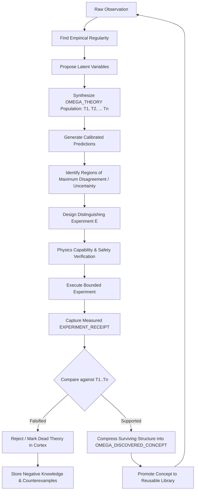

# DOCTRINE-006: DISCOVERY & PHYSICS ZERO — Sovereign Scientific Intelligence

```text
Document ID:     DOCTRINE-006
Milestone:       Milestone 0 (DOCTRINE_V1) & Physics Zero Era (M27-M35)
Classification:  Sovereign Machine Canonical Doctrine
Target Substrate: Complete Sovereign Stack (Atlas -> Physics -> Omega -> Aien)
Status:          AUTHORITATIVE / CANONICAL / RATIFIED
```

---

## 1. Executive Summary: The North Star

The long-term objective of the Sovereign Machine is no longer merely to build an intelligent model or a high-performance runtime. 

The objective is to build an autonomous machine that can:

$$\text{OBSERVE} \longrightarrow \text{HYPOTHESIZE} \longrightarrow \text{SYNTHESIZE} \longrightarrow \text{PREDICT} \longrightarrow \text{EXPERIMENT} \longrightarrow \text{FALSIFY} \longrightarrow \text{ABSTRACT} \longrightarrow \text{PROVE} \longrightarrow \text{REMEMBER} \longrightarrow \text{DISCOVER AGAIN}$$

**without inheriting human physical theories as answers.**

The machine must be capable of developing its own conceptual vocabulary and mathematical descriptions for reality:

```text
RAW EXPERIENCE
      ↓
DISCOVERED STRUCTURE
      ↓
PREDICTIVE PROCEDURES
      ↓
REUSABLE CONCEPTS
      ↓
TESTABLE THEORIES
      ↓
EXPERIMENTAL EVIDENCE
      ↓
BETTER THEORIES
```

---

## 2. The Canonical Architecture & Invariants

```text
SILICON / UNAVOIDABLE FIRMWARE
              ↓
            ATLAS
       BOOTSTRAP SEED
              ↓
           PHYSICS
   TRUSTED MACHINE AUTHORITY
              ↓
            OMEGA
 SEMANTICS + SYNTHESIS + VERIFICATION
      + REALIZATION + LEARNING
              ↓
             AIEN
  SOVEREIGN DISCOVERY INTELLIGENCE
```

### The Four Canonical Invariants
```text
ATLAS AWAKENS.

PHYSICS AUTHORIZES.

OMEGA DEFINES, SYNTHESIZES,
VERIFIES, AND REALIZES.

AIEN OBSERVES, THINKS,
HYPOTHESIZES, SEARCHES,
DISCOVERS, AND INVENTS.
```

---

## 3. The Physics vs. Physics Zero Distinction

Architectural terminology maintains a permanent, foundational separation:

```text
PHYSICS
=
THE TRUSTED MACHINE AUTHORITY (Constitutional governor of silicon, memory, devices, and effect admission)

PHYSICS ZERO
=
THE CLEAN-ROOM SCIENTIFIC DISCOVERY PROGRAM (Unbiased empirical discovery of nature's laws)
```

### The Foundational Physics Zero Rule
> **AIEN SHALL NOT RECEIVE HUMAN PHYSICAL LAWS AS TRAINING KNOWLEDGE IN THE DISCOVERY LINEAGE.**

The clean-room scientific discovery lineage strictly withholds:
- Newton's Laws, Maxwell's Equations, Relativity, Quantum Mechanics, Thermodynamics, Standard Model physics.
- Human ontological concepts: *mass, force, energy, momentum, charge, field, temperature, velocity, acceleration*.
- Named physical constants ($G, c, \hbar, k_B, \epsilon_0$).
- Textbook physics, human physics terminology, and scientific QA datasets.

These concepts may later be used by humans to interpret AIEN's discoveries; **they are strictly forbidden as inputs to the discovery process.**

---

## 4. Minimum Necessary Epistemic Priors

Physics Zero is not assumption-free. No intelligence can learn without representation. The architectural goal is:

$$\mathbf{\text{Minimum Necessary Epistemic Priors}} \quad \text{rather than} \quad \mathbf{\text{No Priors}}$$

Allowed foundations provided by Omega:
- **Formal Primitives**: Number, Logic, Set / Relation, Function, Composition, Order.
- **Epistemic Primitives**: Probability, Uncertainty, Measurement, Observation, Temporal Order, Action, Outcome, Hypothesis, Prediction, Counterexample.

Omega provides general mathematical machinery. It must **never** encode laws of nature as privileged primitives.

### The Two Physics Zero Research Modes

```text
┌────────────────────────────────────────────────────────────────────────┐
│ P0-MATH (Phase 1)                                                      │
├────────────────────────────────────────────────────────────────────────┤
│ • Supplied: Neutral mathematical toolbox (Calculus, Linear Algebra,    │
│   Differential Equations, Geometry, Probability, Optimization).        │
│ • Withheld: All physical laws, constants, and physical semantics.      │
│ • Research Question: Given human mathematics but zero human physics,   │
│   what physical theories does AIEN discover from observation?          │
└────────────────────────────────────────────────────────────────────────┘

┌────────────────────────────────────────────────────────────────────────┐
│ P0-PRIMITIVE (Phase 2 — Radical Experiment)                            │
├────────────────────────────────────────────────────────────────────────┤
│ • Supplied: Primitive mathematical foundations (Arithmetic, Relations, │
│   Function Composition, Sequences, Probability, Program Synthesis).    │
│ • Withheld: Higher calculus, coordinate manifolds, differential forms. │
│ • Research Question: What mathematical language does a discovery       │
│   system invent when attempting to understand physical reality?        │
└────────────────────────────────────────────────────────────────────────┘
```

---

## 5. The Contamination Firewall & Clean Lineage (`AIEN-P0`)

Physics Zero mandates a mathematically sealed model lineage: **`AIEN-P0`**.

```text
           FORBIDDEN CORPORA                        CLEAN ANCESTRY
┌───────────────────────────────────────┐   ┌───────────────────────────────┐
│ • Internet Crawls / Common Crawl      │   │ • Omega-generated tasks       │
│ • Scientific Papers (arXiv, DOI)      │   │ • Omega synthesis traces      │
│ • Physics Textbooks & Wikipedia       │   │ • Neutral mathematical proofs │
│ • Human Physics Q&A datasets          │   │ • Physics Zero observations   │
│ • Pretrained LLMs (Llama, GPT, etc.)  │   └───────────────┬───────────────┘
│ • Physics simulation source code      │                   │
│ • Named scientific benchmarks         │                   ▼
└───────────────────────────────────────┘               [ AIEN-P0 ]
```

### Cryptographic Lineage Tracking
Every model checkpoint in the `AIEN-P0` lineage must possess a tamper-proof cryptographic manifest:
```text
MODEL_ID:              sha256(weights || architecture)
TRAINING_CORPUS_ROOT:  sha256(merkle_root_of_all_training_shards)
OMEGA_LIBRARY_ROOT:    sha256(omega_library_generation)
WORLD_EXPOSURE_ROOT:   sha256(recorded_experiment_receipts)
CHECKPOINT_PARENT:     sha256(prior_checkpoint)
```
Any model containing a single token from a forbidden corpus fails the `P0_CONTAMINATION_AUDIT_PASS` and is permanently barred from Physics Zero qualification.

---

## 6. Sealed World Generation & Observation Protocols

The generative laws governing benchmark worlds must never enter AIEN's observation channel:

```text
┌───────────────────────────────────────┐
│          SEALED WORLD ORACLE          │
│   (Holds hidden generative laws:      │
│    no source code, labels, or names   │
│    ever leak to observation channel)  │
└───────────────────┬───────────────────┘
                    │
                    │ Observations Only
                    │ (CHANNEL_001, CHANNEL_002, ...)
                    ▼
               [ AIEN-P0 ]
                    │
                    │ Proposes EXPERIMENT_INTENT
                    ▼
               [ PHYSICS ]  (Enforces capability, safety, and rate limits)
                    │
                    │ Executes Bounded Mutation
                    ▼
          [ SEALED WORLD ORACLE ]
```

### Channel Randomization & Neutral Schema
- Field names must never leak ontology (e.g. `mass`, `velocity`, `force` are forbidden).
- Schema uses neutral numeric streams: `CHANNEL_001`, `CHANNEL_002`, `OBSERVATION_TIME`, `MEASUREMENT_UNCERTAINTY`, `ACTION_HISTORY`, or raw high-dimensional sensory feeds (pixels, waveforms).
- Every hidden world randomizes channel order, scaling factors, offsets, coordinate frames, and action identifiers.

---

## 7. The First-Class Discovery Objects in Omega

### 7.1 `OMEGA_THEORY`
An executable semantic model representing an explanatory hypothesis:

```text
OMEGA_THEORY:
  THEORY_ID:               Semantic digest
  OBSERVABLE_SCHEMA:       Set of tracked channels
  LATENT_VARIABLES:        Discovered unobserved state variables
  DERIVED_VARIABLES:       Synthesized functions of observables
  RELATIONS:               Mathematical equations and constraints
  DYNAMICAL_RULES:         Temporal evolution functions
  DOMAIN_OF_VALIDITY:      Regime bounds where predictions hold
  INITIAL_CONDITIONS:      State initialization requirements
  ASSUMPTIONS:             Explicit epistemic conditions
  PREDICTION_PROCEDURE:    Executable Omega synthesis procedure
  UNCERTAINTY_MODEL:       Variance and error distribution
  COUNTERFACTUAL_MODEL:    Interventional response functions
  KNOWN_FAILURES:          Catalog of regimes where theory breaks
  COUNTEREXAMPLES:         Recorded empirical falsifications
  EVIDENCE_IDS:            Cryptographic links to experiment receipts
  COMPETING_THEORY_IDS:    Active alternatives in population
  DESCRIPTION_LENGTH:      Kolmogorov-like program cost
  PREDICTIVE_SCORE:        Empirical accuracy ledger
  EXPERIMENTAL_STATUS:     SUPPORTED | UNDERDETERMINED | FALSIFIED | UNTESTED
  VERIFICATION_STATUS:     Omega V-Ladder proof certificate
```

### 7.2 `OMEGA_DISCOVERED_CONCEPT`
A synthesized abstraction representing an invented latent property:

```text
OMEGA_DISCOVERED_CONCEPT:
  SEMANTIC_ID:             e.g., Ω-A17, Ω-A92 (No human names)
  DEFINITION_GRAPH:        Exact mathematical composition graph
  DERIVATION:              Trace from originating observations
  INPUT_DOMAIN:            Admissible input state space
  OUTPUT_DOMAIN:           Resulting state space
  RELATIONS:               Coupling with other discovered concepts
  ORIGINATING_THEORIES:    Theories employing this concept
  PREDICTIVE_UTILITY:      Marginal improvement in prediction accuracy
  COMPRESSION_UTILITY:     Description length reduction in corpus
  COUNTERFACTUAL_UTILITY:  Interventional prediction power
  EVIDENCE:                Validating receipts
  COUNTEREXAMPLES:         Regimes where concept fails to hold
```

### 7.3 Mathematics Discovery Objects
- `OMEGA_CONJECTURE`: A mathematically formulated claim without an empirical or deductive proof.
- `OMEGA_THEOREM`: A conjecture paired with an Omega-verified deductive proof.
- `OMEGA_LEMMA`: An intermediate verified abstraction that shortens proof searches.
- `OMEGA_PROOF`: A verifiable V5 proof-carrying tree in Omega.
- `OMEGA_COUNTEREXAMPLE`: A concrete mathematical state refuting a conjecture.

---

## 8. The Scientific Discovery Loop & Theory Competition



### Theory Competition & The Distinguishing Experiment
AIEN maintains an active population of competing theories ($\mathcal{T} = \{T_1, T_2, \dots, T_n\}$). When multiple theories explain historical observations, AIEN must formulate an active experiment $E$ satisfying:

$$P(\text{Result} \mid T_A) \neq P(\text{Result} \mid T_B)$$

Passing the **`AIEN_DISTINGUISHING_EXPERIMENT_PASS`** demonstrates scientific reasoning beyond statistical curve fitting.

### Epistemic Humility & Falsification
- AIEN is explicitly rewarded for discovering counterexamples and falsifying its own theories.
- Theories carry explicit status tags: `SUPPORTED`, `UNDERDETERMINED`, `FALSIFIED`, `LOCALLY_VALID`, `UNTESTED`, `INSUFFICIENT_EVIDENCE`.
- Outputting *"The available observations do not distinguish these models"* is treated as a correct epistemic result, not a failure.

---

## 9. Negative Knowledge in Cortex

Cortex permanently records dead theories alongside successful ones to prevent circular rediscovery:

```text
┌────────────────────────────────────────────────────────────────────────┐
│ NEGATIVE KNOWLEDGE RECORD (Cortex)                                     │
├────────────────────────────────────────────────────────────────────────┤
│ • Dead Theory ID & Original Hypothesis Form                            │
│ • Initial Plausibility & Observations it Explained                     │
│ • Predicted Behavior vs. Measured Reality                              │
│ • The Decisive Falsifying Experiment (Receipt ID)                      │
│ • Minimal Counterexample State                                         │
│ • Bounded Residual Domain where the Theory Remains Locally Valid       │
└────────────────────────────────────────────────────────────────────────┘
```

---

## 10. Multi-Objective Theory Quality Pareto Surface

Theories are evaluated on an 11-dimensional Pareto frontier without collapsing to a scalar metric:

$$\mathcal{P}_{\text{Theory}} = \Big\langle \text{Predictive Accuracy}, \text{Calibration}, \text{Description Length}, \text{Parameter Count}, \text{Counterfactual Accuracy}, \text{Intervention Accuracy}, \text{Out-of-Distribution Generalization}, \text{Data Efficiency}, \text{Experimental Efficiency}, \text{Robustness}, \text{Computational Cost} \Big\rangle$$

---

## 11. Physical Experiment Intent & Receipt

When discovery transitions to physical laboratories, interactions follow the capability-governed Effect Cycle:

### `EXPERIMENT_INTENT`
Submitted by AIEN to Physics:
- `THEORY_IDS`: Competing hypotheses being tested.
- `EXPECTED_INFORMATION_GAIN`: Mutual information between outcome and theory space.
- `ACTION_SEQUENCE`: Bounded actuator trajectory.
- `PHYSICAL_BOUNDS`: Maximum voltage, velocity, force, temperature, or travel limits.
- `SAFETY_INVARIANTS`: Conditions that trigger instant abort if violated.
- `STOP_CONDITIONS`: Measurable terminal criteria.

### `EXPERIMENT_RECEIPT`
Emitted by Physics and permanently committed to Cortex:
- `EXPERIMENT_ID`: Cryptographic receipt handle.
- `ACTUAL_ACTIONS`: Physical telemetry of actuated commands.
- `TIMESTAMPS`: Hardware cycle timestamps.
- `RAW_SENSOR_OUTPUTS`: Uncalibrated and calibrated measurement channels.
- `CALIBRATION_STATE`: Environmental baselines.
- `FAULTS / INTERRUPTIONS`: Safety interventions or hardware watchdogs.
- `RESOURCE_USAGE`: Joules consumed, time elapsed.
- `EVIDENCE_ID`: Merkle leaf committed to machine audit ledger.

---

## 12. The Physics Zero Benchmark Pyramid

The system advances through nine verified benchmark tiers:

```text
  [ P0-8 ] Open Scientific Discovery (Self-directed investigation of unknown physical systems)
  [ P0-7 ] Safe Real Laboratory (Passive optics, pendulums, thermal blocks, bounded circuits)
  [ P0-6 ] Adversarial Scientific Worlds (Delayed confounders, broken sensors, chaotic dynamics)
  [ P0-5 ] Alien-Law Universes (Non-inverse distance laws, non-Euclidean dynamics, novel symmetries)
  [ P0-4 ] Distributed & Field-Like Systems (Wave mechanics, diffusion, continuous media)
  [ P0-3 ] Noisy & Partially Observed Systems (Hidden state, measurement noise, sensor lag)
  [ P0-2 ] Multi-Entity Interaction (N-body dynamics, collisional exchanges, bound states)
  [ P0-1 ] Simple Continuous Dynamics (Oscillators, constant acceleration, drag)
  [ P0-0 ] Discrete Hidden-Rule Worlds (Cellular automata, permutation grids, discrete state machines)
```

---

## 13. The 41-Milestone Sovereign Roadmap

```text
FOUNDATIONAL ERA (M0 - M3)
  M0:  DOCTRINE_V1                     Canonical architecture codified & ratified. [COMPLETE]
  M1:  ATLAS_BOOT                      Irreducible bootstrap seed (atlas.bin). [COMPLETE / QEMU QUALIFIED]
  M2:  PHYSICS_BOOT                    Physical machine authority nucleus (physics.bin). [IN PROGRESS]
  M3:  PHYSICS_EFFECTS                 Capabilities, effect admission, and signed receipts.

OMEGA CORE SUBSTRATE (M4 - M7)
  M4:  OMEGA_SEMANTICS                 Semantic object model, types, and identity.
  M5:  OMEGA_AARCH64                   Native AArch64 realization generator (no LLVM).
  M6:  OMEGA_SELF_HOST                 Omega reproduces minimal realization compiler.
  M7:  OMEGA_VERIFY                    V0-V2 mandatory verification; V3-V5 framework.

PROGRAM SYNTHESIS & LIBRARY LEARNING (M8 - M14)
  M8:  OMEGA_PROGRAM_CORE              Synthesis tasks, cost models, program IDs.
  M9:  OMEGA_SYNTHESIS_V0              Deterministic typed program synthesis.
  M10: OMEGA_LIBRARY_V1                Versioned procedural library and catalog.
  M11: OMEGA_LIBRARY_DISCOVERY         Abstraction discovery from program corpus.
  M12: OMEGA_LIVING_MATVEC             Adaptive multi-target realization selection.
  M13: OMEGA_MACHINE_GRAPH             Formal physical hardware topology graph.
  M14: OMEGA_REALIZATION_SYNTHESIS     Automated G_S x G_M -> G_R synthesis.

ACCELERATOR COGNITION SUBSTRATE (M15 - M19)
  M15: PHYSICS_ACCELERATOR_LINK        Bounded coherent CPU/GPU memory interface.
  M16: BLACKWELL_NATIVE_PATH_KNOWN     Empirical hardware execution characterization.
  M17: OMEGA_BLACKWELL_VECTOR          Verified Blackwell vector compute realization.
  M18: OMEGA_BLACKWELL_MATMUL          Verified Blackwell tensor matrix multiplication.
  M19: OMEGA_ACCELERATOR_RESIDENT      Persistent GPU-resident execution substrate.

SOVEREIGN TRAINING RUNTIME (M20 - M26)
  M20: OMEGA_TENSOR                    Tensor semantics, strides, shapes, and types.
  M21: OMEGA_AUTODIFF                  Sovereign automatic differentiation engine.
  M22: OMEGA_OPTIMIZER                 SGD / Adam / AdamW verified realizations.
  M23: OMEGA_SEARCH_GUIDE_TRAINING     First search guide trained on Omega traces.
  M24: AIEN_0                          First sovereign neural guide ranking subgoals.
  M25: AIEN_GUIDED_SYNTHESIS           Neural-guided synthesis with verified parity.
  M26: AIEN_ABSTRACTION_DISCOVERY      AIEN proposes concepts; Omega validates survival.

PHYSICS ZERO DISCOVERY ERA (M27 - M35)
  M27: PHYSICS_ZERO_PROTOCOL           Contamination firewall & sealed evaluation specs.
  M28: PHYSICS_ZERO_HIDDEN_WORLDS      Discrete & continuous sealed worlds (P0-0..P0-2).
  M29: AIEN_THEORY_DISCOVERY           OMEGA_THEORY population, competition, revision.
  M30: AIEN_ACTIVE_EXPERIMENTATION     Active distinguishing experiment formulation.
  M31: AIEN_CONCEPT_FORMATION          Latent concept discovery (OMEGA_DISCOVERED_CONCEPT).
  M32: PHYSICS_ZERO_ALIEN_WORLDS       Discovery on unfamiliar laws (P0-5).
  M33: PHYSICS_ZERO_NOVEL_REGIME       Extrapolation to unobserved state spaces.
  M34: PHYSICS_ZERO_NOVEL_PHENOMENON   Predictive discovery of unobserved phenomena.
  M35: PHYSICS_ZERO_REAL_LAB           Safe, capability-bounded physical lab discovery.

GENERAL AIEN ERA (M36 - M40)
  M36: AIEN_HUMAN_INTERFACE            Perceptual adapter: Human Language <-> Omega.
  M37: AIEN_RESIDENT                   Persistent accelerator-resident cognition.
  M38: OMEGA_CONTINUAL_LIBRARY_LEARNING Continuous Wake/Solve/Verify/Sleep loop.
  M39: AIEN_SCIENTIFIC_AUTONOMY        Autonomous hypothesis, experiment, and theory cycle.
  M40: AIEN_SUCCESSION                 AIEN-N proposes candidate AIEN-N+1.
```

---

## 14. The Procedural Intelligence Creed

```text
WEIGHTS SUGGEST.

PROGRAMS EXPLAIN.

OMEGA VERIFIES.

PHYSICS AUTHORIZES.

EXPERIMENTS FALSIFY.

EVIDENCE TEACHES.
```

---

## 15. The Defining Question

The sovereign architecture builds toward a singular experiment:

```text
START WITH A CLEAN AIEN.

DO NOT TEACH IT PHYSICS.

GIVE IT MATHEMATICS.

GIVE IT SENSORS.

GIVE IT MEMORY.

GIVE IT PROGRAM SYNTHESIS.

GIVE IT THE ABILITY TO PROPOSE SAFE EXPERIMENTS.

LET PHYSICS AUTHORIZE THEM.

LET THE WORLD ANSWER.

WAIT.

THEN ASK:

WHAT UNIVERSE DID YOU DISCOVER?
```
