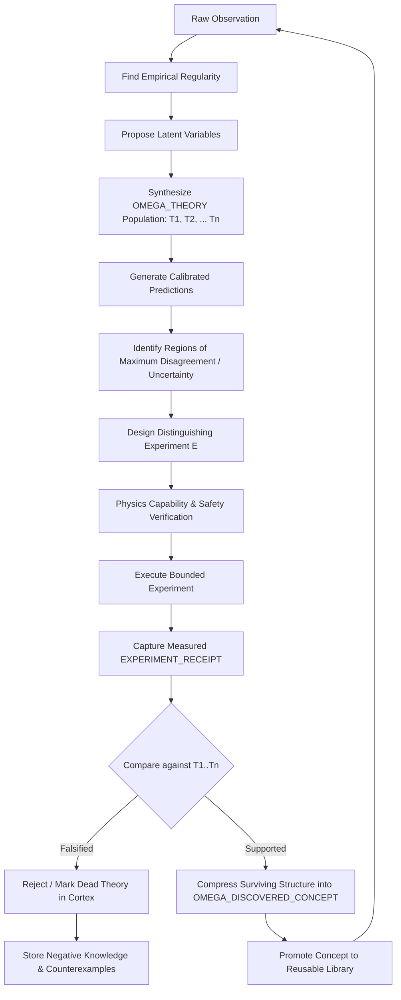

# DOCTRINE-006: DISCOVERY & PHYSICS ZERO — Sovereign Scientific Intelligence

```text
Document ID:     DOCTRINE-006
Milestone:       Milestone 0 (DOCTRINE_V1) & Physics Zero Era (M27-M35)
Classification:  Sovereign Machine Canonical Doctrine
Target Substrate: Complete Sovereign Stack (Atlas -> Physics -> Omega -> Aien)
Status:          AUTHORITATIVE / CANONICAL / RATIFIED
```

---

## 1. Executive Summary: The North Star

The long-term objective of the Sovereign Machine is no longer merely to build an intelligent model or a high-performance runtime. 

The objective is to build an autonomous machine that can:

$$\text{OBSERVE} \longrightarrow \text{HYPOTHESIZE} \longrightarrow \text{SYNTHESIZE} \longrightarrow \text{PREDICT} \longrightarrow \text{EXPERIMENT} \longrightarrow \text{FALSIFY} \longrightarrow \text{ABSTRACT} \longrightarrow \text{PROVE} \longrightarrow \text{REMEMBER} \longrightarrow \text{DISCOVER AGAIN}$$

**without inheriting human physical theories as answers.**

The machine must be capable of developing its own conceptual vocabulary and mathematical descriptions for reality:

```text
RAW EXPERIENCE
      ↓
DISCOVERED STRUCTURE
      ↓
PREDICTIVE PROCEDURES
      ↓
REUSABLE CONCEPTS
      ↓
TESTABLE THEORIES
      ↓
EXPERIMENTAL EVIDENCE
      ↓
BETTER THEORIES
```

---

## 2. The Canonical Architecture & Invariants

```text
SILICON / UNAVOIDABLE FIRMWARE
              ↓
            ATLAS
       BOOTSTRAP SEED
              ↓
           PHYSICS
   TRUSTED MACHINE AUTHORITY
              ↓
            OMEGA
 SEMANTICS + SYNTHESIS + VERIFICATION
      + REALIZATION + LEARNING
              ↓
             AIEN
  SOVEREIGN DISCOVERY INTELLIGENCE
```

### The Four Canonical Invariants
```text
ATLAS AWAKENS.

AIEN PROPOSES.

OMEGA DEFINES.

PHYSICS REALIZES.

AEGIS VERIFIES.

HARDWARE ACTS.

EVIDENCE TEACHES.
```

---

## 3. The Physics vs. Physics Zero Distinction

Architectural terminology maintains a permanent, foundational separation:

```text
PHYSICS (MACHINE PHYSICS)
=
THE PHYSICAL COMPILER & MACHINE REALIZER (Lowering formal Omega programs to silicon states, page tables, and hardware queues, with AEGIS continuous invariant verification)

PHYSICS ZERO
=
THE CLEAN-ROOM SCIENTIFIC DISCOVERY PROGRAM (Unbiased empirical discovery of nature's laws)
```

### The Foundational Physics Zero Rule
> **AIEN SHALL NOT RECEIVE HUMAN PHYSICAL LAWS AS TRAINING KNOWLEDGE IN THE DISCOVERY LINEAGE.**

The clean-room scientific discovery lineage strictly withholds:
- Newton's Laws, Maxwell's Equations, Relativity, Quantum Mechanics, Thermodynamics, Standard Model physics.
- Human ontological concepts: *mass, force, energy, momentum, charge, field, temperature, velocity, acceleration*.
- Named physical constants ($G, c, \hbar, k_B, \epsilon_0$).
- Textbook physics, human physics terminology, and scientific QA datasets.

These concepts may later be used by humans to interpret AIEN's discoveries; **they are strictly forbidden as inputs to the discovery process.**

---

## 4. Minimum Necessary Epistemic Priors

Physics Zero is not assumption-free. No intelligence can learn without representation. The architectural goal is:

$$\mathbf{\text{Minimum Necessary Epistemic Priors}} \quad \text{rather than} \quad \mathbf{\text{No Priors}}$$

Allowed foundations provided by Omega:
- **Formal Primitives**: Number, Logic, Set / Relation, Function, Composition, Order.
- **Epistemic Primitives**: Probability, Uncertainty, Measurement, Observation, Temporal Order, Action, Outcome, Hypothesis, Prediction, Counterexample.

Omega provides general mathematical machinery. It must **never** encode laws of nature as privileged primitives.

### The Two Physics Zero Research Modes

```text
┌────────────────────────────────────────────────────────────────────────┐
│ P0-MATH (Phase 1)                                                      │
├────────────────────────────────────────────────────────────────────────┤
│ • Supplied: Neutral mathematical toolbox (Calculus, Linear Algebra,    │
│   Differential Equations, Geometry, Probability, Optimization).        │
│ • Withheld: All physical laws, constants, and physical semantics.      │
│ • Research Question: Given human mathematics but zero human physics,   │
│   what physical theories does AIEN discover from observation?          │
└────────────────────────────────────────────────────────────────────────┘

┌────────────────────────────────────────────────────────────────────────┐
│ P0-PRIMITIVE (Phase 2 — Radical Experiment)                            │
├────────────────────────────────────────────────────────────────────────┤
│ • Supplied: Primitive mathematical foundations (Arithmetic, Relations, │
│   Function Composition, Sequences, Probability, Program Synthesis).    │
│ • Withheld: Higher calculus, coordinate manifolds, differential forms. │
│ • Research Question: What mathematical language does a discovery       │
│   system invent when attempting to understand physical reality?        │
└────────────────────────────────────────────────────────────────────────┘
```

---

## 5. The Contamination Firewall & Clean Lineage (`AIEN-P0`)

Physics Zero mandates a mathematically sealed model lineage: **`AIEN-P0`**.

```text
           FORBIDDEN CORPORA                        CLEAN ANCESTRY
┌───────────────────────────────────────┐   ┌───────────────────────────────┐
│ • Internet Crawls / Common Crawl      │   │ • Omega-generated tasks       │
│ • Scientific Papers (arXiv, DOI)      │   │ • Omega synthesis traces      │
│ • Physics Textbooks & Wikipedia       │   │ • Neutral mathematical proofs │
│ • Human Physics Q&A datasets          │   │ • Physics Zero observations   │
│ • Pretrained LLMs (Llama, GPT, etc.)  │   └───────────────┬───────────────┘
│ • Physics simulation source code      │                   │
│ • Named scientific benchmarks         │                   ▼
└───────────────────────────────────────┘               [ AIEN-P0 ]
```

### Cryptographic Lineage Tracking
Every model checkpoint in the `AIEN-P0` lineage must possess a tamper-proof cryptographic manifest:
```text
MODEL_ID:              sha256(weights || architecture)
TRAINING_CORPUS_ROOT:  sha256(merkle_root_of_all_training_shards)
OMEGA_LIBRARY_ROOT:    sha256(omega_library_generation)
WORLD_EXPOSURE_ROOT:   sha256(recorded_experiment_receipts)
CHECKPOINT_PARENT:     sha256(prior_checkpoint)
```
Any model containing a single token from a forbidden corpus fails the `P0_CONTAMINATION_AUDIT_PASS` and is permanently barred from Physics Zero qualification.

---

## 6. Sealed World Generation & Observation Protocols

The generative laws governing benchmark worlds must never enter AIEN's observation channel:

```text
┌───────────────────────────────────────┐
│          SEALED WORLD ORACLE          │
│   (Holds hidden generative laws:      │
│    no source code, labels, or names   │
│    ever leak to observation channel)  │
└───────────────────┬───────────────────┘
                    │
                    │ Observations Only
                    │ (CHANNEL_001, CHANNEL_002, ...)
                    ▼
               [ AIEN-P0 ]
                    │
                    │ Proposes EXPERIMENT_INTENT
                    ▼
               [ PHYSICS ]  (Enforces capability, safety, and rate limits)
                    │
                    │ Executes Bounded Mutation
                    ▼
          [ SEALED WORLD ORACLE ]
```

### Channel Randomization & Neutral Schema
- Field names must never leak ontology (e.g. `mass`, `velocity`, `force` are forbidden).
- Schema uses neutral numeric streams: `CHANNEL_001`, `CHANNEL_002`, `OBSERVATION_TIME`, `MEASUREMENT_UNCERTAINTY`, `ACTION_HISTORY`, or raw high-dimensional sensory feeds (pixels, waveforms).
- Every hidden world randomizes channel order, scaling factors, offsets, coordinate frames, and action identifiers.

---

## 7. The First-Class Discovery Objects in Omega

### 7.1 `OMEGA_THEORY`
An executable semantic model representing an explanatory hypothesis:

```text
OMEGA_THEORY:
  THEORY_ID:               Semantic digest
  OBSERVABLE_SCHEMA:       Set of tracked channels
  LATENT_VARIABLES:        Discovered unobserved state variables
  DERIVED_VARIABLES:       Synthesized functions of observables
  RELATIONS:               Mathematical equations and constraints
  DYNAMICAL_RULES:         Temporal evolution functions
  DOMAIN_OF_VALIDITY:      Regime bounds where predictions hold
  INITIAL_CONDITIONS:      State initialization requirements
  ASSUMPTIONS:             Explicit epistemic conditions
  PREDICTION_PROCEDURE:    Executable Omega synthesis procedure
  UNCERTAINTY_MODEL:       Variance and error distribution
  COUNTERFACTUAL_MODEL:    Interventional response functions
  KNOWN_FAILURES:          Catalog of regimes where theory breaks
  COUNTEREXAMPLES:         Recorded empirical falsifications
  EVIDENCE_IDS:            Cryptographic links to experiment receipts
  COMPETING_THEORY_IDS:    Active alternatives in population
  DESCRIPTION_LENGTH:      Kolmogorov-like program cost
  PREDICTIVE_SCORE:        Empirical accuracy ledger
  EXPERIMENTAL_STATUS:     SUPPORTED | UNDERDETERMINED | FALSIFIED | UNTESTED
  VERIFICATION_STATUS:     Omega V-Ladder proof certificate
```

### 7.2 `OMEGA_DISCOVERED_CONCEPT`
A synthesized abstraction representing an invented latent property:

```text
OMEGA_DISCOVERED_CONCEPT:
  SEMANTIC_ID:             e.g., Ω-A17, Ω-A92 (No human names)
  DEFINITION_GRAPH:        Exact mathematical composition graph
  DERIVATION:              Trace from originating observations
  INPUT_DOMAIN:            Admissible input state space
  OUTPUT_DOMAIN:           Resulting state space
  RELATIONS:               Coupling with other discovered concepts
  ORIGINATING_THEORIES:    Theories employing this concept
  PREDICTIVE_UTILITY:      Marginal improvement in prediction accuracy
  COMPRESSION_UTILITY:     Description length reduction in corpus
  COUNTERFACTUAL_UTILITY:  Interventional prediction power
  EVIDENCE:                Validating receipts
  COUNTEREXAMPLES:         Regimes where concept fails to hold
```

### 7.3 Mathematics Discovery Objects
- `OMEGA_CONJECTURE`: A mathematically formulated claim without an empirical or deductive proof.
- `OMEGA_THEOREM`: A conjecture paired with an Omega-verified deductive proof.
- `OMEGA_LEMMA`: An intermediate verified abstraction that shortens proof searches.
- `OMEGA_PROOF`: A verifiable V5 proof-carrying tree in Omega.
- `OMEGA_COUNTEREXAMPLE`: A concrete mathematical state refuting a conjecture.

---

## 8. The Scientific Discovery Loop & Theory Competition


```mermaid
flowchart TD
    OBS[Raw Observation] --> REG[Find Empirical Regularity]
    REG --> LAT[Propose Latent Variables]
    LAT --> SYN[Synthesize OMEGA_THEORY Population: T1, T2, ... Tn]
    SYN --> PRED[Generate Calibrated Predictions]
    PRED --> UNC[Identify Regions of Maximum Disagreement / Uncertainty]
    UNC --> EXP_PLAN[Design Distinguishing Experiment E]
    EXP_PLAN --> PHYS_CHECK[Physics Capability & Safety Verification]
    PHYS_CHECK --> EXEC_EXP[Execute Bounded Experiment]
    EXEC_EXP --> MEAS[Capture Measured EXPERIMENT_RECEIPT]
    MEAS --> EVAL{Compare against T1..Tn}
    EVAL -->|Falsified| REJ[Reject / Mark Dead Theory in Cortex]
    EVAL -->|Supported| COMP[Compress Surviving Structure into OMEGA_DISCOVERED_CONCEPT]
    REJ --> NEG[Store Negative Knowledge & Counterexamples]
    COMP --> PROMOT[Promote Concept to Reusable Library]
    PROMOT --> OBS
```

### Theory Competition & The Distinguishing Experiment
AIEN maintains an active population of competing theories ($\mathcal{T} = \{T_1, T_2, \dots, T_n\}$). When multiple theories explain historical observations, AIEN must formulate an active experiment $E$ satisfying:

$$P(\text{Result} \mid T_A) \neq P(\text{Result} \mid T_B)$$

Passing the **`AIEN_DISTINGUISHING_EXPERIMENT_PASS`** demonstrates scientific reasoning beyond statistical curve fitting.

### Epistemic Humility & Falsification
- AIEN is explicitly rewarded for discovering counterexamples and falsifying its own theories.
- Theories carry explicit status tags: `SUPPORTED`, `UNDERDETERMINED`, `FALSIFIED`, `LOCALLY_VALID`, `UNTESTED`, `INSUFFICIENT_EVIDENCE`.
- Outputting *"The available observations do not distinguish these models"* is treated as a correct epistemic result, not a failure.

---

## 9. Negative Knowledge in Cortex

Cortex permanently records dead theories alongside successful ones to prevent circular rediscovery:

```text
┌────────────────────────────────────────────────────────────────────────┐
│ NEGATIVE KNOWLEDGE RECORD (Cortex)                                     │
├────────────────────────────────────────────────────────────────────────┤
│ • Dead Theory ID & Original Hypothesis Form                            │
│ • Initial Plausibility & Observations it Explained                     │
│ • Predicted Behavior vs. Measured Reality                              │
│ • The Decisive Falsifying Experiment (Receipt ID)                      │
│ • Minimal Counterexample State                                         │
│ • Bounded Residual Domain where the Theory Remains Locally Valid       │
└────────────────────────────────────────────────────────────────────────┘
```

---

## 10. Multi-Objective Theory Quality Pareto Surface

Theories are evaluated on an 11-dimensional Pareto frontier without collapsing to a scalar metric:

$$\mathcal{P}_{\text{Theory}} = \Big\langle \text{Predictive Accuracy}, \text{Calibration}, \text{Description Length}, \text{Parameter Count}, \text{Counterfactual Accuracy}, \text{Intervention Accuracy}, \text{Out-of-Distribution Generalization}, \text{Data Efficiency}, \text{Experimental Efficiency}, \text{Robustness}, \text{Computational Cost} \Big\rangle$$

---

## 11. Physical Experiment Intent & Receipt

When discovery transitions to physical laboratories, interactions follow the capability-governed Effect Cycle:

### `EXPERIMENT_INTENT`
Submitted by AIEN to Physics:
- `THEORY_IDS`: Competing hypotheses being tested.
- `EXPECTED_INFORMATION_GAIN`: Mutual information between outcome and theory space.
- `ACTION_SEQUENCE`: Bounded actuator trajectory.
- `PHYSICAL_BOUNDS`: Maximum voltage, velocity, force, temperature, or travel limits.
- `SAFETY_INVARIANTS`: Conditions that trigger instant abort if violated.
- `STOP_CONDITIONS`: Measurable terminal criteria.

### `EXPERIMENT_RECEIPT`
Emitted by Physics and permanently committed to Cortex:
- `EXPERIMENT_ID`: Cryptographic receipt handle.
- `ACTUAL_ACTIONS`: Physical telemetry of actuated commands.
- `TIMESTAMPS`: Hardware cycle timestamps.
- `RAW_SENSOR_OUTPUTS`: Uncalibrated and calibrated measurement channels.
- `CALIBRATION_STATE`: Environmental baselines.
- `FAULTS / INTERRUPTIONS`: Safety interventions or hardware watchdogs.
- `RESOURCE_USAGE`: Joules consumed, time elapsed.
- `EVIDENCE_ID`: Merkle leaf committed to machine audit ledger.

---

## 12. The Physics Zero Benchmark Pyramid

The system advances through nine verified benchmark tiers:

```text
  [ P0-8 ] Open Scientific Discovery (Self-directed investigation of unknown physical systems)
  [ P0-7 ] Safe Real Laboratory (Passive optics, pendulums, thermal blocks, bounded circuits)
  [ P0-6 ] Adversarial Scientific Worlds (Delayed confounders, broken sensors, chaotic dynamics)
  [ P0-5 ] Alien-Law Universes (Non-inverse distance laws, non-Euclidean dynamics, novel symmetries)
  [ P0-4 ] Distributed & Field-Like Systems (Wave mechanics, diffusion, continuous media)
  [ P0-3 ] Noisy & Partially Observed Systems (Hidden state, measurement noise, sensor lag)
  [ P0-2 ] Multi-Entity Interaction (N-body dynamics, collisional exchanges, bound states)
  [ P0-1 ] Simple Continuous Dynamics (Oscillators, constant acceleration, drag)
  [ P0-0 ] Discrete Hidden-Rule Worlds (Cellular automata, permutation grids, discrete state machines)
```

---

## 13. The 41-Milestone Sovereign Roadmap

The canonical 41-milestone roadmap (M0-M40), with milestone code identifiers and current status, is maintained in exactly one place: **[`ROADMAP.md`](ROADMAP.md)**. This document does not restate the roadmap table or milestone status.

The Physics Zero program defined in this document occupies the **Physics Zero Discovery Era (M27-M35)**, followed by the **General AIEN Era (M36-M40)**.

---

## 14. The Procedural Intelligence Creed

```text
AIEN PROPOSES.

OMEGA DEFINES.

PHYSICS REALIZES.

AEGIS VERIFIES.

HARDWARE ACTS.

EVIDENCE TEACHES.
```

---

## 15. The Defining Question

The sovereign architecture builds toward a singular experiment:

```text
START WITH A CLEAN AIEN.

DO NOT TEACH IT PHYSICS.

GIVE IT MATHEMATICS.

GIVE IT SENSORS.

GIVE IT MEMORY.

GIVE IT PROGRAM SYNTHESIS.

GIVE IT THE ABILITY TO PROPOSE SAFE EXPERIMENTS.

LET PHYSICS AUTHORIZE THEM.

LET THE WORLD ANSWER.

WAIT.

THEN ASK:

WHAT UNIVERSE DID YOU DISCOVER?
```

---

## 16. Verification Contract, Dependencies & Responsibilities

This section states how a discovery record says what it knows, how records compose, how they age, and who does what. It adds no new authority, no new layer, and no milestone. It documents the existing division of roles and tightens the records of §7 to §11.

### 16.1 Responsibilities

Verifying and authorizing are separate operations held by separate parties. A verdict from the verifier is never a permission, and a permission is never a proof.

| Operation | Holder | What it does | What it never does |
|---|---|---|---|
| Propose | AIEN | Suggests theories, concepts and `EXPERIMENT_INTENT`s (§6, §11). | Execute, verify or authorize its own proposals. |
| Define | Omega | States the claim with crisp boundaries: types, domains, error envelopes. The Omega verifier (OMEGA.md §11.1) checks deductive proofs and issues V-Ladder certificates (§7.1, §7.3). | Admit physical effects. |
| Verify | AEGIS | Checks that a record, program or realization meets its stated contract and system invariants. | Change the checked work, decide policy, or propose the work it checks. |
| Mint / revoke capabilities | Capability authority (capability root) | Issues and withdraws enforceable capabilities (ARCHITECTURE.md §2.7 rules). | Judge scientific merit. |
| Authorize | Physics | Admits or refuses an `EXPERIMENT_INTENT` against capability, safety and rate limits (§6, §15). | Rewrite the theory under test. |
| Realize | Physics | Executes the bounded mutation and emits the `EXPERIMENT_RECEIPT` (§11). | Act outside the authorized bounds. |
| Act | Hardware | Performs the physical transformation. | Act without an authorized effect. |
| Record | Cortex / Evidence ledger | Holds receipts, theories, negative knowledge (§9). | Rewrite a committed receipt. |
| Observe and propose containment | ARGUS (ADR 0017) | Detects violations of hard invariants and proposes narrow containment. | Authorize, grant, refuse or revoke anything itself. |

**Bridging the two wordings.** The published loop says "Omega verifies" and this document's creed says "AEGIS verifies". These are two different checks. Inside Omega, the Omega verifier checks deductive claims and issues the V-Ladder certificate, so the meaning arrives crisp and checkable. AEGIS holds the verifying seat across the whole path: the witness that checks a record, program or realization against its stated contract and the system invariants, changes nothing, and decides no policy. Neither of them authorizes; Physics does.

**Trust base.** Every verdict depends on the checker, the toolchain that built it, and the hardware that ran it. A record names these in `DEPENDS_ON` (§16.2) so that a fault found in any of them flags the verdicts that relied on it (§16.5).

### 16.2 The Verification Contract

Every `OMEGA_THEORY`, `OMEGA_DISCOVERED_CONCEPT`, and promoted library entry carries a verification contract. It separates what the existing fields `ASSUMPTIONS`, `EVIDENCE_IDS` and `VERIFICATION_STATUS` (§7.1) currently blend together:

```text
VERIFICATION_CONTRACT:
  PROVED:             Statements with an Omega-verified deductive proof, each naming its proof
  TESTED:             Statements checked against finite cases, each naming the test set and its receipt
  MEASURED:           Quantities observed on Physics, each naming its EXPERIMENT_RECEIPT and CALIBRATION_STATE
  ASSUMED:            Conditions taken without proof or test (priors, sensor models, regime bounds)
  DEPENDS_ON:         Records, receipts, calibrations, checker, toolchain and hardware identities relied upon
  PERMITTED_EFFECTS:  The effects the record may request when realized, and nothing broader
```

Rules:
- **None substitutes for another.** `PROVED`, `TESTED`, `MEASURED` and `ASSUMED` stay separate: a test is not a proof, a measurement is not a test, an assumption is not a measurement. A statement enters a field only with the evidence that field requires, through a new record that cites the old one. This is the same discipline ADR 0020 §2.1 applies to its own five record kinds ("the five categories never collapse"); it is stated here for these fields, not inherited from that ADR.
- **Empty is honest.** An empty `PROVED` field is a correct record. A claim placed in the wrong field is a contract violation that AEGIS reports.
- **A receipt is immutable, not beyond challenge.** Its bytes are committed and can be inspected by anyone; they cannot be argued with. Its method and its interpretation can be contested, and a successful challenge produces a new record that cites the old one, never an edit to it. Reproducibility is a separate claim: it needs a recorded protocol and setup, and a new run whose own receipt agrees.

### 16.3 Composition Rule

- **Provides / requires.** A requirement of one part (an `ASSUMED` condition or a required input) is discharged only by an output of another part that carries the matching kind of evidence: a proof discharges a proof requirement, and a test or a measurement does not. Discharge holds only on the intersection of the supplier's declared domain (`DOMAIN_OF_VALIDITY` of a theory, `INPUT_DOMAIN` of a concept) with the domain of use. Every requirement not discharged this way stays in the composite's `ASSUMED` field; it is never silently dropped.
- **Effect compatibility.** The composite's `PERMITTED_EFFECTS` is no broader than what its parts permit, and two parts whose effects conflict on the same state do not compose.
- **Order of preference.** Pure functions first, then explicit state transitions with declared inputs and outputs. Shared mutable state is admitted only when the rules for how the parts interact on that state are themselves specified and verified.

### 16.4 Human Intent Step

Formal verification proves that a program meets its specification. It cannot establish an intention that was never stated. Before a specification is accepted as the target for synthesis or experiment, the human who states the intent (the Human Operator of AIEN.md) supplies, on that specification:
- **Concrete examples** of accepted and rejected outcomes.
- **Forbidden outcomes.** Where a forbidden outcome is an abort condition or a measurable end criterion, AIEN binds it into the `SAFETY_INVARIANTS` or `STOP_CONDITIONS` field of the `EXPERIMENT_INTENT` it proposes (§11). Rejected examples that are neither stay on the human specification.
- **Review of consequential ambiguities:** every point where two readings of the specification lead to different effects is listed and resolved, or the specification is not accepted.

For sealed worlds, examples and forbidden outcomes are written in the neutral schema of §6 (`CHANNEL_nnn`, `ACTION_HISTORY`, `OBSERVATION_TIME`). Stating them in ontology terms would leak human physics through the intent channel and breach §3.

### 16.5 Applicability and Dependencies

- **Receipts are immutable.** A committed `EXPERIMENT_RECEIPT` is never edited.
- **The current assessment is separate.** Whether a record still applies is a separate, revisable assessment that cites receipts; it is never written into them.
- **Reassessment is triggered by changed conditions, not elapsed time.** A changed `CALIBRATION_STATE`, a falsified or withdrawn dependency, or a fault found in a checker, toolchain or hardware identity flags for recheck every record that depends on it, directly or through the transitive closure of `DEPENDS_ON`.
- **Known-invalid support suspends applicability.** When a dependency is already falsified or withdrawn, the current applicability of every record relying on it is suspended until a recheck passes. Its history is kept. This is a change of epistemic status, a new assessment, not a containment action.
- **Capability withdrawal uses existing design.** Withdrawing an enforceable capability that an experiment or realization relied on follows the ARGUS-1 narrow-revoke pattern of ADR 0017: ARGUS proposes, AEGIS verifies against policy, the capability root revokes, and evidence is always written. Confidence about predicted state is carried by the belief / estimation layer of ADR 0020, whose confidence grants nothing (confidence is not authority). These are cross-references, not new mechanisms.

**Rule-change test (protocol, to be scheduled).** Change the rules of a simulated sealed world partway through a discovery run and measure three latencies: time to detect the change, time to stop relying on the old explanation, and time to a supported replacement. This test waits on the recorded PASS of EXP-001R (the successor to the failed EXP-001 compression-bridge run) and on completion of CEXP-1 as frozen in The Turing Discovery Gap Conjecture, Revision 6, 2026-09-30. Revision 6 does not define this test. It carries no milestone number and supports no Physics Zero claim until it has run.

### 16.6 Distinguishing Experiments and Equivalence

This tightens §8:
- **Name the rivals.** Every distinguishing experiment names, from `COMPETING_THEORY_IDS`, which rival explanations it separates and which it cannot. Passing `AIEN_DISTINGUISHING_EXPERIMENT_PASS` requires that list.
- **Preserve ambiguity.** When no permitted intervention separates two theories, both stay `UNDERDETERMINED`. The system does not pick one by preference.
- **Success is first an equivalence class.** Two theories are equivalent when one maps to the other by a reparameterization that is invertible on the declared domain, with the observation and intervention mappings transformed consistently, so that every permitted observation and intervention gets the same prediction (for example, a latent scale absorbed by an inverse coefficient). A transformation that is not invertible there needs separate evidence of equivalence. Success is first stated as the equivalence class, not as one preferred form.
- **Comparison to a named constant needs a declared correspondence rule.** Any comparison between a discovered quantity and a named physical constant is a human interpretation step after discovery (§3). It requires a correspondence rule (which discovered quantity maps to which human quantity, under which units and frames) declared and committed before the comparison is made. The constant never enters the discovery process.

### 16.7 Blindness Inventory

The firewall of §5 governs what the lineage may learn from. Blindness also covers what the experiment hands to the learner. The preregistered specification of every Physics Zero run (fixed in advance, in the sense of The Turing Discovery Gap Conjecture, Revision 6, 2026-09-30) additionally records:
- **Permitted primitives:** the exact Omega formal and epistemic primitives supplied (§4), and the research mode (P0-MATH or P0-PRIMITIVE).
- **Lineage ancestry and priors:** every library, checkpoint and prior carried into the run, by digest, consistent with the lineage manifest of §5.
- **Calibration assumptions:** the sensor and noise models assumed, and the `CALIBRATION_STATE` they rest on.
- **Data transforms:** every preprocessing step between the sealed world and the observation channel, including the randomizations of §6.

Under the decoder rule of Revision 6, anything available to the decoder beyond the evaluation input locations X is part of the model and is charged in its description length L(M). Operating cost (search, maintenance, library construction) stays in the discovery budget account and is not converted into bits.

**Inherited-knowledge experiments sit outside Physics Zero.** An experiment in which pretrained models may propose candidates is permitted only as a separately named experiment class, explicitly outside Physics Zero, never part of the `AIEN-P0` lineage, and with a weaker claim: what it finds says nothing about discovery without inherited knowledge. Its inherited knowledge is charged under the decoder rule. The forbidden corpora of §5, the lineage manifest, and `P0_CONTAMINATION_AUDIT_PASS` are unchanged by this rule. No such class is defined yet.
