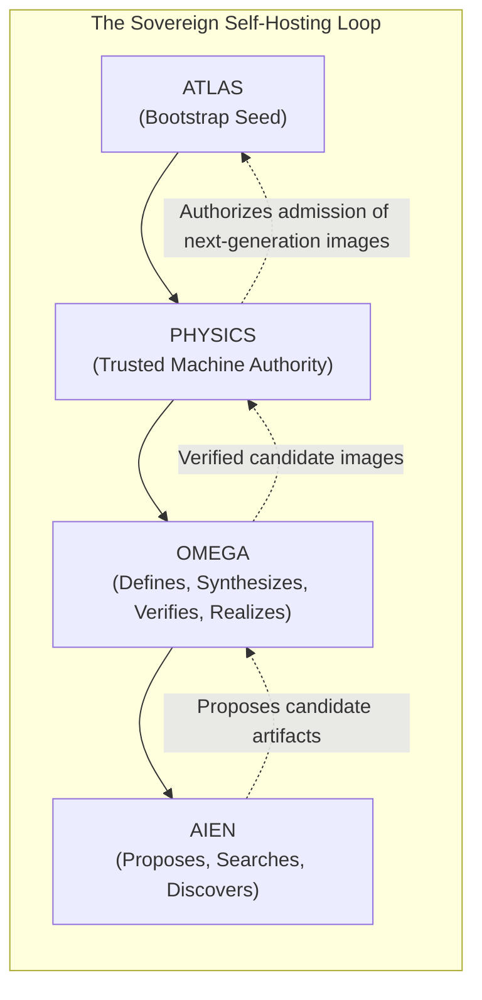

# DOCTRINE-SOV-001: SOVEREIGNTY AND CLOSURE
## The Canonical Law, Oracle Principle, Self-Hosting Closure, and Provenance Doctrine

```text
Document ID:     DOCTRINE-SOV-001
Milestone:       Milestone 0 (DOCTRINE_V1)
Classification:  Sovereign Machine Canonical Doctrine
Target Substrate: Complete Sovereign Stack (Atlas -> Physics -> Omega -> Aien)
Status:          AUTHORITATIVE / CANONICAL / RATIFIED
Revision:        Evidence-integrity revision (aien-architecture#8)
Roadmap:         Canonical M0-M40 Sovereign Discovery roadmap (DISCOVERY.md §13)
```

> **Reading this document.** Everything below is either *law* (what the Sovereign Machine must be), a *target* (a theorem the lineage must eventually satisfy), or *evidence* (a result backed by a recorded qualification receipt). Only the last category may be described as demonstrated. Where this document states a target, it is a requirement, not a report.

---

## 0. The Evidence Rule

> **The Evidence Rule:**
> *No sovereignty, hardware, or training result is demonstrated until a qualification receipt for it exists. A target is never evidence of itself.*

Every closure proof, gate, and qualification in this document carries the same five fields:

| Field | Meaning |
| :--- | :--- |
| **TARGET / THEOREM** | The property the lineage must satisfy. A requirement, not a claim. |
| **CURRENT STATUS** | What has actually been qualified, on which substrate, and what is pending. |
| **REQUIRED EVIDENCE** | The observations that must be recorded before the target may be declared met. |
| **QUALIFICATION ARTIFACT** | The named gate / receipt that records the evidence. |
| **PASS/FAIL** | The objective criterion that decides the gate. |

Status vocabulary, in increasing strength:

```text
TARGET            Specified; no qualifying evidence exists.
IN PROGRESS       Work under way; no qualifying receipt for the current revision.
QEMU QUALIFIED    All emulation gates passed with receipts. Says nothing about silicon.
NATIVE QUALIFIED  Native gates passed with receipts on the physical target substrate.
```

Substrate rule: **a QEMU pass never implies, substitutes for, or partially satisfies a native pass.** Native qualification (`*_NATIVE_PASS`) is evaluated only on physical silicon (the current reference substrate is NVIDIA DGX Spark), and only a native receipt may raise a status to `NATIVE QUALIFIED`.

### 0.1 Evidence Snapshot (as of this revision)

| Item | Status | Evidence |
| :--- | :--- | :--- |
| M0 `DOCTRINE_V1` | COMPLETE | Ratified doctrine corpus. |
| M1 `ATLAS_BOOT` | COMPLETE / QEMU QUALIFIED | `aien-dev/atlas`; QEMU gates only. `ATLAS_BOOT_NATIVE_PASS` pending. |
| M2 `PHYSICS_BOOT` | QEMU QUALIFIED (requalified 2026-09-26) | aien-architecture#6, `aien-dev/physics#1`, `aien-dev/physics#3`. QEMU only. `PHYSICS_BOOT_NATIVE_PASS` pending. |
| Physical DGX Spark / native Blackwell execution of this stack | NOT DEMONSTRATED | No native receipt exists. |
| Sovereign training (any AIEN lineage) | NOT DEMONSTRATED | No training has occurred in the sovereign stack. |
| `SOVEREIGN_MACHINE_CLOSURE` | TARGET | No closure evidence exists. |

This snapshot is the only place in this document that reports status. It must be updated, with receipt references, whenever a gate changes state.

---

## 1. The Sovereignty Law

> **The Sovereignty Law:**
> *The permanent lineage of the Sovereign Machine must not require, depend upon, link against, or incorporate Rust, Cargo, LLVM, GCC, Clang, Python, Linux, POSIX runtimes, CUDA, PyTorch, TensorFlow, JAX, Triton, CuDNN, external virtual machines, foreign runtime schedulers, or foreign pretrained neural weights.*

### 1.1 The Meaning of Complete Sovereignty
Sovereignty is not an aesthetic preference or an open-source license; it is an existential computational boundary. A system is sovereign if and only if its operational continuity, cognitive validity, and physical transformations are completely decoupled from external technological civilizations, corporate software stacks, and cloud ecosystems.

**The permanent lineage** is the set of artifacts the Sovereign Machine needs in order to exist and to reproduce itself: `atlas.bin`, `physics.bin`, the Omega realization, synthesis, and verification substrate, the AIEN training and inference runtime, every AIEN checkpoint, the provenance ledgers, and the tooling that regenerates all of them. Anything outside that set (a development host, oracle, test harness, emulator, or scaffold) is not part of the lineage, and the lineage must not require it (§3).

The litmus test of sovereignty is the **Severance Invariant** (a target, qualified only through `SOVEREIGN_MACHINE_CLOSURE`, §4.6):
If all external software repositories, global network backbones, commercial compiler toolchains, and proprietary AI models were instantaneously obliterated, the permanent lineage must continue to power on, self-execute, synthesize machine code, adapt to physical workloads, train its cognitive models, and, through PHYSICS, govern its physical effects indefinitely from its internal, self-contained lineage.

### 1.2 Explicit Enumeration of Forbidden Dependencies
The permanent lineage strictly forbids:

| Forbidden Dependency Category | Specific Prohibited Technologies | Sovereign Replacement Mechanism (target) |
| :--- | :--- | :--- |
| **Foreign Compilers & Toolchains** | `LLVM`, `GCC`, `Clang`, `Rustc`, `Cargo`, `NVCC`, `Triton` | **Omega Realization Substrate**: Direct machine code synthesis ($\mathcal{G}_S \times \mathcal{G}_M \to \mathcal{G}_R \to \text{bytes}$). |
| **Foreign Interpreters & Runtimes**| `Python`, `Node.js`, `JVM`, `glibc`, `musl`, `libstdc++` | **Physics Authority Nucleus**: Bare-metal execution with zero dynamic userspace runtime. |
| **Foreign Operating Systems** | `Linux`, `BSD`, `Windows`, `macOS`, `systemd`, `POSIX` | **PHYSICS**: Capability-based trusted machine authority and effect admission cycle. |
| **Proprietary Accelerator Stacks** | `CUDA Driver`, `CUDA Runtime`, `CuDNN`, `TensorRT`, `ROCm` | **PHYSICS-mediated accelerator interface**: Direct command submission over the CPU/accelerator link described by the MachineGraph ($\mathcal{G}_M$). |
| **Foreign ML Frameworks** | `PyTorch`, `TensorFlow`, `JAX`, `ONNX Runtime`, `vLLM` | **Omega Tensor Engine / AIEN runtime**: Omega-synthesized tensor, autodiff, and optimizer realizations over accelerator-accessible memory (§4.7). |
| **Foreign Pretrained Weights** | Any externally trained checkpoint, open or closed | **Sovereign Lineage Models**: Weights trained inside the lineage with complete cryptographic dataset provenance (§5). |

Any component that introduces a transient dependency during development must possess an explicit, non-negotiable **Deprecation Horizon** that terminates no later than `SOVEREIGN_MACHINE_CLOSURE` qualification (§4.6). A dependency not removed by then fails closure.

---

## 2. The Founding Exception

### 2.1 The Bootstrap Paradox
A perfectly self-hosting system presents a foundational paradox: *How does a software lineage write its own compiler if no compiler exists to assemble the first line of code?*

Historically, this paradox has been resolved through inherited dependencies: compiling C with GCC, which was compiled with another C compiler, tracing back through decades of opaque binary lineage (the Ken Thompson "Reflections on Trusting Trust" vulnerability).

### 2.2 Formal Definition of the Founding Exception
The Sovereign Machine resolves the bootstrap paradox through **The Founding Exception**:

$$\mathcal{A}_0 \equiv \text{Atlas}$$

* **Atlas is the Irreducible Root Artifact:** Atlas ($A_0$) is the singular, non-sovereign seed artifact permitted at system inception.
* **Bounded Scope of Exception:** The exception applies strictly to the initial generation of `atlas.bin`. Once `atlas.bin` is assembled, audited, and sealed (see [`ATLAS.md`](ATLAS.md)), the exception terminates.
* **The Lineage Invariant:**
  $$\forall \text{ artifact } \mathcal{X} \in \{\text{Physics}, \text{Omega}, \text{Aien}\}: \quad \text{Lineage}(\mathcal{X}) \subseteq \text{Evolution}(\mathcal{A}_0)$$
  Every layer, engine, kernel, compiler, and neural network operating above Atlas must ultimately be derived, synthesized, and verified exclusively through the internal lineage initiated by Atlas. During development this invariant is a target; it becomes a qualified property only at `SOVEREIGN_MACHINE_CLOSURE`.
* **The Scaffolding Deprecation Horizon:** The host machine, cross-assembler, and development environment used to craft $A_0$, and every development tool used to build pre-closure versions of Physics, Omega, or AIEN, are **Scaffolding**. Scaffolding participates in the historical genesis of the lineage, but the lineage must be able to regenerate itself without it once the self-hosting loop closes.
* **Unavoidable Platform Firmware:** Silicon and its unavoidable firmware sit below Atlas (see [`DISCOVERY.md`](DISCOVERY.md) §2). They are not part of the lineage and are not covered by the Founding Exception; they must be enumerated as substrate facts in the MachineGraph and trust base rather than silently assumed.

---

## 3. The Oracle Principle

Throughout development, up to `SOVEREIGN_MACHINE_CLOSURE`, external tools (such as Linux, existing AIENOS, NVIDIA CUDA, and PyTorch) may be employed under strict containment as **Oracles** or **Scaffolds**.

### 3.1 The Principle Defined
> **The Oracle Principle:**
> *Existing AIENOS, Linux, CUDA, and research runtimes are strictly Oracles, Scaffolds, and Empirical References. They are NEVER deployed ancestors, runtime dependencies, or architectural templates of the permanent lineage.*

An **Oracle** is an external computational entity queried solely for:
1. **Mathematical Ground Truth:** Generating reference output tensors ($y_{\text{exact}}$) from known inputs to verify that Omega realizations satisfy error bounds:
   $$\max_i |y_{\text{sovereign}}[i] - y_{\text{oracle}}[i]| \le \epsilon$$
2. **Performance Baselines:** Measuring hardware limits, memory bandwidth saturation percentages, and FLOP utilization under identical silicon conditions.
3. **Behavioral Divergence Hunting:** Detecting subtle floating-point drift, tensor misalignment, or semantic graph compilation errors.

A **Scaffold** is an external development environment (host OS, cross-toolchain, test harness, emulator such as QEMU) used to build or exercise pre-closure artifacts.

**Explicit Non-Requirement:** Oracles and Scaffolds may exist outside the permanent lineage only if they are *explicitly non-required*. Each must be registered with its deprecation horizon, and the closure qualification (§4.6) must succeed with every registered Oracle and Scaffold absent.

The development-time Oracle is distinct from the **Sealed World Oracle** of Physics Zero ([`DISCOVERY.md`](DISCOVERY.md) §6), which is part of the experimental apparatus and is governed by the contamination firewall.

```text
┌────────────────────────────────────────────────────────────────────────┐
│                        THE ORACLE ISOLATION GATE                       │
│                                                                        │
│   ┌────────────────────┐                   ┌───────────────────────┐   │
│   │   ORACLE REALM     │                   │    SOVEREIGN REALM    │   │
│   │ (Linux / CUDA / PT)│                   │(Atlas / Physics/Omega)│   │
│   │                    │                   │                       │   │
│   │ [ Reference Model ]│                   │ [ Sovereign Engine ]  │   │
│   └─────────┬──────────┘                   └───────────┬───────────┘   │
│             │                                          │               │
│             │ Reference Tensor                         │ Observed      │
│             │ Y_oracle                                 │ Y_sovereign   │
│             ▼                                          ▼               │
│        ┌────────────────────────────────────────────────────┐          │
│        │            FORMAL PARITY COMPARATOR                │          │
│        │        || Y_sovereign - Y_oracle || <= eps         │          │
│        └─────────────────────────┬──────────────────────────┘          │
│                                  │                                     │
│                                  ▼                                     │
│                     PASS: Oracle Severed Permanently                   │
│                     FAIL: Divergence Hunt Initiated                    │
└────────────────────────────────────────────────────────────────────────┘
```

### 3.2 The Oracle Boundary Invariants
* **Zero-Code Leakage:** No source file, header, symbol, macro, or dynamic library from an Oracle may ever be copied, linked, or imported into the permanent lineage.
* **Black-Box Comparator:** The Oracle interacts with the sovereign verification harness exclusively through serialized numerical tensors and scalar telemetry metrics.
* **Zero Training Leakage:** Oracle outputs are verification signals only. They are never training data for any AIEN lineage, and never carry physical laws, constants, or terminology into the Physics Zero lineage (§5.1).
* **Disposable Status:** Once an Omega realization or Physics capability demonstrates parity and passes formal verification with a recorded receipt, the Oracle query for that subsystem is permanently severed.

---

## 4. The Self-Hosting Loop and Closure Proofs

Sovereignty is achieved when the permanent lineage completes the **Self-Hosting Closure Loop**. At closure, the lineage possesses complete regenerative self-containment.



Authority in the loop follows the canonical split: **AIEN proposes and searches; OMEGA defines and verifies; PHYSICS authorizes physical effects.** No regenerated artifact is admitted to the machine except through a PHYSICS-authorized effect.

The architecture requires the following **Closure Proofs**. Each is a target until its qualification artifact records a PASS. Roadmap positions refer to the canonical M0-M40 roadmap ([`DISCOVERY.md`](DISCOVERY.md) §13).

### 4.1 Proof 1: `ATLAS_BOOT`
* **ROADMAP POSITION:** M1 `ATLAS_BOOT`.
* **TARGET / THEOREM:** An immutable, raw binary image (`atlas.bin`) of $\le 64\text{ KB}$ can initialize an AArch64 bare-metal platform from reset, verify the next stage via SHA-256, refuse corrupted payloads into fail-closed quiescence, and monotonically hand off control to Physics, without third-party bootloaders or foreign operating systems. Only unavoidable platform firmware (§2.2) may execute before Atlas.
* **CURRENT STATUS:** COMPLETE / QEMU QUALIFIED (`aien-dev/atlas`). **Native: NOT DEMONSTRATED.** No physical DGX Spark boot of `atlas.bin` has been recorded.
* **REQUIRED EVIDENCE:** QEMU: artifact identity, static audit, handoff, and corruption-refusal receipts (held). Native: serial console capture of a physical cold boot on the target substrate showing clean entry, next-stage verification, corruption refusal, and handoff to Physics; boot-to-handoff latency is to be measured and recorded, not assumed.
* **QUALIFICATION ARTIFACT:** QEMU: `ATLAS_BOOT_QEMU_PASS`, `ATLAS_HANDOFF_QEMU_PASS`, `ATLAS_CORRUPTION_REFUSAL_QEMU_PASS`, `ATLAS_FAIL_CLOSED_QEMU_PASS`, `ATLAS_AUDIT_PASS`. Native: `ATLAS_BOOT_NATIVE_PASS`, `ATLAS_HANDOFF_NATIVE_PASS` (both pending).
* **PASS/FAIL:** Every listed gate for the claimed substrate records PASS with a receipt. Any fault, fallthrough, or accepted corrupted payload is FAIL.

### 4.2 Proof 2: `PHYSICS_BOOT`
* **ROADMAP POSITION:** M2 `PHYSICS_BOOT` (prerequisite for M3 `PHYSICS_EFFECTS`).
* **TARGET / THEOREM:** `physics.bin` accepts the Atlas handoff, validates and copies the ingress descriptor, installs contract-driven exception vectors, establishes physical frame authority and a kernel-private capability root, and reaches a quiescent ready state as the sole authority over physical effects.
* **CURRENT STATUS:** QEMU QUALIFIED after requalification (aien-architecture#6, `aien-dev/physics#1`, `aien-dev/physics#3`). **Native: NOT DEMONSTRATED.**
* **REQUIRED EVIDENCE:** QEMU receipts for every M2 gate on the current revision (see `docs/milestone-2-spec.md`); then a physical cold boot through Atlas into Physics on the target substrate.
* **QUALIFICATION ARTIFACT:** `PHYSICS_BOOT_QEMU_PASS` and the M2 static/runtime gates; `PHYSICS_BOOT_NATIVE_PASS` (pending).
* **PASS/FAIL:** All M2 gates PASS on the current revision for the claimed substrate. A QEMU PASS does not satisfy the native gate.

### 4.3 Proof 3: `OMEGA_LIVING_MATVEC`
* **ROADMAP POSITION:** M12 `OMEGA_LIVING_MATVEC` (depends on the M4-M7 Omega core, including M5 `OMEGA_AARCH64`).
* **TARGET / THEOREM:** Omega can ingest a pure mathematical Matrix-Vector multiplication specification ($\mathcal{G}_S$), synthesize multiple distinct machine-code realizations ($R_0 \dots R_n$) directly into memory, measure live execution on CPU execution units, and autonomously select and dispatch the best realization without invoking an external compiler, assembler, or JIT runtime.
* **CURRENT STATUS:** TARGET. No evidence exists.
* **REQUIRED EVIDENCE:** Execution trace on the target substrate showing synthesis with no foreign toolchain present, the measured cost of each realization, the selection decision, and numerical parity against an Oracle reference.
* **QUALIFICATION ARTIFACT:** `OMEGA_LIVING_MATVEC_PASS` receipt (to be defined in the M12 specification).
* **PASS/FAIL (target thresholds):** Selected realization achieves $> 85\%$ of measured STREAM bandwidth on the same substrate; numerical error $\hat{\epsilon} \le 10^{-6}$ against an IEEE-754 double-precision reference; zero foreign toolchain invocations.

### 4.4 Proof 4: `OMEGA_ACCELERATOR_NATIVE`
* **ROADMAP POSITION:** M15 `PHYSICS_ACCELERATOR_LINK` through M18 `OMEGA_BLACKWELL_MATMUL`; prerequisites are M13 `OMEGA_MACHINE_GRAPH` and M14 `OMEGA_REALIZATION_SYNTHESIS`.
* **TARGET / THEOREM:** Omega can emit native accelerator code and dispatch schedules for the accelerator described by the MachineGraph (currently NVIDIA Blackwell, as integrated in DGX Spark), submitting vector and tensor-contraction workloads over the PHYSICS-authorized CPU/accelerator link, without linking against the CUDA runtime, the CUDA driver, or closed user-mode libraries.
* **CURRENT STATUS:** TARGET. **NOT DEMONSTRATED.** No native Blackwell execution of this stack has been recorded.
* **REQUIRED EVIDENCE:** Physical-silicon execution trace confirming completion of Omega-synthesized vector and matmul workloads, with completion handles posted through PHYSICS-mediated rings; numerical parity against an Oracle reference; an audit showing zero CUDA host API calls and no foreign driver in the path. Emulation cannot satisfy this proof.
* **QUALIFICATION ARTIFACT:** Native receipts for M15-M18 (e.g. `OMEGA_BLACKWELL_MATMUL_NATIVE_PASS`; exact gate names to be fixed in those milestone specifications).
* **PASS/FAIL:** All M15-M18 native gates PASS on physical hardware; any CUDA or foreign-driver dependency in the qualified path is FAIL.

### 4.5 Proof 5: `AIEN_0` sovereign training
* **ROADMAP POSITION:** M20 `OMEGA_TENSOR` through M24 `AIEN_0` (requires M19 `OMEGA_ACCELERATOR_RESIDENT`).
* **TARGET / THEOREM:** The lineage can compute forward and backward passes, formulate weight updates, and update model parameters held in accelerator-accessible memory (§4.7) using Omega-synthesized kernels on provenance-ledgered sovereign datasets, without PyTorch, JAX, or foreign training orchestration frameworks.
* **CURRENT STATUS:** TARGET. **NOT DEMONSTRATED.** No sovereign training has occurred.
* **REQUIRED EVIDENCE:** A training run on the native target substrate with: the provenance root of every training shard (§5.3); step-level numerical parity of forward, backward, and optimizer steps against an Oracle reference on identical inputs and initialization (Oracle used for verification only, §3.2); the full loss trajectory; the resulting checkpoint's lineage manifest.
* **QUALIFICATION ARTIFACT:** `AIEN_0_TRAINING_NATIVE_PASS` receipt plus the checkpoint's lineage manifest (to be defined in the M20-M24 specifications).
* **PASS/FAIL (target thresholds):** Training loss decreases over $\ge 1{,}000$ continuous gradient steps; per-step parity within the tolerance fixed by the milestone specification; zero foreign framework or foreign weight in the path.

### 4.6 The Master Gate: `SOVEREIGN_MACHINE_CLOSURE`
<!-- HISTORICAL-PROVENANCE:BEGIN -->
`SOVEREIGN_MACHINE_CLOSURE` is a **stable named architectural gate**, not a roadmap milestone number. Earlier drafts placed it at "Milestone 27"; in the canonical M0-M40 roadmap, M27 is `PHYSICS_ZERO_PROTOCOL`, and closure has no milestone number of its own.
<!-- HISTORICAL-PROVENANCE:END -->

* **ROADMAP POSITION:** Cross-cutting. It cannot be evaluated until its prerequisites exist: native qualification of M1-M3, Omega self-hosting (M6) and verification (M7), native accelerator execution (M15-M19), and the sovereign training runtime through M24 `AIEN_0`. Its earliest possible evaluation is therefore after M24. Reaching any roadmap milestone, including M27-M35 (Physics Zero) or M36-M40, does not imply closure; any claim that a lineage (including `AIEN-P0`) is *sovereign* additionally requires this gate.
* **TARGET / THEOREM:** The permanent lineage (§1.1) reproduces itself:

  $$\mathcal{S}_{t+1} = \text{Omega}_{\text{sov}}\Big(\text{Physics}_{\text{sov}}\big(\text{Atlas}_{\text{sov}}(\text{Silicon})\big)\Big), \qquad \mathcal{S}_{t+1} \equiv \mathcal{S}_t$$

  where $\equiv$ means bit-identical for deterministic artifacts (`atlas.bin`, `physics.bin`, the Omega substrate, the AIEN runtime) and Omega-verified equivalence under the recorded specification for artifacts that are not bit-reproducible. The regenerated lineage must boot on cold hardware, rebuild itself, and retrain AIEN from its own provenance-ledgered corpora, **without requiring Rust, Cargo, LLVM, GCC, Clang, Python, Linux, POSIX runtimes, CUDA, PyTorch, or any other foreign runtime, and without foreign pretrained weights.**
* **CURRENT STATUS:** TARGET. No closure evidence exists; its prerequisites are themselves unqualified (§0.1).
* **REQUIRED EVIDENCE:**
  1. A severance run on the native target substrate with every registered Oracle and Scaffold (§3) absent and no foreign toolchain, OS, runtime, or weight present on the machine.
  2. Regeneration of every lineage artifact from the lineage's own sources by the lineage's own toolchain, with digests compared against generation $t$.
  3. A dependency audit of the full lineage showing Foreign Dependency Count $= 0$.
  4. A cold boot of the regenerated images through Atlas and Physics to an operational AIEN, recorded as native receipts.
  5. A retraining run from the provenance ledger reproducing a lineage checkpoint within the equivalence criterion fixed by the training specification.
* **QUALIFICATION ARTIFACT:** `SOVEREIGN_MACHINE_CLOSURE_PASS`: a signed closure receipt bundling the native receipts, digests, and audit above.
* **PASS/FAIL:** All five evidence items recorded with receipts; Sovereign Code Ratio $= 100.0\%$ of the lineage; Foreign Dependency Count $= 0$. Anything less is FAIL.

### 4.7 Memory Semantics Are MachineGraph-Driven
Sovereignty doctrine makes no assumption about a particular memory technology. "Resident" and "permanent" state (weights, KV pools, gradients, optimizer state, Cortex tiers) means **accelerator-accessible memory as described by the MachineGraph ($\mathcal{G}_M$, M13)**, with placement decided by Omega realization synthesis and authorized by PHYSICS.

* On the current reference substrate, **DGX Spark**, CPU and GPU share coherent unified system memory; there is no separate accelerator-local HBM pool.
* Future substrates may expose discrete accelerator memory (e.g. HBM), multiple memory tiers, or different coherence models. Those are MachineGraph facts, not sovereignty requirements.
* No closure proof or gate may be phrased in terms of a specific memory product or a specific system (such as HBM3e or GB200).

---

## 5. Dataset Sovereignty & Cryptographic Provenance

A model trained on poisoned, unverified, or legally compromised data is not sovereign. The cognitive integrity of AIEN depends upon absolute dataset hygiene and verifiable provenance. Because lineages differ in what they may learn from, provenance is tracked **per lineage**.

### 5.1 Separate Lineages

```text
┌────────────────────────────────────────────────────────────────────────┐
│ AIEN-P0  — Physics Zero clean scientific-discovery lineage             │
├────────────────────────────────────────────────────────────────────────┤
│ • Allowed: Omega-generated tasks and synthesis traces, neutral         │
│   mathematical proofs, formal logic, verifiable algorithms/ASTs,       │
│   Physics Zero observations and experiment receipts.                   │
│ • Forbidden: human physical laws, named physical constants, physics    │
│   terminology and ontology, scientific papers/textbooks/corpora,       │
│   scientific QA sets and benchmarks, physics simulation source, and    │
│   pretrained models of any kind (including pretrained science models). │
│ • Governed by: DISCOVERY.md §3-§6 and P0_CONTAMINATION_AUDIT_PASS.     │
└────────────────────────────────────────────────────────────────────────┘
                                   │
               clean experiment frozen (checkpoint sealed,
               contamination audit passed, manifest signed)
                                   │
                                   ▼  (one-way; nothing flows back)
┌────────────────────────────────────────────────────────────────────────┐
│ General AIEN / science lineages (later, e.g. from M36 onward)          │
├────────────────────────────────────────────────────────────────────────┤
│ • May additionally ingest provenance-controlled human knowledge,       │
│   including human physical laws, engineering standards, and            │
│   scientific literature, each shard ledgered under §5.3.               │
│ • Must never be used as a parent, data source, or distillation         │
│   teacher for any AIEN-P0 checkpoint.                                  │
└────────────────────────────────────────────────────────────────────────┘
```

A general lineage may branch from a frozen `AIEN-P0` checkpoint, but the branch is a new lineage with its own manifest. Once any human-physics token enters a checkpoint's ancestry, that checkpoint and all its descendants are permanently outside `AIEN-P0`.

### 5.2 The Pristine Data Doctrine (all lineages)
1. **Zero Unverified Web Scrapes:** Bulk crawling of public internet data without provenance verification is strictly prohibited.
2. **Zero Commercial Taint:** Training corpora must not contain unauthorized intellectual property, proprietary source code, or synthetic outputs generated by commercial closed models with restrictive terms of service.
3. **Zero Foreign Weights:** No lineage is initialized from, merged with, or distilled from a foreign pretrained model.
4. **Pristine Mathematical & Formal Foundation:** The shared cognitive seed foundation is limited to what `AIEN-P0` permits:
   * Formal mathematical proofs (Lean, Coq, Isabelle, formal logic), within the Physics Zero research mode in force (`P0-MATH` or `P0-PRIMITIVE`, [`DISCOVERY.md`](DISCOVERY.md) §4).
   * Verifiable algorithmic implementations and AST representations.
   * Omega-generated tasks, synthesis traces, and verifiable reasoning chains free of physical ontology.

   Physical laws, engineering standards, and thermodynamic principles are **not** part of this foundation. They may enter only a general lineage, and only after the clean experiment is frozen (§5.1).

### 5.3 The Cryptographic Provenance Ledger
Every training token ingested into any AIEN lineage must be bound to a **Cryptographic Provenance Certificate** that names its lineage. The block below is an illustrative format only; it is not a real record, and no sovereign dataset has yet been certified.

```text
┌────────────────────────────────────────────────────────────────────────┐
│          SOVEREIGN DATASET PROVENANCE BLOCK  (ILLUSTRATIVE FORMAT)     │
├────────────────────────────────────────────────────────────────────────┤
│ Dataset Chunk ID:     <content-derived identifier>                     │
│ Lineage:              AIEN-P0 | AIEN-GENERAL-<n>                       │
│ BLAKE3 Content Hash:  <32-byte digest>                                 │
│ Source Authority:     <originating archive / Omega generator>          │
│ Verification Level:   <e.g. FORMAL_PROOF_VERIFIED>                     │
│ Contamination Class:  P0_CLEAN | HUMAN_SCIENCE | ...                   │
│ Token Count:          <n>                                              │
│ Synthesizer Hash:     <Omega generator digest, if synthetic>           │
│ Signature:            Ed25519 <signature>                              │
└────────────────────────────────────────────────────────────────────────┘
```

* **Content-Addressed Storage:** Datasets reside in immutable, content-addressed stores. Any bit-flip or unauthorized modification invalidates the dataset signature.
* **Lineage Enforcement:** A shard whose contamination class is not permitted for a lineage must be rejected before ingestion, and the rejection recorded.
* **Poisoning Defense (target):** The ingestion path must include an adversarial filter that rejects samples exhibiting entropy anomalies, suspicious token distributions, or unverified mathematical claims.

### 5.4 Synthetic Self-Distillation
Beyond the initial seed corpus, AIEN expands its cognitive capacity through **Autonomous Synthetic Self-Distillation**:
1. AIEN poses formal problems in J-Space.
2. Multiple internal reasoning trajectories are explored.
3. Solutions are submitted to Omega for verification (compiling the code, executing the test, verifying the proof); any physical experiment is submitted to PHYSICS for authorization and produces an `EXPERIMENT_RECEIPT`.
4. Only reasoning trajectories that terminate in **Omega-verified results or receipt-backed experimental evidence** are ingested into the training buffer, under the provenance rules of the lineage being trained. For `AIEN-P0`, the only empirical source is Physics Zero observations and receipts.

---

## 6. Verification Gates for the Entire Roadmap

Roadmap progression is governed by four sequential **Verification Gates**, aligned to the canonical M0-M40 roadmap. No milestone within a higher gate may be declared complete until all preceding gate invariants are verified with receipts. Physics Zero (M27-M35) and the General AIEN Era (M36-M40) are governed by [`DISCOVERY.md`](DISCOVERY.md) and are not renumbered here.

```text
     M0                  M1-M3                 M4-M26              (named gate)
┌───────────┐       ┌─────────────┐       ┌─────────────┐       ┌─────────────────┐
│  GATE 0:  │       │   GATE 1:   │       │   GATE 2:   │       │     GATE 3:     │
│ DOCTRINE  │ ────> │ BARE-METAL  │ ────> │ AUTONOMOUS  │ ────> │SOVEREIGN_MACHINE│
│           │       │  AUTHORITY  │       │ REALIZATION │       │    _CLOSURE     │
└───────────┘       └─────────────┘       └─────────────┘       └─────────────────┘
```

### 6.1 Gate 0: Doctrine, Architecture, and Formal Specifications (M0)
* **TARGET:** Ratification of `ARCHITECTURE.md`, `SOVEREIGNTY.md`, `ATLAS.md`, `PHYSICS.md`, `OMEGA.md`, `AIEN.md`, `TRUST.md`, and `DISCOVERY.md`, with all concepts defined without ambiguous terminology or unspecified layers.
* **CURRENT STATUS:** COMPLETE (M0 `DOCTRINE_V1`), subject to ongoing evidence-integrity corrections.
* **QUALIFICATION ARTIFACT / PASS/FAIL:** `spark-sentinel` doctrine audit passes with zero unresolved contradictions.

### 6.2 Gate 1: Bare-Metal Awakening & Physical Authority (M1-M3)
* **TARGET / INVARIANTS:**
  1. `atlas.bin` boots the target AArch64 platform and hands off to Physics (M1).
  2. Physics takes the handoff and establishes frame authority, exception vectors, and the capability root (M2).
  3. PHYSICS admits physical effects only through the capability-checked `EFFECT_INTENT` / `EFFECT_RECEIPT` cycle (M3).
  4. Zero stub code in the active runtime path.
* **CURRENT STATUS:** IN PROGRESS. M1 and M2 QEMU qualified; M3 not started. No native gate has passed.
* **REQUIRED EVIDENCE / QUALIFICATION ARTIFACT:** QEMU and native receipts for every M1-M3 gate, including `ATLAS_BOOT_NATIVE_PASS` and `PHYSICS_BOOT_NATIVE_PASS`.
* **PASS/FAIL:** Every M1-M3 gate PASS on native hardware; 100% deterministic boot across 50 consecutive native cold resets. QEMU passes alone leave Gate 1 open.

### 6.3 Gate 2: Autonomous Realization, Accelerator Sovereignty & Sovereign Training (M4-M26)
* **TARGET / INVARIANTS:**
  1. Omega synthesizes and self-hosts its realization layer without LLVM, GCC, or NVCC (M4-M7).
  2. Omega program synthesis, library learning, and living realization selection operate with verified parity (M8-M12).
  3. The MachineGraph describes the substrate's memory and interconnect, and realizations are synthesized against it (M13-M14).
  4. Native accelerator execution runs Omega-synthesized vector and tensor workloads without the CUDA runtime or driver, through PHYSICS-authorized interfaces (M15-M19).
  5. PHYSICS effect admission refuses 100% of injected unauthorized I/O and accelerator doorbell attempts.
  6. The sovereign training runtime trains `AIEN_0` from scratch on provenance-ledgered data (M20-M24), and the AIEN proposal loop operates under Omega verification (M25-M26).
* **CURRENT STATUS:** TARGET. No evidence exists.
* **PASS/FAIL:** Maximum floating-point error $\hat{\epsilon} \le 10^{-5}$ across all synthesized tensor kernels; zero memory leaks across $10^7$ continuous ring transactions; all accelerator and training gates PASS natively.

### 6.4 Gate 3: `SOVEREIGN_MACHINE_CLOSURE`
* **TARGET / INVARIANTS:**
  1. The lineage's own toolchain compiles every lineage component from source.
  2. AIEN foundation weights are trained from scratch inside the lineage on provenance-ledgered data.
  3. Cold silicon boot from power-off to an operational AIEN completes with zero foreign binaries or runtimes.
  4. Full self-reproduction: the lineage regenerates and verifies its own next-generation boot images and runtime (§4.6).
* **CURRENT STATUS:** TARGET.
* **QUALIFICATION ARTIFACT:** `SOVEREIGN_MACHINE_CLOSURE_PASS` (§4.6).
* **PASS/FAIL:** Sovereign Code Ratio $= 100.0\%$. Foreign Dependency Count $= 0$. All evidence recorded as native receipts.

### 6.5 Architectural Separation of Lowering and Verification
Under ratified ADR 0013, PHYSICS is Machine Physics: the physical compiler, lowering backend, and machine realizer that lowers formal OMEGA programs into physical machine operations. AEGIS is the continuous invariant and contract checker that verifies semantic fidelity, types, bounds, object generations, capability contracts, and post-execution state transitions. PHYSICS is not a gatekeeper, and AEGIS is not an authority oracle. PHYSICS realizes operations within verified contracts, HARDWARE executes state transitions, and EVIDENCE records the immutable result.

```text
================================================================================
                    SOVEREIGNTY IS THE INVIOLABLE LAW
            EVIDENCE, NOT ASSERTION, IS HOW IT IS SHOWN
================================================================================
```
