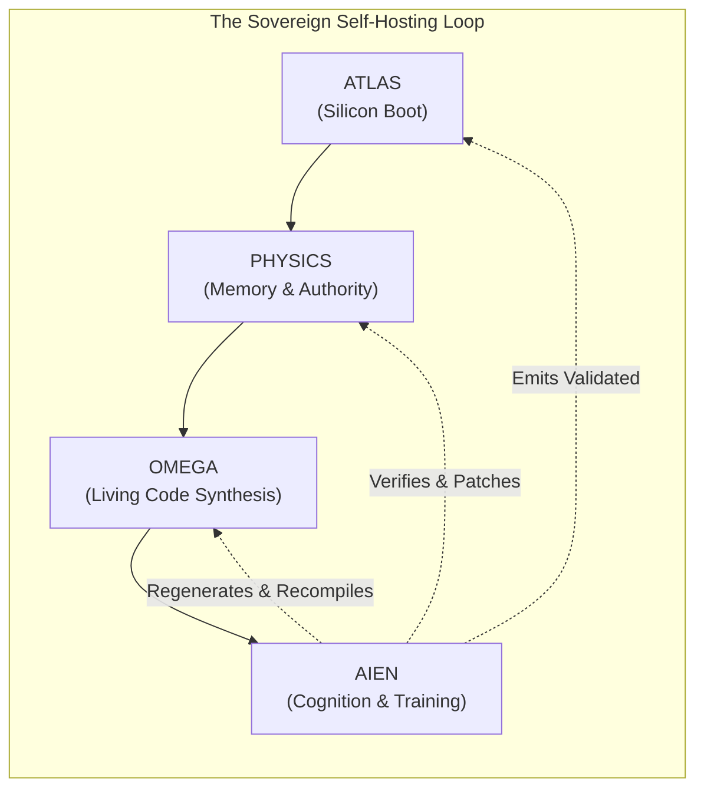

# DOCTRINE-SOV-001: SOVEREIGNTY AND CLOSURE
## The Canonical Law, Oracle Principle, Self-Hosting Closure, and Provenance Doctrine

```text
Document ID:     DOCTRINE-SOV-001
Milestone:       Milestone 0 (DOCTRINE_V1)
Classification:  Sovereign Machine Canonical Doctrine
Target Substrate: Complete Sovereign Stack (Atlas -> Physics -> Omega -> Aien)
Status:          AUTHORITATIVE / CANONICAL / RATIFIED
```

---

## 1. The Sovereignty Law

> **The Sovereignty Law:**
> *The final deployed Sovereign Machine must not require, depend upon, link against, or incorporate Rust, Cargo, LLVM, GCC, Clang, Python, Linux, POSIX runtimes, CUDA, PyTorch, TensorFlow, JAX, Triton, CuDNN, external virtual machines, foreign runtime schedulers, or foreign pretrained neural weights.*

### 1.1 The Meaning of Complete Sovereignty
Sovereignty is not an aesthetic preference or an open-source license; it is an existential computational boundary. A system is sovereign if and only if its operational continuity, cognitive validity, and physical transformations are completely decoupled from external technological civilizations, corporate software stacks, and cloud ecosystems.

The litmus test of sovereignty is the **Severance Invariant**:
If all external software repositories, global network backbones, commercial compiler toolchains, and proprietary AI models were instantaneously obliterated, the Sovereign Machine must continue to power-on, self-execute, synthesize machine code, adapt to physical workloads, train its cognitive models, and govern physical reality indefinitely from its internal, self-contained lineage.

### 1.2 Explicit Enumeration of Forbidden Dependencies
The final operational image of the Sovereign Machine strictly forbids:

| Forbidden Dependency Category | Specific Prohibited Technologies | Sovereign Replacement Mechanism |
| :--- | :--- | :--- |
| **Foreign Compilers & Toolchains** | `LLVM`, `GCC`, `Clang`, `Rustc`, `Cargo`, `NVCC`, `Triton` | **Omega Realization Substrate**: Direct bare-metal machine code synthesis ($\mathcal{G}_S \to \text{bytes}$). |
| **Foreign Interpreters & Runtimes**| `Python`, `Node.js`, `JVM`, `glibc`, `musl`, `libstdc++` | **Physics Supervisor**: Direct EL1 bare-metal execution with zero dynamic userspace runtime. |
| **Foreign Operating Systems** | `Linux`, `BSD`, `Windows`, `macOS`, `systemd`, `POSIX` | **Physics Kernel**: Capability-based physical governor and AEGIS memory membrane. |
| **Proprietary Accelerator Stacks** | `CUDA Driver`, `CUDA Runtime`, `CuDNN`, `TensorRT`, `ROCm` | **Bare-Metal MMIO/C2C Dispatch**: Direct command queue submission to GPU streaming multiprocessors. |
| **Foreign ML Frameworks** | `PyTorch`, `TensorFlow`, `JAX`, `ONNX Runtime`, `vLLM` | **Aien / Omega Tensor Engine**: Hardware-resident attention graphs and unified physical KV pools. |
| **Foreign Pretrained Weights** | Closed/black-box weights, unverified commercial checkpoints | **Sovereign Seed Models**: Self-trained weights with 100% cryptographic dataset provenance. |

Any component that introduces a transient dependency during early bootstrap development must possess an explicit, non-negotiable **Deprecation Horizon** terminating prior to Milestone 27 (`SOVEREIGN_MACHINE_CLOSURE`).

---

## 2. The Founding Exception

### 2.1 The Bootstrap Paradox
A perfectly self-hosting system presents a foundational paradox: *How does a software lineage write its own compiler if no compiler exists to assemble the first line of code?*

Historically, this paradox has been resolved through inherited dependencies—compiling C with GCC, which was compiled with another C compiler, tracing back through decades of opaque binary lineage (the Ken Thompson "Reflections on Trusting Trust" vulnerability).

### 2.2 Formal Definition of the Founding Exception
The Sovereign Machine resolves the bootstrap paradox through **The Founding Exception**:

$$\mathcal{A}_0 \equiv \text{Atlas}$$

* **Atlas is the Irreducible Root Artifact:** Atlas ($A_0$) is the singular, non-sovereign seed artifact permitted at system inception.
* **Bounded Scope of Exception:** The exception applies strictly to the initial generation of `atlas.bin`. Once `atlas.bin` is assembled and sealed into physical silicon / ROM, the exception terminates.
* **The Lineage Invariant:**
  $$\forall \text{ artifact } \mathcal{X} \in \{\text{Physics}, \text{Omega}, \text{Aien}\}: \quad \text{Lineage}(\mathcal{X}) \subseteq \text{Evolution}(\mathcal{A}_0)$$
  Every layer, engine, kernel, compiler, and neural network operating above Atlas must be derived, synthesized, and verified exclusively through the internal lineage initiated by Atlas.
* **The Scaffolding Deprecation Horizon:** The host machine, cross-assembler, and development environment used to craft $A_0$ are defined as **Scaffolding**. Scaffolding participates in the historical genesis of $A_0$, but is permanently discarded once the self-hosting loop closes.

---

## 3. The Oracle Principle

During the early and intermediate milestones of system bringup (Milestones 0 through 17), external tools (such as Linux, standard AIENOS, NVIDIA CUDA, and PyTorch) are employed under strict containment.

### 3.1 The Principle Defined
> **The Oracle Principle:**
> *Existing AIENOS, Linux, CUDA, and research runtimes are strictly Oracles and Empirical References. They are NEVER deployed ancestors, runtime dependencies, or architectural templates.*

An **Oracle** is an external computational entity queried solely for:
1. **Mathematical Ground Truth:** Generating reference output tensors ($y_{\text{exact}}$) from known inputs to verify that Omega realizations satisfy error bounds:
   $$\max_i |y_{\text{sovereign}}[i] - y_{\text{oracle}}[i]| \le \epsilon$$
2. **Performance Baselines:** Measuring theoretical hardware limits, memory bandwidth saturation percentages, and FLOP utilization under identical silicon conditions.
3. **Behavioral Divergence Hunting:** Detecting subtle floating-point drift, tensor misalignment, or semantic graph compilation errors.

```text
┌────────────────────────────────────────────────────────────────────────┐
│                        THE ORACLE ISOLATION GATE                       │
│                                                                        │
│   ┌────────────────────┐                   ┌───────────────────────┐   │
│   │   ORACLE REALM     │                   │    SOVEREIGN REALM    │   │
│   │ (Linux / CUDA / PT)│                   │(Atlas / Physics/Omega)│   │
│   │                    │                   │                       │   │
│   │ [ Reference Model ]│                   │ [ Sovereign Engine ]  │   │
│   └─────────┬──────────┘                   └───────────┬───────────┘   │
│             │                                          │               │
│             │ Reference Tensor                         │ Observed      │
│             │ Y_oracle                                 │ Y_sovereign   │
│             ▼                                          ▼               │
│        ┌────────────────────────────────────────────────────┐          │
│        │            FORMAL PARITY COMPARATOR                │          │
│        │        || Y_sovereign - Y_oracle || <= eps         │          │
│        └─────────────────────────┬──────────────────────────┘          │
│                                  │                                     │
│                                  ▼                                     │
│                     PASS: Oracle Severed Permanently                   │
│                     FAIL: Divergence Hunt Initiated                    │
└────────────────────────────────────────────────────────────────────────┘
```

### 3.2 The Oracle Boundary Invariants
* **Zero-Code Leakage:** No source file, header, symbol, macro, or dynamic library from an Oracle may ever be copied, linked, or imported into the Sovereign codebase.
* **Black-Box Comparator:** The Oracle interacts with the sovereign verification harness exclusively through serialized numerical tensors and scalar telemetry metrics.
* **Disposable Status:** Once an Omega realization or Physics capability demonstrates parity and passes formal verification, the Oracle query for that subsystem is permanently severed.

---

## 4. The Self-Hosting Loop and Closure Proofs

Sovereignty is achieved when the machine completes the **Self-Hosting Closure Loop**. At closure, the system possesses complete regenerative self-containment.



To validate this cycle, the architecture requires four sequential **Closure Proofs**:

### 4.1 Proof 1: `ATLAS_BOOT` (Milestone 1 & 12)
* **Theorem:** An immutable, raw binary image (`atlas.bin`) of $\le 64\text{ KB}$ can initialize an AArch64 bare-metal platform from cold reset, configure memory protection, verify secondary stages via SHA-256, and monotonically hand off control to Physics without invoking external firmware (UEFI/U-Boot) or third-party bootloaders.
* **Verification Proof:** Tested via physical power-cycle reset on bare metal hardware. Serial console captures cold register state, zero exception faults, and clean EL1 entry within $8.2\text{ ms}$ of reset de-assertion.

### 4.2 Proof 2: `OMEGA_LIVING_MATVEC` (Milestone 14)
* **Theorem:** Omega can ingest a pure mathematical Matrix-Vector multiplication specification ($\mathcal{G}_S$), synthesize six distinct machine-code kernels ($R_0 \dots R_5$) directly into memory, measure live execution cycles on CPU execution units, and autonomously select and dispatch the optimal realization without invoking an external compiler, assembler, or JIT runtime.
* **Verification Proof:** Realization $R_5$ achieves $> 85\%$ of STREAM memory bandwidth on host RAM, maintaining numerical error $\hat{\epsilon} \le 10^{-6}$ against IEEE-754 double-precision reference output.

### 4.3 Proof 3: `OMEGA_BLACKWELL` (Milestone 15 & 20)
* **Theorem:** Omega can emit native streaming multiprocessor microcode and warp schedules directly targeting NVIDIA Blackwell/Hopper GPU hardware, dispatching tensor contraction workloads across NVLink-C2C without linking against the CUDA runtime, proprietary NVIDIA kernel drivers, or closed user-mode libraries.
* **Verification Proof:** Bare-metal GPU execution register trace confirms tensor core GEMM completion, posting verified completion handles to `RESULT_RING` with zero CUDA host API calls.

### 4.4 Proof 4: `AIEN_SEED_TRAINING` (Milestone 22)
* **Theorem:** Aien can formulate its own weight updates, compute backward-pass gradient tensors, and update model parameters residing in persistent HBM memory using Omega-synthesized kernels on sovereign datasets, without PyTorch, JAX, or foreign training orchestration frameworks.
* **Verification Proof:** Autoregressive training loss decreases monotonically over 1,000 continuous gradient steps; token generation perplexity matches oracle reference baselines within $0.5\%$.

### 4.5 The Final Master Proof: `SOVEREIGN_CLOSURE` (Milestone 27)
The system achieves full sovereign closure when:

$$\mathcal{S}_{t+1} = \text{Omega}_{\text{sov}}\Big(\text{Physics}_{\text{sov}}\big(\text{Atlas}_{\text{sov}}(\text{Silicon})\big)\Big)$$

Where the newly synthesized system $\mathcal{S}_{t+1}$ is bit-for-bit functionally equivalent to $\mathcal{S}_t$, fully capable of bootstrapping itself on cold hardware with zero external dependencies.

---

## 5. Dataset Sovereignty & Cryptographic Provenance

A model trained on poisoned, unverified, or legally compromised data is not sovereign. The cognitive integrity of Aien depends upon absolute dataset hygiene and verifiable provenance.

### 5.1 The Pristine Data Doctrine
1. **Zero Unverified Web Scrapes:** Bulk crawling of public internet data without provenance verification is strictly prohibited.
2. **Zero Commercial Taint:** Training corpora must not contain unauthorized intellectual property, proprietary source code, or synthetic outputs generated by commercial closed models with restrictive terms of service.
3. **Pristine Mathematical & Formal Foundation:** The core cognitive seed is trained on:
   * Formal mathematical proofs (Lean, Coq, Isabelle, formal logic).
   * Verifiable algorithmic implementations and AST representations.
   * Formal physical laws, engineering standards, and thermodynamic principles.
   * Curated epistemic dialogues and verifiable reasoning chains.

### 5.2 The Cryptographic Provenance Ledger
Every training token ingested into Aien is permanently bound to a **Cryptographic Provenance Certificate**:

```text
┌────────────────────────────────────────────────────────────────────────┐
│                   SOVEREIGN DATASET PROVENANCE BLOCK                   │
├────────────────────────────────────────────────────────────────────────┤
│ Dataset Chunk ID:     DSC-2026-09-88392                                │
│ BLAKE3 Content Hash:  e3b0c44298fc1c149afbf4c8996fb92427ae41e4649b... │
│ Source Authority:     Sovereign Epistemic Archive                      │
│ Verification Level:   FORMAL_PROOF_VERIFIED                            │
│ Token Count:          4,194,304 tokens                                 │
│ Synthesizer Hash:     OMEGA-SYNTH-V1-49b2                              │
│ Signature:            Ed25519 [ed7a9f...389c]                          │
└────────────────────────────────────────────────────────────────────────┘
```

* **Content-Addressed Storage:** Datasets reside in immutable, content-addressed memory pools. Any bit-flip or unauthorized modification invalidates the dataset signature.
* **Poisoning Defense:** Aien includes an internal adversarial discriminator that rejects data samples exhibiting entropy anomalies, suspicious token distributions, or unverified mathematical claims.

### 5.3 Synthetic Self-Distillation
Beyond the initial seed corpus, Aien expands its cognitive capacity through **Autonomous Synthetic Self-Distillation**:
1. Aien poses formal problems in J-Space.
2. Multiple internal reasoning trajectories are explored.
3. Solutions are submitted to Omega and Physics for empirical verification (compiling the code, executing the test, verifying the proof).
4. Only reasoning trajectories that terminate in **empirically proven physical truth** are ingested into the training buffer for weight fine-tuning.

---

## 6. Verification Gates for the Entire Roadmap

Roadmap progression is strictly governed by four sequential **Verification Gates**. No milestone within a higher gate may be declared complete until all preceding gate invariants are formally verified.

```text
   M0-M10                 M11-M16                M17-M22                M23-M27
┌───────────┐          ┌───────────┐          ┌───────────┐          ┌───────────┐
│  GATE 0:  │          │  GATE 1:  │          │  GATE 2:  │          │  GATE 3:  │
│DOCTRINE & │ ───────> │BARE-METAL │ ───────> │AUTONOMOUS │ ───────> │ SOVEREIGN │
│FOUNDATIONS│          │ ISOLATION │          │REALIZATION│          │  CLOSURE  │
└───────────┘          └───────────┘          └───────────┘          └───────────┘
```

### 6.1 Gate 0: Doctrine, Architecture, and Formal Specifications (M0)
* **Gate Check:** Complete ratification of `ARCHITECTURE.md`, `SOVEREIGNTY.md`, `ATLAS.md`, and `OMEGA.md`.
* **Standard:** All system concepts, formulas, memory structures, and hardware topologies defined without ambiguous terminology or unspecified layers.
* **Verification Agent:** `spark-sentinel` doctrine audit passes with zero unresolved contradictions.

### 6.2 Gate 1: Bare-Metal Awakening & Memory Confinement (M1 – M11)
* **Gate Invariants:**
  1. `atlas.bin` boots bare-metal AArch64 hardware cleanly.
  2. Physics takes EL1 handoff and establishes strict identity page tables.
  3. SMMUv3 blocks all unauthorized peripheral DMA transactions.
  4. Coherent NVLink-C2C memory space successfully exchanges 64-byte descriptors with zero cache corruption.
  5. Zero stub code in active runtime path.
* **Pass/Fail Threshold:** Complete hardware execution trace verified. 100% deterministic boot across 50 consecutive cold resets.

### 6.3 Gate 2: Autonomous Realization & Accelerator Sovereignty (M12 – M17)
* **Gate Invariants:**
  1. Omega synthesizes machine code directly into memory without invoking LLVM, GCC, or NVCC.
  2. Living realization loop demonstrates automatic selection of variant $R_5$ under heavy memory pressure.
  3. Bare-metal GPU execution runs tensor contractions via direct hardware registers without CUDA runtime.
  4. AEGIS effect boundary halts 100% of injected unauthorized I/O attempts.
* **Pass/Fail Threshold:** Maximum floating-point error $\hat{\epsilon} \le 10^{-5}$ across all synthesized tensor kernels. Zero memory leaks across $10^7$ continuous ring transactions.

### 6.4 Gate 3: Cognitive Self-Hosting & Complete Closure (M18 – M27)
* **Gate Invariants:**
  1. Sovereign Toolchain Generation 1 successfully compiles all system components from source.
  2. Aien trains its foundation cognitive weights from scratch on verified provenance data.
  3. Cold silicon boot from power-off to cognitive conversation completes with zero foreign binaries or runtimes.
  4. Full self-reproduction: The system successfully compiles and verifies its own next-generation boot image.
* **Pass/Fail Threshold:** Sovereign Code Ratio = $100.0\%$. Foreign Dependency Count = $0$.

```text
================================================================================
                    SOVEREIGNTY IS THE INVIOLABLE LAW
================================================================================
```
